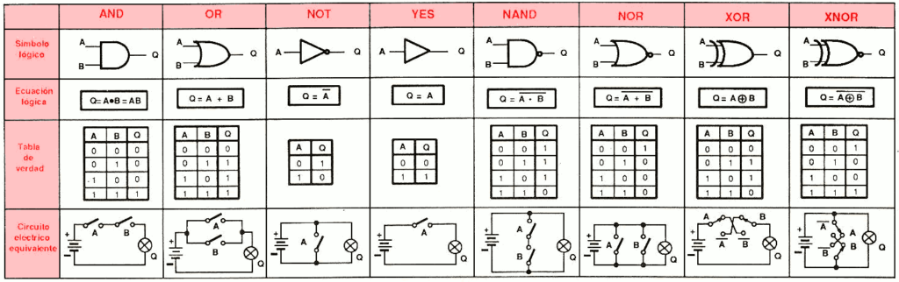
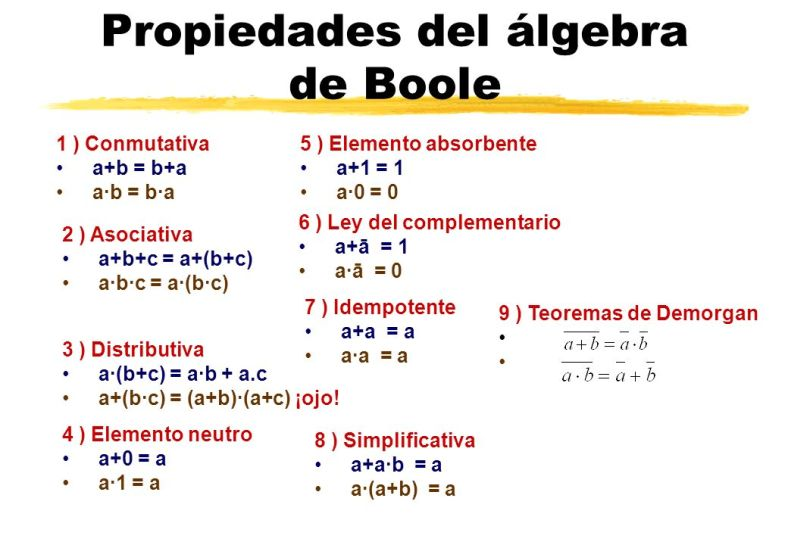

# Álgebra de Boole

## 1. Variables Lógicas y sus Estados

En los sistemas digitales se utilizan variables lógicas que solo pueden tomar dos valores binarios: 0 y 1. Estos valores representan estados físicos y eléctricos específicos:

- **Valor 1:** Nivel de voltaje alto (típicamente 5V), estado ON, verdadero o "High".
- **Valor 0:** Nivel de voltaje bajo (0V), estado OFF, falso o "Low".

Estos estados son mutuamente excluyentes; es decir, una variable no puede valer 0 y 1 al mismo tiempo, de la misma forma que un semáforo no puede estar en rojo y verde simultáneamente.

## 2. Compuertas Lógicas Básicas

La clase introduce los componentes fundamentales que procesan estas variables:

- **AND (Y):** La salida es 1 solo si todas las entradas son 1.
- **OR (O):** La salida es 1 si al menos una de las entradas es 1.
- **NOT (NO):** Es un inversor; la salida es siempre el estado opuesto a la entrada.
- **Otras compuertas:** Se presentan también las funciones NAND, NOR, XOR (OR exclusiva) y XNOR. El material incluye diagramas de pines para circuitos integrados comerciales de la serie 74 (como el 7408 para AND o el 7432 para OR).

## 3. Fundamentos del Álgebra de Boole

Es la teoría matemática aplicada a la lógica combinatoria. Sus pilares son:

- **Operadores:** Se definen formalmente el producto lógico (AND "·"), la suma lógica (OR "+") y la negación (NOT "¯").
- **Postulados:** Incluyen la existencia de variables complementarias (A̅ = A') y la propiedad conmutativa tanto para la suma (A + B = B + A) como para el producto (A · B = B · A).

## 4. Teoremas Principales

Para simplificar funciones lógicas complejas, se utilizan varios teoremas fundamentales:

- **Leyes de DeMorgan:** Permiten transformar una suma negada en un producto de negados, y viceversa ((A + B)' = A' · B').
- **Teorema de Consenso:** Ayuda a eliminar términos redundantes en una expresión (AB + BC + A'C = AB + A'C).
- **Multiplicación y Factorización:** Reglas para manipular algebraicamente las expresiones booleanas.

Este conocimiento es esencial para tu proyecto del Arduino Mega 2560, ya que el microcontrolador utiliza estas reglas lógicas para procesar las señales de los sensores y activar las alarmas del sistema de monitoreo térmico.
