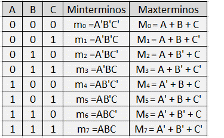

# Circuitos Combinacionales

<iframe width="560" height="315" src="https://www.youtube.com/embed/UaRZk8C_YDo" title="Circuitos Combinacionales" frameborder="0" allow="accelerometer; autoplay; clipboard-write; encrypted-media; gyroscope; picture-in-picture; web-share" allowfullscreen></iframe>

## 1. Definición de Circuito Combinacional

Un circuito combinacional se define como aquel cuya salida en cualquier momento depende exclusivamente de los niveles presentes en las entradas. Sus características principales son:

- **Independencia de la salida:** No tiene retroalimentación; la salida actual no influye en las futuras.
- **Independencia del tiempo:** No tiene memoria de estados anteriores.

## 2. Formas de Representar una Función

Una misma función lógica puede expresarse de tres maneras:

- **Expresión Algebraica:** Existen infinitas formas de escribirla (unas más simples que otras).
- **Expresión Gráfica (Esquemático):** Se puede representar de infinitos modos usando distintos tipos de compuertas.
- **Tabla de Verdad:** Es la única representación única y absoluta para cada función.

<iframe width="560" height="315" src="https://www.youtube.com/embed/ipPUac1vhNU" title="Hallar la función lógica a partir del circuito eléctrico" frameborder="0" allow="accelerometer; autoplay; clipboard-write; encrypted-media; gyroscope; picture-in-picture; web-share" allowfullscreen></iframe>

<iframe width="560" height="315" src="https://www.youtube.com/embed/eo_2owYN9X4" title="Hallar el circuito eléctrico a partir de la función lógica" frameborder="0" allow="accelerometer; autoplay; clipboard-write; encrypted-media; gyroscope; picture-in-picture; web-share" allowfullscreen></iframe>

## 3. Formas Canónicas (Estándar)

Dentro de las infinitas expresiones algebraicas, se destacan dos que sirven como estándar para el diseño automático:

- **Primera Forma Canónica (Suma de Productos):** Se basa en los mintérminos (mᵢ), que corresponden a las filas de la tabla de verdad donde la función vale "1".
- **Segunda Forma Canónica (Producto de Sumas):** Se basa en los maxtérminos (Mᵢ), correspondientes a las filas donde la función vale "0".
- **Conversión:** Es un proceso directo; los términos que faltan en una forma son precisamente los que componen la otra.

<iframe width="560" height="315" src="https://www.youtube.com/embed/3ZTbrJzUpcc" title="YouTube video player" frameborder="0" allow="accelerometer; autoplay; clipboard-write; encrypted-media; gyroscope; picture-in-picture; web-share" allowfullscreen></iframe>

## 4. Implementación Práctica

La clase detalla cómo llevar estas funciones al hardware real:

- **Puertas Universales:** Se explica que cualquier función puede realizarse exclusivamente con puertas NAND.

  <iframe width="560" height="315" src="https://www.youtube.com/embed/KD5_nfrDQoI" title="Hallar el circuito a partir de la función lógica solo con NANDs" frameborder="0" allow="accelerometer; autoplay; clipboard-write; encrypted-media; gyroscope; picture-in-picture; web-share" allowfullscreen></iframe>
- **Optimización:** Para la segunda forma canónica, lo más óptimo es utilizar puertas NOR.
- **Circuitos Integrados:** Se muestran ejemplos de conexión física en chips comerciales, como el 74LS00 (que contiene cuatro puertas NAND).

## 5. Métodos de Simplificación

Para evitar el uso excesivo de componentes, se presentan dos métodos:

- **Método Algebraico:** Aplicación de teoremas y postulados de Boole (vistos en la clase 3).

  <iframe width="560" height="315" src="https://www.youtube.com/embed/6SFNbdhjS7Q" title="Simplificación algebraica" frameborder="0" allow="accelerometer; autoplay; clipboard-write; encrypted-media; gyroscope; picture-in-picture; web-share" allowfullscreen></iframe>
- **Mapa de Karnaugh:** Es un método gráfico que permite una simplificación rápida y visual. Se basa en agrupar casillas adyacentes de 2ⁿ términos (1, 2, 4, 8...) para eliminar las variables que cambian de estado en cada grupo.

  **2 variables**

  <iframe width="560" height="315" src="https://www.youtube.com/embed/7wFCzMdgmFU" title="Mapa de Karnaugh - 2 variables" frameborder="0" allow="accelerometer; autoplay; clipboard-write; encrypted-media; gyroscope; picture-in-picture; web-share" allowfullscreen></iframe>

  **3 variables**

  <iframe width="560" height="315" src="https://www.youtube.com/embed/EmAmKbk94I0" title="Mapa de Karnaugh - 3 variables" frameborder="0" allow="accelerometer; autoplay; clipboard-write; encrypted-media; gyroscope; picture-in-picture; web-share" allowfullscreen></iframe>

  **4 variables**

  <iframe width="560" height="315" src="https://www.youtube.com/embed/nIgIREYHbx4" title="Mapa de Karnaugh 1" frameborder="0" allow="accelerometer; autoplay; clipboard-write; encrypted-media; gyroscope; picture-in-picture; web-share" allowfullscreen></iframe>

  <iframe width="560" height="315" src="https://www.youtube.com/embed/vacBsx_ZljY" title="Mapa de Karnaugh 2" frameborder="0" allow="accelerometer; autoplay; clipboard-write; encrypted-media; gyroscope; picture-in-picture; web-share" allowfullscreen></iframe>

  <iframe width="560" height="315" src="https://www.youtube.com/embed/9dd6eW6-p1M" title="Mapa de Karnaugh 3" frameborder="0" allow="accelerometer; autoplay; clipboard-write; encrypted-media; gyroscope; picture-in-picture; web-share" allowfullscreen></iframe>

  <iframe width="560" height="315" src="https://www.youtube.com/embed/oG2c87Jln34" title="Mapa de Karnaugh - 4 variables" frameborder="0" allow="accelerometer; autoplay; clipboard-write; encrypted-media; gyroscope; picture-in-picture; web-share" allowfullscreen></iframe>

