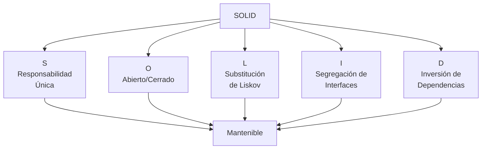

# Principios SOLID

Los principios SOLID son cinco principios fundamentales del diseño orientado a objetos que ayudan a crear software más mantenible, flexible y fácil de entender.

## Los cinco principios

| Principio | Nombre | Descripción |
|-----------|--------|-------------|
| **S** | Responsabilidad Única | Una clase debe tener una sola razón para cambiar |
| **O** | Abierto/Cerrado | Las entidades deben estar abiertas para extensión pero cerradas para modificación |
| **L** | Substitución de Liskov | Los objetos de una clase derivada deben poder sustituir objetos de la clase base |
| **I** | Segregación de Interfaces | Los clientes no deben verse forzados a depender de interfaces que no usan |
| **D** | Inversión de Dependencias | Depender de abstracciones, no de concreciones |

## Diagrama de overview



## Navegación

- [S - Responsabilidad Única](buenas-practicas/solid/principio-s)
- [O - Abierto/Cerrado](buenas-practicas/solid/principio-o)
- [L - Substitución de Liskov](buenas-practicas/solid/principio-l)
- [I - Segregación de Interfaces](buenas-practicas/solid/principio-i)
- [D - Inversión de Dependencias](buenas-practicas/solid/principio-d)

# Conceptos que uno debe entender antes

## Alto nivel vs bajo nivel

**Alto nivel**

Parte del sistema que contiene la lógica del Navegación

**Bajo nivel**

Tareas concretas y técnicas

```typescript
class MySQLDatabase {

    public void guardarPedido() {
        System.out.println("Pedido guardado en MySQL");
    }
}
class GestorPedidos {

    private MySQLDatabase db;

    public GestorPedidos() {
        db = new MySQLDatabase();
    }

    public void procesarPedido() {

        System.out.println("Procesando pedido...");

        db.guardarPedido();
    }
}
```

**Quién es alto nivel?**

`class GestorPedidos`


**Quién es bajo nivel?**

`class MySQLDatabase`
