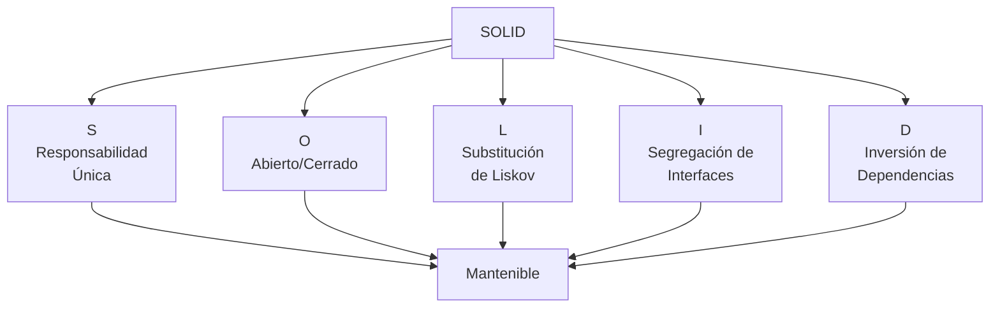

# Principios SOLID

Los principios SOLID son cinco principios fundamentales del diseño orientado a objetos que ayudan a crear software más mantenible, flexible y fácil de entender.

## Los cinco principios

| Principio | Nombre | Descripción |
|-----------|--------|-------------|
| **S** | Responsabilidad Única | Una clase debe tener una sola razón para cambiar |
| **O** | Abierto/Cerrado | Las entidades deben estar abiertas para extensión pero cerradas para modificación |
| **L** | Substitución de Liskov | Los objetos de una clase derivada deben poder sustituir objetos de la clase base |
| **I** | Segregación de Interfaces | Los clientes no deben verse forzados a depender de interfaces que no usan |
| **D** | Inversión de Dependencias | Depender de abstracciones, no de concreciones |

## Diagrama de overview

## Navegación

- [S - Responsabilidad Única](principio-s)
- [O - Abierto/Cerrado](principio-o)
- [L - Substitución de Liskov](principio-l)
- [I - Segregación de Interfaces](principio-i)
- [D - Inversión de Dependencias](principio-d)