# 1. Disparadores y eventos en GitHub Actions

> **Pertenece a:** Creación y gestión de flujos de trabajo (Author and manage workflows - 20-25%)

La idea fundamental es:

> Un workflow necesita un evento que indique **cuándo** debe ejecutarse.

Por ejemplo:

```yaml
name: CI

on:
  push:
    branches:
      - main
```

Esto significa:

> "Ejecuta este workflow cuando haya un push a `main`."

---

## 1. Estructura básica de un trigger

Todo comienza con `on:`.

```yaml
name: Mi Workflow

on:
  push:
    branches:
      - main

jobs:
  build:
    runs-on: ubuntu-latest

    steps:
      - run: echo "Ejecutando workflow"
```

La estructura conceptual es:

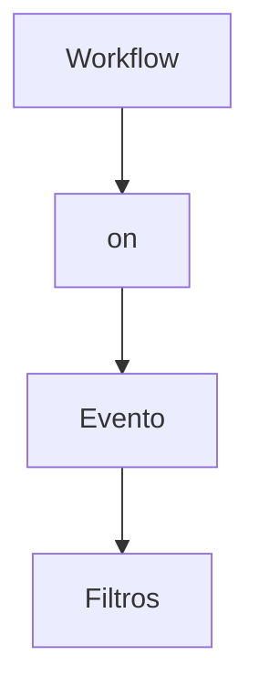

Por ejemplo:

```yaml
on:
  push:
    branches:
      - main
```

- `on` → define el disparador.
- `push` → evento.
- `branches` → filtro.
- `main` → rama sobre la que aplica.

---

## 2. Eventos de repositorio

GitHub tiene muchos eventos que pueden disparar workflows. Los más importantes para certificación son:

| Evento | Cuándo ocurre |
|---|---|
| `push` | Se hace push al repositorio |
| `pull_request` | Se crea/modifica un Pull Request |
| `issues` | Se crea/modifica una issue |
| `issue_comment` | Se agrega un comentario |
| `release` | Se crea/modifica una release |
| `create` | Se crea una rama o tag |
| `delete` | Se elimina una rama o tag |
| `fork` | Se hace fork del repositorio |
| `workflow_dispatch` | Ejecución manual |
| `schedule` | Ejecución programada |
| `workflow_run` | Termina otro workflow |
| `repository_dispatch` | Evento enviado mediante API |

No necesitas memorizar todos al principio. Concéntrate especialmente en:

- `push`
- `pull_request`
- `workflow_dispatch`
- `schedule`
- `workflow_run`
- `repository_dispatch`

---

## 3. push

Es uno de los triggers más utilizados.

```yaml
on:
  push:
```

Se ejecuta cuando se realiza un push. Puedes limitarlo a determinadas ramas:

```yaml
on:
  push:
    branches:
      - main
```

| Push | ¿Ejecuta? |
|---|---|
| `push` → `main` | ✅ |
| `push` → `develop` | ❌ |
| `push` → `feature` | ❌ |

También puedes especificar varias ramas:

```yaml
on:
  push:
    branches:
      - main
      - develop
```

### Filtrar por paths

También puedes ejecutar el workflow dependiendo de qué archivos cambiaron:

```yaml
on:
  push:
    paths:
      - 'src/**'
```

| Cambio | ¿Ejecuta? |
|---|---|
| `src/App.tsx` | ✅ |
| `src/components/X` | ✅ |
| `README.md` | ❌ |

Esto es muy útil en monorepos. Puedes combinar:

```yaml
on:
  push:
    branches:
      - main
    paths:
      - 'frontend/**'
```

> Ejecutar solamente cuando hay un push a `main` **y** el cambio afecta `frontend/**`.

---

## 4. pull_request

Otro trigger fundamental.

```yaml
on:
  pull_request:
```

Se ejecuta ante determinados cambios relacionados con Pull Requests. Por ejemplo:

```yaml
on:
  pull_request:
    branches:
      - main
```

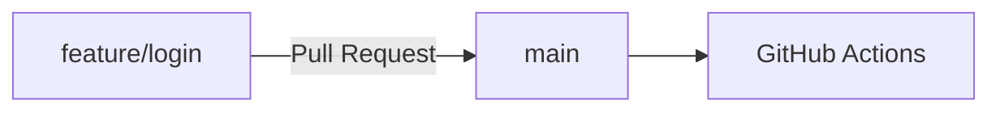

Es muy común utilizarlo para:

- ejecutar tests;
- lint;
- verificar TypeScript;
- ejecutar builds;
- comprobar que el PR no rompe el proyecto.

```yaml
name: PR Validation

on:
  pull_request:
    branches:
      - main

jobs:
  test:
    runs-on: ubuntu-latest

    steps:
      - uses: actions/checkout@v4

      - run: npm install
      - run: npm test
```

---

## 5. pull_request tiene tipos

Puedes especificar qué acción sobre el PR debe disparar el workflow.

```yaml
on:
  pull_request:
    types:
      - opened
      - synchronize
      - reopened
```

Algunos tipos importantes:

- `opened`
- `closed`
- `reopened`
- `synchronize`
- `edited`
- `labeled`
- `unlabeled`
- `assigned`
- `unassigned`

### synchronize

Este es especialmente importante. Ocurre cuando se agregan nuevos commits al PR.

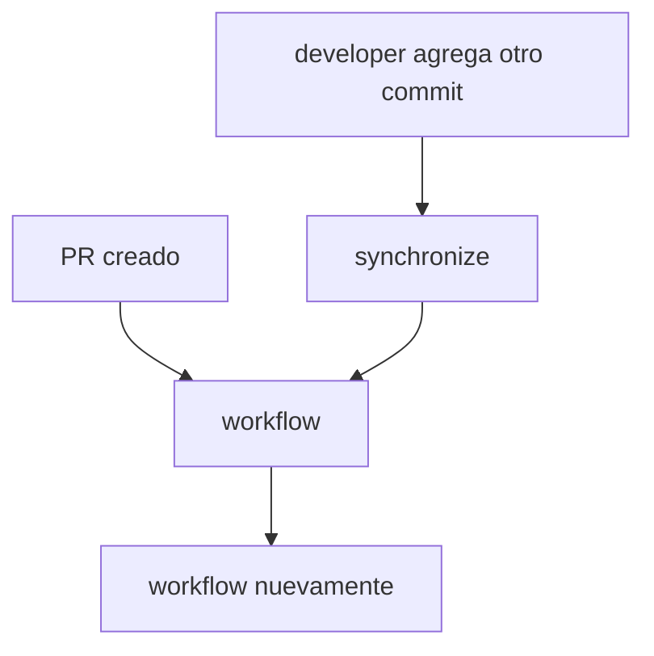

---

## 6. Diferencia importante: push vs pull_request

Esto es algo que debes entender muy bien.

```yaml
on:
  push:
```

Responde a: *"Alguien hizo push."*

```yaml
on:
  pull_request:
```

Responde a: *"Ocurrió una acción relacionada con un Pull Request."*

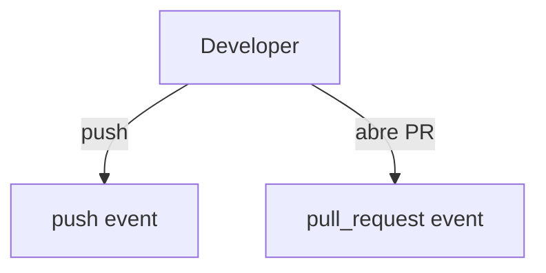

---

## 7. Múltiples eventos

Puedes configurar varios triggers:

```yaml
on:
  push:
    branches:
      - main

  pull_request:
    branches:
      - main

  workflow_dispatch:
```

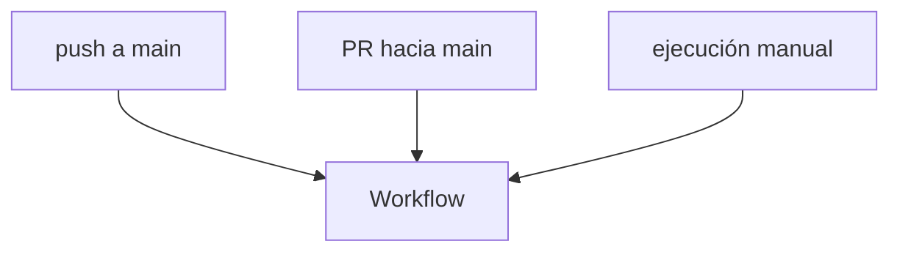

---

## 8. workflow_dispatch ⭐

Este es uno de los más importantes. Permite ejecutar manualmente un workflow.

```yaml
on:
  workflow_dispatch:
```

Entonces GitHub mostrará la opción para ejecutar el workflow manualmente.

```yaml
name: Deploy

on:
  workflow_dispatch:

jobs:
  deploy:
    runs-on: ubuntu-latest

    steps:
      - run: echo "Deployando..."
```

Puedes utilizarlo para:

- deployments manuales;
- migraciones;
- tareas administrativas;
- scripts;
- operaciones que no quieres ejecutar automáticamente.

---

## 9. Inputs en workflow_dispatch

Aquí se pone interesante. Puedes solicitar parámetros al usuario.

```yaml
on:
  workflow_dispatch:
    inputs:
      environment:
        description: "Environment"
        required: true
        type: choice
        options:
          - development
          - staging
          - production
```

Cuando ejecutas manualmente el workflow, GitHub te permite elegir:

```text
Environment:
  ○ development
  ○ staging
  ● production
```

Luego puedes utilizarlo:

```yaml
jobs:
  deploy:
    runs-on: ubuntu-latest

    steps:
      - run: echo "Deploying to ${{ inputs.environment }}"
```

---

## 10. Tipos de inputs

Los inputs de `workflow_dispatch` pueden tener diferentes tipos.

```yaml
on:
  workflow_dispatch:
    inputs:
      environment:
        type: choice
        options:
          - dev
          - staging
          - production

      debug:
        type: boolean

      version:
        type: string

      branch:
        type: string
```

Los tipos que debes conocer son:

- `string`
- `boolean`
- `choice`
- `environment`

---

## 11. schedule ⭐

Permite ejecutar workflows automáticamente siguiendo una programación. Utiliza sintaxis **cron**.

```yaml
on:
  schedule:
    - cron: '0 0 * * *'
```

Esto significa: *ejecutar todos los días a las 00:00 UTC.*

---

## 12. Entender cron

La estructura es:

```text
┌──────── minuto
│ ┌────── hora
│ │ ┌──── día del mes
│ │ │ ┌── mes
│ │ │ │ ┌ día de semana
│ │ │ │ │
* * * * *
```

Ejemplo:

```yaml
cron: '0 0 * * *'
```

| Campo | Valor |
|---|---|
| `0` | minuto |
| `0` | hora |
| `*` | cualquier día |
| `*` | cualquier mes |
| `*` | cualquier día de semana |

### Ejemplos

**Cada hora**

```yaml
cron: '0 * * * *'
```

**Todos los días a las 8 AM UTC**

```yaml
cron: '0 8 * * *'
```

**Todos los lunes**

```yaml
cron: '0 8 * * 1'
```

**Primer día de cada mes**

```yaml
cron: '0 0 1 * *'
```

---

## 13. ⚠️ Cron usa UTC

Esto es muy importante para el examen. GitHub Actions interpreta los `schedule` usando **UTC**.

Si quieres ejecutar algo a las **8:00 AM Perú** (Perú está en UTC-5), serían las **13:00 UTC**:

```yaml
schedule:
  - cron: '0 13 * * *'
```

---

## 14. Múltiples schedules

Puedes tener varios:

```yaml
on:
  schedule:
    - cron: '0 8 * * 1'
    - cron: '0 8 * * 5'
```

Eso ejecutaría el workflow:

- Lunes 08:00 UTC
- Viernes 08:00 UTC

---

## 15. Webhooks y repository_dispatch ⭐

Aquí hay una distinción importante.

Un **webhook** permite que sistemas externos reaccionen a eventos de GitHub.

Pero en GitHub Actions existe también:

```yaml
on:
  repository_dispatch:
```

Esto permite que un sistema externo envíe un **evento personalizado** al repositorio mediante la **API de GitHub**.

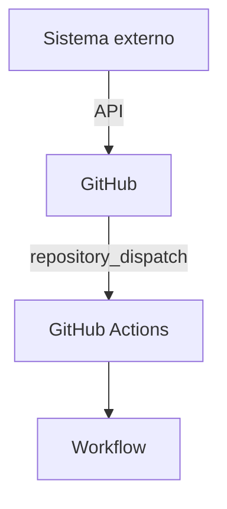

Por ejemplo, un sistema externo podría decir: *"Se completó el proceso de facturación, ejecuta este workflow."*

---

## 16. repository_dispatch con tipos

Puedes definir:

```yaml
on:
  repository_dispatch:
    types:
      - deploy
      - build
```

Entonces el workflow puede reaccionar a diferentes eventos personalizados.

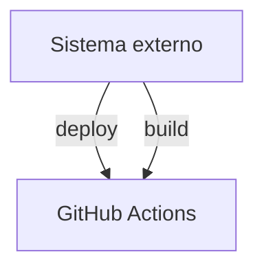

---

## 17. workflow_run ⭐

Otro trigger importante. Permite ejecutar un workflow cuando otro workflow termina.

```yaml
on:
  workflow_run:
    workflows:
      - Tests
    types:
      - completed
```

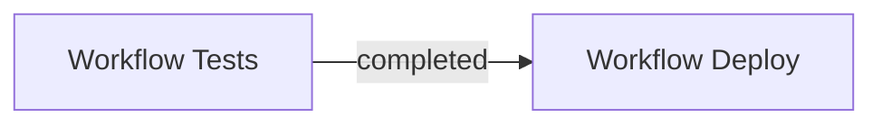

Esto permite construir pipelines:

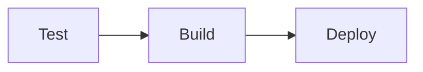

---

## 18. Ejemplo real

Imagina tu proyecto Next.js. Quieres:

- Ejecutar tests cuando alguien haga PR.
- Hacer build cuando se haga push a main.
- Permitir deployment manual.
- Ejecutar una tarea cada noche.

Podrías tener:

```yaml
name: CI/CD

on:
  push:
    branches:
      - main

  pull_request:
    branches:
      - main

  workflow_dispatch:

  schedule:
    - cron: '0 5 * * *'

jobs:
  build:
    runs-on: ubuntu-latest

    steps:
      - uses: actions/checkout@v4

      - run: npm install
      - run: npm run build
```

Tenemos **cuatro** formas diferentes de activar el workflow:

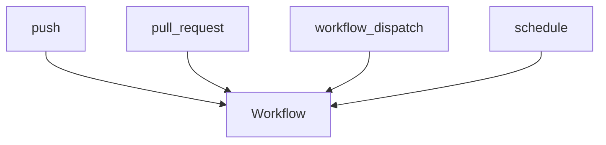

---

## 19. Filtros que debes estudiar

Los triggers pueden tener filtros. Los principales:

**branches**

```yaml
on:
  push:
    branches:
      - main
```

**branches-ignore**

```yaml
on:
  push:
    branches-ignore:
      - development
```

**paths**

```yaml
on:
  push:
    paths:
      - 'src/**'
```

**paths-ignore**

```yaml
on:
  push:
    paths-ignore:
      - '*.md'
```

**tags**

```yaml
on:
  push:
    tags:
      - 'v*'
```

Por ejemplo, `v1.0.0`, `v1.2.0`, `v2.0.0` podrían activar el workflow.

---

## 20. branches + paths

Esto es especialmente importante.

```yaml
on:
  push:
    branches:
      - main
    paths:
      - 'backend/**'
```

No significa *main O backend*. Significa **main Y backend/****.

| Push | ¿Ejecuta? |
|---|---|
| `main` + `backend` | ✅ |
| `main` + `frontend` | ❌ |
| `develop` + `backend` | ❌ |
| `develop` + `frontend` | ❌ |

---

## 21. El evento release

Puedes disparar workflows cuando ocurre una release:

```yaml
on:
  release:
    types:
      - published
```

Muy útil para:

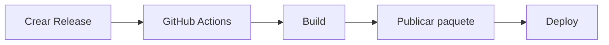

---

## 22. create y delete

Puedes reaccionar a creación/eliminación de ramas o tags.

```yaml
on:
  create:
```

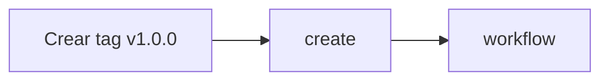

---

## 23. Contexto del evento

Una vez que un evento dispara el workflow, GitHub proporciona información sobre ese evento.

Puedes acceder mediante:

```yaml
${{ github.event }}
```

Por ejemplo:

```yaml
- run: echo "${{ github.event_name }}"
```

Podría devolver `push`.

También:

```yaml
${{ github.ref }}
```

para conocer la referencia que disparó el workflow.

Y:

```yaml
${{ github.sha }}
```

para obtener el commit SHA.

> Esto conecta directamente con el concepto de **contexts**, que también es importante para la certificación.

---

## 24. Diferencia entre event_name y event

Recuerda:

```yaml
github.event_name
```

te dice *¿qué evento disparó el workflow?* (ejemplo: `push`).

Mientras:

```yaml
github.event
```

contiene los **datos completos** asociados al evento.

```text
github.event_name
       ↓
     "push"

github.event
       ↓
{ información completa del push }
```

---

## 25. Eventos vs webhooks

Esta distinción puede confundirte.

**GitHub Actions event** — es el evento que puede activar un workflow:

```yaml
on:
  push:
```

**Webhook** — es un mecanismo para enviar información de GitHub a un sistema externo.

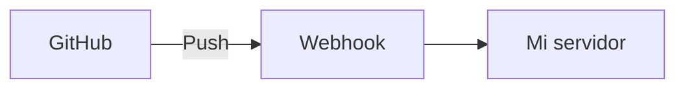

Con Actions:

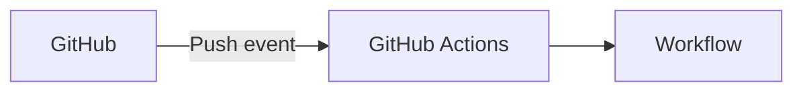

> Webhook y GitHub Actions **no son exactamente lo mismo**.

---

## 26. Un concepto muy importante: múltiples eventos

Si haces:

```yaml
on:
  push:
  pull_request:
```

el workflow se ejecutará cuando ocurra **cualquiera** de los dos eventos.

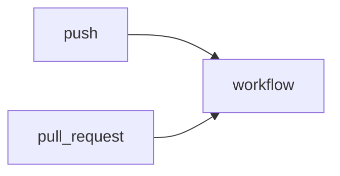

Mientras que **dentro de un mismo evento**:

```yaml
on:
  push:
    branches:
      - main
    paths:
      - src/**
```

los filtros actúan **conjuntamente**.

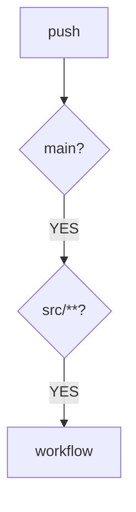

---

## 27. Tabla para memorizar para la certificación

Te recomiendo aprenderte esta tabla:

| Trigger | Uso |
|---|---|
| `push` | Cuando se hace push |
| `pull_request` | Cambios relacionados con PR |
| `workflow_dispatch` | Ejecución manual |
| `schedule` | Ejecución programada |
| `workflow_run` | Cuando termina otro workflow |
| `repository_dispatch` | Evento externo mediante API |
| `release` | Eventos de releases |
| `issues` | Eventos de issues |
| `issue_comment` | Comentarios en issues/PR |
| `create` | Creación de rama/tag |
| `delete` | Eliminación de rama/tag |

---

## 🧠 Lo que deberías dominar para el examen

Si estás estudiando específicamente para la certificación GitHub Actions, divide este tema así:

### Nivel 1 — Obligatorio

Debes saber escribir:

```yaml
on:
  push:
  pull_request:
  workflow_dispatch:
  schedule:
```

### Nivel 2 — Muy importante

Filtros:

```yaml
branches:
branches-ignore:
paths:
paths-ignore:
tags:
tags-ignore:
```

Y:

```yaml
types:
```

### Nivel 3 — Importante

Inputs:

```yaml
workflow_dispatch:
  inputs:
```

Y cron:

```yaml
schedule:
  - cron: '...'
```

### Nivel 4 — Para diferenciarte en el examen

Comprender `workflow_run`, `repository_dispatch`, `release`, y la diferencia entre:

- GitHub event
- Webhook
- repository_dispatch

---

## 🎯 Ejercicio de certificación

Intenta responder estas preguntas sin mirar arriba:

1. ¿Qué trigger usarías para permitir que un administrador ejecute manualmente un deployment?
2. ¿Qué trigger utilizarías para ejecutar un workflow todos los días a las 03:00 UTC?
3. ¿Cómo harías que un workflow solamente responda a push sobre `main`?
4. ¿Qué filtro utilizarías para ejecutar un workflow solamente cuando cambien archivos dentro de `src/`?
5. ¿Qué trigger utilizarías para ejecutar un workflow después de que otro workflow termine?
6. ¿Cuál es la diferencia entre `push` y `pull_request`?
7. ¿Qué mecanismo utilizarías si un sistema externo necesita enviar un evento personalizado a GitHub para iniciar un workflow?
8. ¿Qué devuelve?

```yaml
${{ github.event_name }}
```

---

> **Siguientes temas:** Creación y gestión de flujos de trabajo (jobs, steps, runners, contexts, etc.)
