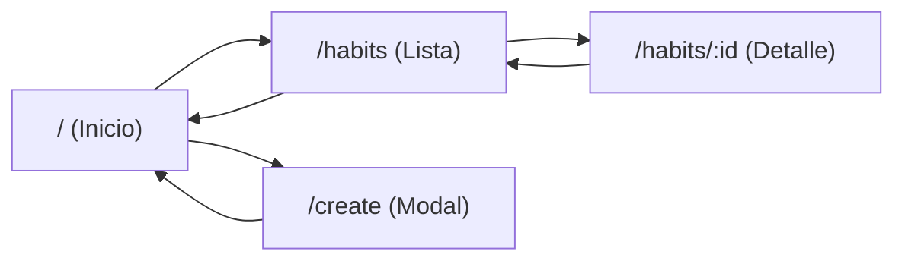

# Tutorial de Expo Router

## Antes de empezar: crear el proyecto

Expo Router es la forma moderna de navegar en React Native con Expo.

```bash
npx create-expo-app@latest habit-tracker
```

El template por defecto de Expo ya incluye Expo Router configurado (carpeta `app/` con `_layout.tsx` e `index.tsx`).

Para habilitar **deep linking** (abrir la app desde un enlace), define un `scheme` en `app.json`:

```json
{
  "expo": {
    "scheme": "habittracker"
  }
}
```

---

## 1. Concepto básico

En Expo Router la **estructura de carpetas = las rutas**.

| Archivo / Carpeta | Ruta que genera |
|---|---|
| `app/index.tsx` | `/` (pantalla de inicio) |
| `app/habits/index.tsx` | `/habits` |
| `app/habits/[id].tsx` | `/habits/123` |
| `app/profile.tsx` | `/profile` |
| `app/(tabs)/_layout.tsx` | Grupo de tabs |

El archivo especial **`_layout.tsx`** define cómo se navega entre las pantallas de esa carpeta (Stack, Tabs, etc.).

---

## 2. Estructura recomendada para tu Habit Tracker

Vamos a crear esta estructura:

```text
app/
├── _layout.tsx              ← Layout raíz (Stack principal)
├── index.tsx                ← Pantalla de inicio (/)
├── habits/
│   ├── index.tsx            ← Lista de hábitos (/habits)
│   └── [id].tsx             ← Detalle de un hábito (/habits/123)
└── create.tsx               ← Crear nuevo hábito (/create)
```

---

## 3. Crear las pantallas paso a paso

### Paso 1: Layout raíz

Crea el archivo `app/_layout.tsx`:

```tsx
import { Stack } from 'expo-router';

export default function RootLayout() {
  return (
    <Stack>
      <Stack.Screen name="index" options={{ title: 'Inicio' }} />
      <Stack.Screen name="habits/index" options={{ title: 'Mis Hábitos' }} />
      <Stack.Screen name="habits/[id]" options={{ title: 'Detalle' }} />
      <Stack.Screen name="create" options={{ title: 'Nuevo Hábito', presentation: 'modal' }} />
    </Stack>
  );
}
```

> `presentation: 'modal'` hace que la pantalla de crear se abra como modal (muy útil).

### Paso 2: Pantalla de inicio (`app/index.tsx`)

```tsx
import { View, Text, StyleSheet, Pressable } from 'react-native';
import { Link } from 'expo-router';

export default function HomeScreen() {
  return (
    <View style={styles.container}>
      <Text style={styles.title}>Habit Tracker</Text>
      <Text style={styles.subtitle}>Construye mejores hábitos</Text>

      <Link href="/habits" asChild>
        <Pressable style={styles.button}>
          <Text style={styles.buttonText}>Ver mis hábitos</Text>
        </Pressable>
      </Link>

      <Link href="/create" asChild>
        <Pressable style={[styles.button, styles.secondaryButton]}>
          <Text style={styles.buttonText}>Crear nuevo hábito</Text>
        </Pressable>
      </Link>
    </View>
  );
}

const styles = StyleSheet.create({
  container: {
    flex: 1,
    justifyContent: 'center',
    alignItems: 'center',
    padding: 24,
    backgroundColor: '#f8fafc',
  },
  title: {
    fontSize: 32,
    fontWeight: 'bold',
    marginBottom: 8,
  },
  subtitle: {
    fontSize: 16,
    color: '#64748b',
    marginBottom: 40,
  },
  button: {
    backgroundColor: '#3b82f6',
    paddingVertical: 14,
    paddingHorizontal: 32,
    borderRadius: 12,
    marginBottom: 16,
    width: '100%',
    alignItems: 'center',
  },
  secondaryButton: {
    backgroundColor: '#10b981',
  },
  buttonText: {
    color: 'white',
    fontSize: 16,
    fontWeight: '600',
  },
});
```

### Paso 3: Lista de hábitos (`app/habits/index.tsx`)

```tsx
import { View, Text, FlatList, Pressable, StyleSheet } from 'react-native';
import { Link } from 'expo-router';

const MOCK_HABITS = [
  { id: '1', name: 'Meditar', streak: 12 },
  { id: '2', name: 'Leer 20 min', streak: 5 },
  { id: '3', name: 'Ejercicio', streak: 8 },
];

export default function HabitsScreen() {
  return (
    <View style={styles.container}>
      <FlatList
        data={MOCK_HABITS}
        keyExtractor={(item) => item.id}
        renderItem={({ item }) => (
          <Link href={`/habits/${item.id}`} asChild>
            <Pressable style={styles.card}>
              <Text style={styles.habitName}>{item.name}</Text>
              <Text style={styles.streak}>{item.streak} días de racha</Text>
            </Pressable>
          </Link>
        )}
      />
    </View>
  );
}

const styles = StyleSheet.create({
  container: {
    flex: 1,
    padding: 16,
    backgroundColor: '#f8fafc',
  },
  card: {
    backgroundColor: 'white',
    padding: 20,
    borderRadius: 12,
    marginBottom: 12,
    elevation: 2,
  },
  habitName: {
    fontSize: 18,
    fontWeight: '600',
  },
  streak: {
    marginTop: 4,
    color: '#64748b',
  },
});
```

### Paso 4: Detalle de hábito (ruta dinámica) — `app/habits/[id].tsx`

```tsx
import { View, Text, StyleSheet } from 'react-native';
import { useLocalSearchParams } from 'expo-router';

export default function HabitDetailScreen() {
  const { id } = useLocalSearchParams<{ id: string }>();

  return (
    <View style={styles.container}>
      <Text style={styles.title}>Detalle del hábito</Text>
      <Text style={styles.id}>ID: {id}</Text>
      <Text style={styles.description}>
        Aquí mostraremos el historial, estadísticas y opciones del hábito.
      </Text>
    </View>
  );
}

const styles = StyleSheet.create({
  container: {
    flex: 1,
    padding: 24,
    backgroundColor: '#f8fafc',
  },
  title: {
    fontSize: 24,
    fontWeight: 'bold',
    marginBottom: 8,
  },
  id: {
    fontSize: 16,
    color: '#64748b',
    marginBottom: 16,
  },
  description: {
    fontSize: 16,
    lineHeight: 24,
  },
});
```

### Paso 5: Crear hábito (`app/create.tsx`)

```tsx
import { View, Text, StyleSheet } from 'react-native';

export default function CreateHabitScreen() {
  return (
    <View style={styles.container}>
      <Text style={styles.title}>Crear nuevo hábito</Text>
      <Text>Aquí irá el formulario</Text>
    </View>
  );
}

const styles = StyleSheet.create({
  container: {
    flex: 1,
    padding: 24,
    backgroundColor: '#f8fafc',
  },
  title: {
    fontSize: 24,
    fontWeight: 'bold',
  },
});
```

---

## 4. Formas de navegar

### Opción 1 — Con `<Link>` (recomendada para botones)

```tsx
<Link href="/habits" asChild>
  <Pressable>...</Pressable>
</Link>
```

### Opción 2 — Programáticamente (con `useRouter`)

```tsx
import { useRouter } from 'expo-router';

const router = useRouter();

// Ir a otra pantalla
router.push('/habits');
router.push(`/habits/${id}`);

// Volver atrás
router.back();

// Reemplazar (no se puede volver)
router.replace('/habits');
```

---

## 5. Referencia rápida del router

| Método | Qué hace |
|---|---|
| `push(href)` | Apila una pantalla (puedes volver atrás) |
| `replace(href)` | Reemplaza la pantalla actual (no se vuelve) |
| `navigate(href)` | Navega a la pantalla; si ya existe en el stack, reutiliza |
| `back()` | Vuelve a la pantalla anterior |
| `dismiss(count?)` | Cierra una o más pantallas del stack (útil en modales) |
| `dismissTo(href)` | Cierra pantallas hasta quedar en una específica |
| `canGoBack()` | Devuelve `true`/`false` si se puede retroceder |
| `setParams(params)` | Actualiza los parámetros de la ruta actual |

---

## 6. Prueba lo que hiciste

1. Guarda todos los archivos.
2. Recarga la app (`r` en la terminal o sacude el teléfono → **Reload**).

Deberías poder:

- Ver la pantalla de inicio
- Ir a la lista de hábitos
- Entrar al detalle de cada hábito
- Abrir el modal de "Crear hábito"

---

## 7. Mapa del flujo

