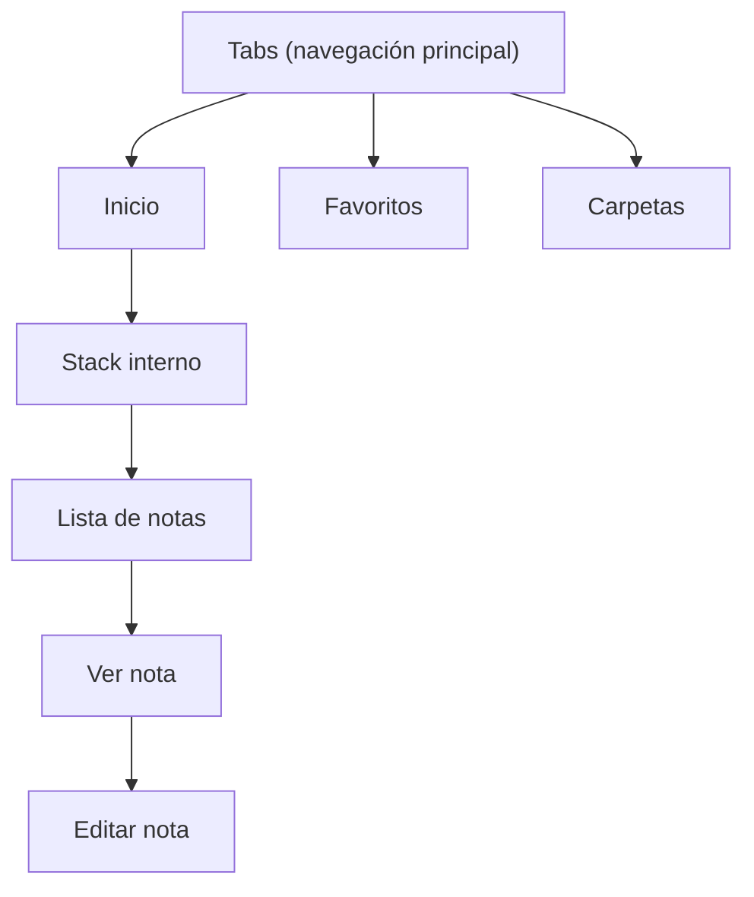

# Stack vs Tabs y rutas por archivos

## 1. ¿Qué es Stack?

Stack es un navegador de tipo pila (como una torre de pantallas).

- Cuando navegas a una nueva pantalla, se apila encima de la anterior.
- Cuando vuelves atrás, se desapila (desaparece la pantalla actual).
- Es el comportamiento clásico de "ir hacia adelante / volver atrás".

Ejemplo mental:

```text
Pantalla Lista de Notas
   └── Pantalla Crear Nota
         └── Pantalla Editar Nota
```

## 2. ¿Qué es Stack.Screen?

Es la forma de configurar cada pantalla dentro del Stack (título, header, animaciones, etc.).

```tsx
<Stack>
  <Stack.Screen name="index" options={{ title: "Mis Notas" }} />
  <Stack.Screen name="nueva" options={{ title: "Nueva Nota", presentation: "modal" }} />
</Stack>
```

## 3. En tu caso actual

Tú no estás usando Stack, estás usando un layout de **Tabs** (pestañas). Tu código actual es típico del template de tabs:

```tsx
<ThemeProvider ...>
  <AnimatedSplashOverlay />
  <AppTabs />   // ← Aquí está el navegador de pestañas
</ThemeProvider>
```

Eso significa que tu navegación principal son pestañas inferiores (como Instagram, WhatsApp, etc.).

## 4. ¿Cuándo usar Stack y cuándo Tabs?

| Tipo | Cuándo usarlo | Ejemplo en tu app de notas |
|---|---|---|
| Tabs | Navegación principal de la app | Inicio / Favoritos / Carpetas |
| Stack | Navegación interna (entrar a detalle) | Lista → Ver nota → Editar nota |

Lo más común en una app de notas es combinar ambos:

```text
Tabs (navegación principal)
  └── Stack (dentro de cada tab)
        └── Pantallas de detalle
```



### Resumen rápido

- **Stack** → navegación de "pantalla encima de pantalla" (con botón de volver).
- **Stack.Screen** → configuración de cada una de esas pantallas.
- Tú actualmente usas **Tabs** (`AppTabs`), que es otra forma de navegación.

## 5. ¿Tiene que ver con las rutas por archivos?

Sí, tiene mucho que ver. Están íntimamente relacionados.

**Expo Router = Rutas por archivos + Navegadores**

Hay dos partes que trabajan juntas:

- **Los archivos** → definen qué rutas existen.
- **Los `_layout.tsx`** → definen cómo se navega entre esas rutas (Stack, Tabs, etc.).

### Ejemplo concreto

Imagina esta estructura de archivos:

```text
app/
├── _layout.tsx          ← Aquí decides si usas Stack o Tabs
├── index.tsx            ← Ruta "/"
├── favoritos.tsx        ← Ruta "/favoritos"
└── nota/
    └── [id].tsx         ← Ruta "/nota/123"
```

- El hecho de que existan los archivos `index.tsx`, `favoritos.tsx` y `nota/[id].tsx` crea las rutas automáticamente.
- Lo que pongas dentro de `_layout.tsx` (si usas `<Stack>` o `<Tabs>`) decide cómo se muestran y se navega entre esas rutas.

### Relación directa

| Concepto | Qué controla | Ejemplo |
|---|---|---|
| Archivos | Qué pantallas / rutas existen | `app/nota/[id].tsx` → `/nota/5` |
| `_layout.tsx` | Cómo se navega entre ellas | Stack, Tabs, Drawer... |
| Stack.Screen | Configuración de cada pantalla | Título, header, animación... |

### En tu código actual

Tú tienes algo parecido a esto:

```tsx
// app/_layout.tsx
<ThemeProvider>
  <AppTabs />   // ← Este componente internamente usa <Tabs>
</ThemeProvider>
```

Eso significa que:

- Las rutas se crean por los archivos que tengas dentro de `app/`.
- El navegador que se está usando es de tipo **Tabs** (pestañas).

Si cambiaras `AppTabs` por un `<Stack>`, seguirías teniendo las mismas rutas (porque los archivos no cambian), pero la forma de navegar entre ellas sería diferente (tipo pila en vez de pestañas).

### Resumen

- **Rutas por archivos** → definen qué pantallas existen.
- **Stack / Tabs / Drawer** → definen cómo se navega entre esas pantallas.
- **Stack.Screen** → te permite configurar cada una de esas pantallas (título, estilo del header, etc.).