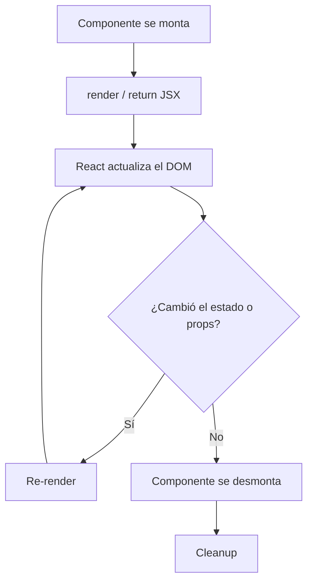

# Ciclo de vida de un componente en React

Todo componente en React pasa por tres fases: **montaje**, **actualización** y **desmontaje**. La forma de manejarlas cambia según uses componentes de clase o funcionales.

## Diagrama general



## Componentes de clase

### Montaje

Se ejecutan una vez al insertar el componente en el DOM:

1. **`constructor(props)`** — Inicializar estado local y bindear métodos
2. **`render()`** — Retorna el JSX
3. **`componentDidMount()`** — Ideal para llamadas API, suscripciones, o manipular el DOM

```jsx
class MiComponente extends React.Component {
  constructor(props) {
    super(props);
    this.state = { data: null };
  }

  componentDidMount() {
    fetch('/api/data')
      .then(res => res.json())
      .then(data => this.setState({ data }));
  }

  render() {
    return <div>{this.state.data}</div>;
  }
}
```

### Actualización

Se ejecutan cuando cambian `props` o `state`:

1. **`shouldComponentUpdate(nextProps, nextState)`** — Optimización: retorna `false` para evitar re-render
2. **`render()`** — Re-renderiza
3. **`componentDidUpdate(prevProps, prevState)`** — Efectos secundarios tras actualizar

```jsx
componentDidUpdate(prevProps) {
  if (this.props.userId !== prevProps.userId) {
    this.fetchUserData(this.props.userId);
  }
}
```

### Desmontaje

1. **`componentWillUnmount()`** — Limpiar suscripciones, timers, listeners

```jsx
componentWillUnmount() {
  clearInterval(this.intervalId);
}
```

## Componentes funcionales (hooks)

Con hooks, el mismo ciclo de vida se controla con `useEffect` y su array de dependencias.

### Montaje (solo al iniciar)

```jsx
useEffect(() => {
  // Equivalente a componentDidMount
  fetch('/api/data').then(...)
}, []); // Array vacío = solo al montar
```

### Actualización (cuando cambian dependencias)

```jsx
useEffect(() => {
  // Equivalente a componentDidUpdate para userId
  fetchUserData(userId);
}, [userId]); // Se ejecuta cuando userId cambia
```

### Desmontaje (cleanup)

```jsx
useEffect(() => {
  const interval = setInterval(() => ...);

  return () => {
    // Equivalente a componentWillUnmount
    clearInterval(interval);
  };
}, []);
```

### Variante: montar + actualizar (sin dependencias)

```jsx
useEffect(() => {
  // Se ejecuta en cada render (montaje y cada actualización)
});
```

## Casos especiales

### `useLayoutEffect`

Similar a `useEffect`, pero se ejecuta **de forma síncrona** después de las mutaciones del DOM pero antes de que el navegador pincele. Útil para medir el DOM o animaciones.

```jsx
useLayoutEffect(() => {
  // Leer layout del DOM antes del pintado
}, []);
```

### `useRef` para ciclo de vida

`useRef` persiste entre renders sin causar re-render. Sirve para detectar si es el primer render:

```jsx
const isFirstRender = useRef(true);

useEffect(() => {
  if (isFirstRender.current) {
    isFirstRender.current = false;
    return;
  }
  // Esto solo se ejecuta en actualizaciones, no en montaje
  console.log('skip first render');
}, [deps]);
```

## StrictMode (React 18+)

En desarrollo, React monta y desmonta el componente dos veces para detectar efectos secundarios. No ocurre en producción.

```jsx
<React.StrictMode>
  <App />
</React.StrictMode>
```

## Errores comunes

| Error | Solución |
|---|---|
| Olvidar el array de dependencias en `useEffect` | Siempre declarar dependencias explícitas |
| No limpiar suscripciones en `useEffect` | Retornar función de cleanup |
| Llamar `setState` en `componentDidUpdate` sin condición | Causa bucle infinito. Siempre comparar props/state previos |
| Usar `useEffect` para cálculo síncrono | Preferir `useMemo` o `useLayoutEffect` si necesitas el DOM |
