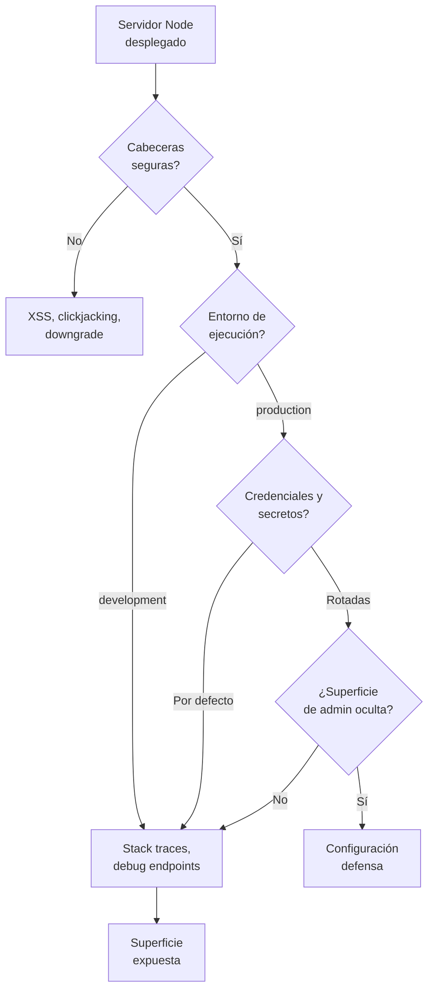

# A02:2025 - Configuración de Seguridad Incorrecta

> **Pertenece a:** OWASP Top 10:2025 · [Volver al índice](README.md)

Esta categoría **subió del #5 en 2021 al #2 en 2025**, el cambio más grande en el ranking. La razón: a medida que más lógica de negocio se configura por código y por variables de entorno, más superficie hay que configurar bien.

Aquí no hay ninguna vulnerabilidad elegante: son valores por defecto que nunca se cambiaron.

## 1. Qué es

Una aplicación mal configurada **funciona**. Los tests pasan. El problema es que funciona con las opciones que el framework, el contenedor o el proveedor de nube dejaron por defecto.

| Ámbito | Ejemplo típico |
|---|---|
| Cabeceras HTTP | Sin CSP, sin HSTS, `X-Powered-By: Express` expuesto |
| Entorno | `NODE_ENV` sin poner, `debug: true` en producción |
| Credenciales | Base de datos con password por defecto, usuario `root` |
| Superficie expuesta | Swagger, health checks, `/debug`, profiler activos |
| Errores | Stack traces completas enviadas al cliente |
| Secretos | `.env` commiteado, secretos en el bundle del frontend |

## Diagrama general



## 2. Ejemplo vulnerable ❌

Un arranque "normal" que en producción se convierte en un problema.

```typescript
// ❌ Vulnerable: todo lo que sale mal, sale al cliente
import express from 'express';
import cors from 'cors';

const app = express();

app.use(cors()); // origin: '*'
app.use(express.json());

app.get('/api/users', async (_req, res) => {
  const users = await db.user.findMany({
    select: { email: true, passwordHash: true }, // hash fuera del select
  });
  res.json(users);
});

app.listen(3000, () => {
  console.log('API listening on 3000');
});
```

Qué falla aquí, punto por punto:

| Línea | Problema | Consecuencia |
|---|---|---|
| `cors()` | Origen abierto para cualquier sitio | Cualquier página puede leer tus respuestas con credenciales |
| Sin `helmet()` | Sin CSP, sin HSTS, sin `X-Content-Type-Options` | XSS y clickjacking sin barreras |
| `passwordHash: true` | Hash de contraseña en la respuesta | Credenciales filtradas al cliente |
| Sin filtro de errores | `res.send(err.stack)` por defecto en dev | Rutas internas, versiones y rutas del servidor |
| Sin rate limit | Sin límite de peticiones | Fuerza bruta sin fricción |

### Errores: el detalle que más se olvida

```typescript
// ❌ El handler por defecto de Express manda el stack en desarrollo
app.get('/api/config', async (_req, res, next) => {
  const cfg = await loadConfig(); // si falla
});

// ✅ Handler global explícito: registro el detalle, devuelvo un código opaco
app.use((err: unknown, req: Request, res: Response, _next: NextFunction) => {
  logger.error({ err, path: req.path }, 'Error no manejado');

  res.status(500).json({
    error: 'Error interno', // nunca err.message ni err.stack
    requestId: req.id,
  });
});
```

> **⚠️ Cuidado:** con `NODE_ENV` sin definir, `app.get('env')` devuelve `'development'` y Express activa el stack trace. Muchos desplieguesAssume production pero nunca exportaron la variable.

## 3. Ejemplo seguro ✅

```typescript
// ✅ Configuración de base explícita
import express from 'express';
import helmet from 'helmet';
import cors from 'cors';
import pino from 'pino';

const logger = pino({ level: process.env.LOG_LEVEL ?? 'info' });

const ALLOWED_ORIGINS = new Set([
  'https://miapp.com',
  'https://app.miapp.com',
]);

const app = express();

// 1. Cabeceras de seguridad
app.use(
  helmet({
    contentSecurityPolicy: {
      directives: {
        defaultSrc: ["'self'"],
        scriptSrc: ["'self'"],
        styleSrc: ["'self'"],
        imgSrc: ["'self'", 'data:'],
        connectSrc: ["'self'", 'https://api.miapp.com'],
        objectSrc: ["'none'"],
        frameAncestors: ["'none'"], // clickjacking
        upgradeInsecureRequests: [],
      },
    },
    hsts: { maxAge: 31_536_000, includeSubDomains: true, preload: true },
    referrerPolicy: { policy: 'strict-origin-when-cross-origin' },
  }),
);

// 2. Sin firmar la tecnología del servidor
app.disable('x-powered-by');

// 3. CORS con allowlist; credenciales solo si la lista es explícita
app.use(
  cors({
    origin(origin, callback) {
      if (!origin || ALLOWED_ORIGINS.has(origin)) return callback(null, true);
      callback(new Error('Origen no permitido por CORS'));
    },
    credentials: true,
    methods: ['GET', 'POST', 'PATCH', 'DELETE'],
  }),
);

// 4. Límite de tamaño del body
app.use(express.json({ limit: '100kb' }));

// 5. Logging estructurado
app.use((req, res, next) => {
  req.id = req.get('x-request-id') ?? randomUUID();
  const start = process.hrtime.bigint();

  res.on('finish', () => {
    logger.info(
      {
        reqId: req.id,
        method: req.method,
        path: req.path,
        status: res.statusCode,
        durationMs: Number(process.hrtime.bigint() - start) / 1e6,
        userId: req.user?.id,
      },
      'request',
    );
  });

  next();
});

// 6. Verificar que el entorno está definido al arrancar
assertEnv('DATABASE_URL');
assertEnv('JWT_SECRET');
assertEnv('NODE_ENV');

function assertEnv(name: string): void {
  if (!process.env[name]) {
    throw new Error(`Falta la variable de entorno ${name}`);
  }
}
```

> **Regla práctica:** arrancar sin configuración válida debe **fallar**, no continuar con defaults. Un `throw` al inicio es mucho mejor que una app que corre con `JWT_SECRET=undefined`.

## 4. En NestJS

```typescript
// src/main.ts
import { NestFactory } from '@nestjs/core';
import { ValidationPipe, VersioningType } from '@nestjs/common';
import helmet from 'helmet';

async function bootstrap() {
  const app = await NestFactory.create(AppModule, {
    // El contenedor no debe filtrar nada por defecto
    logger: ['error', 'warn', 'log'],
  });

  app.use(helmet());
  app.set('trust proxy', 1); // rate limit por IP real detrás de proxy

  app.enableCors({
    origin: [/^https:\/\/[a-z0-9-]+\.miapp\.com$/],
    credentials: true,
    maxAge: 600,
  });

  app.useGlobalPipes(
    new ValidationPipe({ whitelist: true, forbidNonWhitelisted: true, transform: true }),
  );

  // API versionada: /api/v1/...
  app.enableVersioning({ type: VersioningType.URI, defaultVersion: '1' });

  // Graceful shutdown: las peticiones en vuelo terminan
  app.enableShutdownHooks();

  await app.listen(Number(process.env.PORT ?? 3000), '0.0.0.0');
}

void bootstrap();
```

### 4.1 Swagger solo en desarrollo

```typescript
// ⚠️ Swagger expone toda la superficie de la API a quien la abra
if (process.env.NODE_ENV !== 'production') {
  const { DocumentBuilder, SwaggerModule } = await import('@nestjs/swagger');

  const config = new DocumentBuilder()
    .setTitle('Mi API')
    .setVersion('1.0')
    .addBearerAuth()
    .build();

  SwaggerModule.setup('docs', app, SwaggerModule.createDocument(app, config));
}
```

### 4.2 Configuración tipada y validada

```typescript
// src/config/env.ts
import { z } from 'zod';

const EnvSchema = z.object({
  NODE_ENV: z.enum(['development', 'test', 'production']),
  PORT: z.coerce.number().int().positive().default(3000),
  DATABASE_URL: z.string().url(),
  // 32 bytes en base64 = 256 bits
  JWT_SECRET: z.string().min(43),
  CORS_ORIGINS: z.string().transform((v) => v.split(',').map((s) => s.trim())),
  STRIPE_WEBHOOK_SECRET: z.string().min(16),
});

export type Env = z.infer<typeof EnvSchema>;

export const env: Env = EnvSchema.parse(process.env);
```

> **⚠️ Cuidado:** `z.string().min(1)` para un secreto no sirve de nada. Al menos exige una longitud mínima que implique entropía real, y rechaza valores por defecto conocidos.

## 5. Lista de verificación por entorno

| Control | Desarrollo | Producción |
|---|---|---|
| `NODE_ENV` | `development` | `production` (explícito) |
| Secrets | `.env` local, ignorado por git | Gestor de secretos / variables del orquestador |
| Swagger / docs | Habilitado | Deshabilitado o detrás de auth |
| CORS | `localhost:3000` | Allowlist de dominios reales |
| CSP | Relajada para hot reload | Estricta, sin `unsafe-inline` |
| Límite del body | `100kb` | `100kb` o menor |
| Errores | Pretty print | JSON opaco + log interno |
| Base de datos | Local | Sin credenciales por defecto, TLS, red privada |

### Sobre los secretos

```bash
# ❌ Esto no es un gestor de secretos
export DB_PASSWORD="miapp_prod_2024"
echo "DB_PASSWORD=miapp_prod_2024" >> deploy.sh
```

```bash
# ✅ Archivo ignorado por git, en desarrollo
cp .env.example .env
git check-ignore -v .env
```

```bash
# .gitignore
.env
.env.*
!.env.example
*.pem
*.key
```

> **⚠️ Cuidado:** limpiar un secreto del historial de git **no lo revoca**. Si ya se filtró, hay que rotarlo en el proveedor. Considera `git filter-repo` para el historial y la rotación de todas partes.

## 6. Lista de verificación

- [ ] `helmet()` con CSP, HSTS y `frameAncestors` configurados explícitamente
- [ ] `app.disable('x-powered-by')`
- [ ] CORS con allowlist; nunca `origin: true` junto a `credentials: true`
- [ ] `NODE_ENV=production` definido en el despliegue, no asumido
- [ ] ValidationPipe global con `whitelist` y `forbidNonWhitelisted`
- [ ] Handler global de errores que nunca devuelve `err.message` ni `err.stack`
- [ ] Variables de entorno validadas con un esquema al arrancar (fail fast)
- [ ] `.env` en `.gitignore`, y `.env.example` sin valores reales
- [ ] Swagger, profiler y endpoints de debug restringidos a desarrollo
- [ ] Límite de tamaño en `express.json()`
- [ ] `trust proxy` configurado si hay balanceador delante (afecta al rate limit)
- [ ] Contenedor corriendo como usuario no root, con filesystem de solo lectura
- [ ] Puertos de administración no expuestos en producción (health checks con auth)

## Tarjetas de pregunta y respuesta

<div class="qa-card">
  <span class="qa-tag qa-tag-q">Pregunta</span>
  <div class="qa-q"><p>La app corre en producción y sigue mandando stack traces al cliente. ¿Qué variable te faltó poner?</p></div>
  <div class="qa-a">
    <span class="qa-tag qa-tag-a">Respuesta</span>
    <p><code>NODE_ENV</code>. Express usa <code>app.get('env')</code> para decidir si manda el stack, y por defecto vale <code>'development'</code>. Mucha gente asume que el orquestador lo pone en producción; casi nunca lo hace. Fíjalo explícitamente y valida el arranque.</p>
  </div>
</div>

<div class="qa-card">
  <span class="qa-tag qa-tag-q">Pregunta</span>
  <div class="qa-q"><p>¿Para qué sirve una CSP si ya escapo todos los valores en React?</p></div>
  <div class="qa-a">
    <span class="qa-tag qa-tag-a">Respuesta</span>
    <p>Es la segunda línea de defensa, y hay casos donde el escape no aplica: un <code>dangerouslySetInnerHTML</code> accidental, una librería de terceros que escribe en el DOM, un JSON embebido con <code>application/json</code>. La CSP con un nonce estricto es lo que impide que ese punto se convierta en un XSS real.</p>
  </div>
</div>

<div class="qa-card">
  <span class="qa-tag qa-tag-q">Pregunta</span>
  <div class="qa-q"><p>¿Cuál es el problema de <code>origin: '*'</code> con <code>credentials: true</code>?</p></div>
  <div class="qa-a">
    <span class="qa-tag qa-tag-a">Respuesta</span>
    <p>Es contradictorio y el navegador lo rechaza: las cookies solo se envían a un origen específico, nunca a <code>*</code>. Si tu error es "no me llegan las cookies", probablemente pasaste <code>origin: true</code> pensando que era equivalente a la lista. No lo es: <code>origin: true</code> refleja el origen del request en la respuesta.</p>
  </div>
</div>

<div class="qa-card">
  <span class="qa-tag qa-tag-q">Pregunta</span>
  <div class="qa-q"><p>Borré el secreto de <code>.env</code> del repositorio. ¿Ya estoy seguro?</p></div>
  <div class="qa-a">
    <span class="qa-tag qa-tag-a">Respuesta</span>
    <p>No. Sigue en el historial de git y cualquiera con un clon lo puede leer. Tienes que <em>rotar</em> el secreto en el proveedor, y opcionalmente limpiar el historial con <code>git filter-repo</code>. En el orden correcto: rotar primero, limpiar después.</p>
  </div>
</div>

<div class="qa-card">
  <span class="qa-tag qa-tag-q">Pregunta</span>
  <div class="qa-q"><p>¿Por qué <code>trust proxy</code> afecta a la seguridad y no solo al rendimiento?</p></div>
  <div class="qa-a">
    <span class="qa-tag qa-tag-a">Respuesta</span>
    <p>Porque el rate limit por IP usa <code>req.ip</code>. Sin <code>trust proxy</code>, todas las peticiones parecen venir de la IP del balanceador y el límite se agota para todos a la vez. Con un valor incorrecto, un atacante puede además falsificar su IP con la cabecera <code>X-Forwarded-For</code>.</p>
  </div>
</div>

<div class="qa-card">
  <span class="qa-tag qa-tag-q">Pregunta</span>
  <div class="qa-q"><p>¿Swagger en producción es un problema real o solo ruido del escáner?</p></div>
  <div class="qa-a">
    <span class="qa-tag qa-tag-a">Respuesta</span>
    <p>Es un problema real: documenta la superficie completa de tu API, incluidos endpoints que quizá no quieras exponer. Cualquiera puede probarlos sin autenticación previa. Si lo necesitas, ponlo detrás de auth y de allowlist de IP.</p>
  </div>
</div>

<div class="qa-card">
  <span class="qa-tag qa-tag-q">Pregunta</span>
  <div class="qa-q"><p>¿Cómo sé si mi configuración está mal antes de que me ataquen?</p></div>
  <div class="qa-a">
    <span class="qa-tag qa-tag-a">Respuesta</span>
    <p>Con una prueba de cabeceras. Revisa <code>curl -I https://miapp.com</code> y <a href="https://securityheaders.com" target="_blank" rel="noopener">securityheaders.com</a> para CSP, HSTS y HPKP. En el arranque, añade un test que falle si falta alguna cabecera obligatoria, para que no se pierda en un refactor.</p>
  </div>
</div>

---

> **Siguiente tema:** [A03: Fallas en la Cadena de Suministro de Software](03-cadena-de-suministro-de-software.md)
