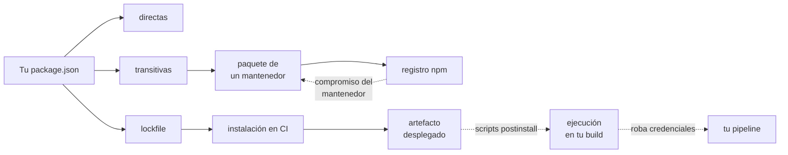

# A03:2025 - Fallas en la Cadena de Suministro de Software

> **Pertenece a:** OWASP Top 10:2025 · [Volver al índice](README.md)

**Categoría nueva en la edición 2025.** Antes (A06:2021) se llamaba "Componentes Vulnerables y Desactualizados" y se limitaba a las métricas de un `package.json`. Ahora el alcance es toda la cadena: tus dependencias, las de tus dependencias, los mantenedores, el registro, el sistema de build y el artefacto que sale de CI.

Fue la categoría más votada en la encuesta de la comunidad, por encima de cualquier otra.

## 1. Qué es

La idea central: **tú no escribiste el código vulnerable, pero lo despliegas y eres responsable de él**.



Los vectores más comunes en un proyecto Node/TypeScript:

| Vector | Qué pasa |
|---|---|
| **Dependencia transitiva vulnerable** | Heredas un CVE que no está en tu `package.json` directo |
| **Confusión de paquetes** | Un nombre parecido (`lodahs`, `crossenv`) se instala por error tipográfico |
| **Mantenedor comprometido** | Publican una versión con malware; `npm install` la instala |
| **Script de instalación** | Un `postinstall` ejecuta código arbitrario en tu máquina y en CI |
| **Lockfile no commiteado** | Cada instalación resuelve versiones distintas: tu build no es reproducible |
| **Ausencia de parches** | Vulnerabilidad publicada y nadie mira `npm audit` |
| **CI sin verificar** | El pipeline instala y ejecuta lo que sea sin `npm ci` ni revisión |

## 2. Ejemplo vulnerable ❌

```json
{
  "name": "mi-api",
  "scripts": {
    "start": "node dist/main.js",
    "build": "tsc -p tsconfig.build.json",
    "postinstall": "node scripts/setup.js"
  },
  "dependencies": {
    "express": "^4.18.2",
    "lodash": "^4.17.20",
    "logger": "^1.0.0"
  }
}
```

Problemas, sin ninguna vulnerabilidad de por medio todavía:

| Problema | Consecuencia |
|---|---|
| `"logger": "^1.0.0"` | PosibleDependency confusion: si existe un paquete público llamado `logger` sin scope, npm lo puede resolver |
| Sin `package-lock.json` en el repo | Cada instalación trae versiones distintas |
| `postinstall` propio | Nadie audita ese script, y es un punto de ejecución automática |
| `lodash ^4.17.20` | Rango abierto: cualquier 4.x entra, incluidas versiones con CVE |

### La cadena de confianza rota

```bash
# ❌ Sin lockfile: npm resuelve "lo último que haya" para cada versión
npm install
# lodash resuelto a 4.17.21 en tu máquina
# lodash resuelto a 4.17.16 (con CVE) en CI, hace tres meses

# ❌ Instalar por rangos sin audit
npm install express@latest
npm audit   # se ejecuta... y se ignora
```

```bash
# ✅ Instalación reproducible y auditada
npm ci --omit=dev          # usa el lockfile, falla si no coincide
npm audit --audit-level=high
npm run build
```

> `npm ci` en lugar de `npm install` es la diferencia entre "despliego lo que está en el lockfile" y "despliego lo que npm decida hoy". Además es más rápido y no reescribe el lockfile.

## 3. Ejemplo seguro ✅

### 3.1 Lockfile y scripts

```json
{
  "name": "mi-api",
  "private": true,
  "packageManager": "npm@10.9.2",
  "engines": {
    "node": ">=20.11.0"
  },
  "scripts": {
    "build": "tsc -p tsconfig.build.json",
    "start": "node dist/main.js",
    "audit:ci": "npm audit --audit-level=high --omit=dev",
    "test": "node --test"
  },
  "dependencies": {
    "express": "4.21.2",
    "pino": "9.5.0"
  },
  "overrides": {
    "lodash": "4.17.21"
  }
}
```

| Campo | Para qué sirve |
|---|---|
| Versiones **exactas** (sin `^`) | Reproducibilidad; el lockfile deja de ser la única barrera |
| `"private": true` | Evita publicar el paquete por accidente |
| `packageManager` | Fija la versión de npm (con `corepack`) |
| `engines.node` | Declara la versión mínima de Node |
| `overrides` | Fuerza una versión transitiva sin esperar a que el padre actualice |

### 3.2 No permitir scripts de instalación

```ini
# .npmrc
ignore-scripts=true
audit=true
fund=false
```

```bash
# Instalación sin ejecutar nada del paquete
npm ci --ignore-scripts
```

> **⚠️ Cuidado:** hay paquetes legítimos que dependen de scripts de instalación (compilación nativa, generación de binarios). Si los necesitas, instálalos de forma explícita en un paso aparte, con el paquete ya identificado en el lockfile. No actives scripts globalmente para "que funcione".

### 3.3 Auditoría en CI

```yaml
# .github/workflows/ci.yml
name: CI
on:
  push:
    branches: [main]
  pull_request:

permissions:
  contents: read # mínimo privilegio: solo lectura

jobs:
  audit:
    runs-on: ubuntu-latest
    steps:
      - uses: actions/checkout@11bd71901bbe5b1630ceea73d27597364c9af683 # pin por SHA
      - uses: actions/setup-node@1e60f620b9541d... # pin por SHA
        with:
          node-version: 20
          cache: npm
      - run: npm ci --ignore-scripts
      - run: npm audit --audit-level=high --omit=dev
      - name: Falla si hay vulnerabilidades altas o críticas
        run: npx --yes audit-ci@6 --level high --omit dev
```

| Práctica | Por qué |
|---|---|
| Acciones pinneadas por **SHA** | Una etiqueta `@v4` puede apuntar a un commit distinto con código malicioso |
| `permissions: contents: read` | Reduce el daño si un job queda comprometido |
| `--omit=dev` | Las devDependencies no llegan a producción; no deben bloquear el pipeline |
| `--ignore-scripts` | Nada de lo instalado ejecuta código en el runner |

### 3.4 Actualizaciones automáticas

```yaml
# .github/dependabot.yml
version: 2
updates:
  - package-ecosystem: npm
    directory: /
    schedule:
      interval: weekly
    open-pull-requests-limit: 10
    groups:
      # Un PR para las devDependencies: son menos críticas
      dev-dependencies:
        dependency-type: development
    ignore:
      # Si un paquete está realmente abandonado, agrupar no ayuda
      - dependency-name: vulnerable-pkg

  - package-ecosystem: github-actions
    directory: /
    schedule:
      interval: monthly
```

```ini
# .npmrc — nunca actualizar sin querer
save-exact=true
```

### 3.5 Detectar confusiones de paquetes

```typescript
// scripts/check-package-names.ts
// Regla: nunca depender de un paquete sin scope (@org/...) en producción
import { readFileSync } from 'node:fs';

interface PackageJson {
  dependencies?: Record<string, string>;
}

const pkg = JSON.parse(readFileSync('package.json', 'utf8')) as PackageJson;

const unscoped = Object.keys(pkg.dependencies ?? {}).filter(
  (name) => !name.startsWith('@'),
);

if (unscoped.length > 0) {
  console.error('Dependencias sin scope (riesgo de confusión):');
  unscoped.forEach((name) => console.error(`  - ${name}`));
  process.exit(1);
}
```

## 4. En NestJS

Los microservicios de NestJS amplían la superficie: cada paquete publicado es un punto de entrada.

```typescript
// Un paquete interno vulnerable llega a producción
import { Injectable } from '@nestjs/common';
import { parse } from 'some-legacy-parser'; // CVE sin parche disponible

@Injectable()
export class CsvService {
  parse(input: string) {
    // ❌ Sin parche upstream: el CVE vive en tu app
    return parse(input);
  }
}
```

Salidas posibles cuando no hay parche upstream:

| Estrategia | Cuándo |
|---|---|
| `overrides` con un fork parcheado | El paquete es parcheable con un diff pequeño |
| Reemplazar la dependencia | El paquete está abandonado o es grande |
| Vendorizar el código en tu repo | Dependencia pequeña, estable y crítica |
| Aislar el proceso | Cuando no puedes evitar la dependencia (proceso separado, sin red) |

```json
{
  "overrides": {
    "some-legacy-parser": "npm:@mi-org/some-legacy-parser-parcheado@1.0.3"
  }
}
```

> **Regla práctica:** toda dependencia directa debe tener un motivo. Mantén un `DEPENDENCIES.md` con una línea por paquete: para qué sirve, quién lo mantiene, y qué pasa si desaparece.

## Lista de verificación

- [ ] `package-lock.json` commiteado y revisado en cada cambio
- [ ] `npm ci --ignore-scripts` en CI y en el Dockerfile
- [ ] Versiones exactas en `package.json` (sin `^`) para dependencias críticas
- [ ] `npm audit --audit-level=high` bloquea el pipeline
- [ ] `overrides` para los transitivos que no puedes esperar a actualizar
- [ ] `.npmrc` con `ignore-scripts=true` y `save-exact=true`
- [ ] Dependabot o Renovate configurado para `npm` y `github-actions`
- [ ] Acciones de GitHub pinneadas por SHA, con `permissions:` mínimos
- [ ] Revisión de todo script `postinstall` / `prepare` antes de aprobarlo
- [ ] `private: true` en el `package.json` de la aplicación
- [ ] Dependencias de producción sin scope evitadas o justificadas
- [ ] Registro de fuentes oficiales o mirror confiable configurado

## Tarjetas de pregunta y respuesta

<div class="qa-card">
  <span class="qa-tag qa-tag-q">Pregunta</span>
  <div class="qa-q"><p>¿Cuál es la diferencia entre <code>npm install</code> y <code>npm ci</code> en materia de seguridad?</p></div>
  <div class="qa-a">
    <span class="qa-tag qa-tag-a">Respuesta</span>
    <p><code>npm install</code> puede resolver versiones nuevas y reescribir el lockfile: lo que despliegas depende del día. <code>npm ci</code> instala exactamente lo del lockfile y falla si hay discrepancia, así que el artefacto es reproducible y auditable. En CI, siempre <code>npm ci</code>.</p>
  </div>
</div>

<div class="qa-card">
  <span class="qa-tag qa-tag-q">Pregunta</span>
  <div class="qa-q"><p>El CVE está en una dependencia transitiva que no aparece en mi <code>package.json</code>. ¿Estoy afectado?</p></div>
  <div class="qa-a">
    <span class="qa-tag qa-tag-a">Respuesta</span>
    <p>Sí. Eso es precisamente lo que la categoría 2025 amplió: el riesgo ya no es solo tu lista directa. <code>npm audit</code> lo detecta, y <code>npm ls &lt;paquete&gt;</code> te muestra de dónde viene. La salida es <code>overrides</code> en el <code>package.json</code> para fijar la versión transitiva sin esperar al mantenedor del padre.</p>
  </div>
</div>

<div class="qa-card">
  <span class="qa-tag qa-tag-q">Pregunta</span>
  <div class="qa-q"><p>¿Por qué instalar con <code>--ignore-scripts</code>?</p></div>
  <div class="qa-a">
    <span class="qa-tag qa-tag-a">Respuesta</span>
    <p>Porque un <code>postinstall</code> es código arbitrario que se ejecuta automáticamente en tu máquina y en el runner de CI, sin revisión. Es el vector más directo para robar variables de entorno. Si un paquete legítimo lo necesita, hazlo en un paso posterior y explícito.</p>
  </div>
</div>

<div class="qa-card">
  <span class="qa-tag qa-tag-q">Pregunta</span>
  <div class="qa-q"><p>¿Qué es la confusión de paquetes (dependency confusion)?</p></div>
  <div class="qa-a">
    <span class="qa-tag qa-tag-a">Respuesta</span>
    <p>Publicas <code>@mi-org/utils</code> en tu registro privado, pero el paquete público <code>utils</code> existe y tiene más versiones. Un <code>npm install utils</code> mal escrito puede terminar trayendo el público. Se evita usando siempre scope (<code>@mi-org/utils</code>) y fijando el registro con <code>publishConfig</code> y un <code>.npmrc</code> por proyecto.</p>
  </div>
</div>

<div class="qa-card">
  <span class="qa-tag qa-tag-q">Pregunta</span>
  <div class="qa-q"><p>¿Por qué pinear las GitHub Actions por SHA y no por etiqueta?</p></div>
  <div class="qa-a">
    <span class="qa-tag qa-tag-a">Respuesta</span>
    <p>Porque una etiqueta es mutable: quien controla el repositorio de la acción puede reescribir <code>v4</code> para apuntar a código malicioso, y tu workflow lo ejecuta sin que cambie tu repositorio. El SHA fija el commit exacto. La etiqueta se actualiza a mano cuando revisas el diff.</p>
  </div>
</div>

<div class="qa-card">
  <span class="qa-tag qa-tag-q">Pregunta</span>
  <div class="qa-q"><p>Mi <code>npm audit</code> falla por algo en <code>devDependencies</code>. ¿Bloqueo el pipeline?</p></div>
  <div class="qa-a">
    <span class="qa-tag qa-tag-a">Respuesta</span>
    <p>Usa <code>--omit=dev</code> para el pipeline de producción: las devDependencies no llegan al artefacto desplegado, así que no deben bloquear un release, aunque sí conviene revisarlas. Distingue también entre <code>audit</code> (informativo) y <code>audit-ci</code> (con exit code para CI).</p>
  </div>
</div>

<div class="qa-card">
  <span class="qa-tag qa-tag-q">Pregunta</span>
  <div class="qa-q"><p>¿Qué hago si la dependencia crítica no tiene parche?</p></div>
  <div class="qa-a">
    <span class="qa-tag qa-tag-a">Respuesta</span>
    <p>Tienes cuatro salidas, en orden de preferencia: <code>overrides</code> a un fork parcheado, reemplazar la dependencia, vendorizar el código si es pequeño y estable, o aislar el proceso sin red si no puedes evitarlo. Lo que no es una salida es "lo dejamos así porque en nuestro caso no pasa nada".</p>
  </div>
</div>

<div class="qa-card">
  <span class="qa-tag qa-tag-q">Pregunta</span>
  <div class="qa-q"><p>¿Qué cambió de A06:2021 a A03:2025?</p></div>
  <div class="qa-a">
    <span class="qa-tag qa-tag-a">Respuesta</span>
    <p>El alcance. En 2021 era "dependencias con vulnerabilidad conocida". En 2025 es el ecosistema completo: registros, mantenedores comprometidos, sistemas de build, artefactos y distribución. Por eso fue la más votada: los incidentes más recientes (ataques a cadenas de suministro) ya no ocurren por un CVE en una librería popular, sino por un eslabón del proceso.</p>
  </div>
</div>

---

> **Siguiente tema:** [A04: Fallas Criptográficas](04-fallas-criptograficas.md)