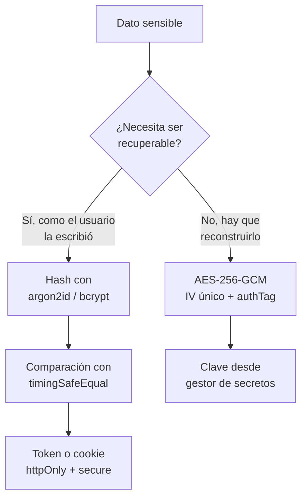

# A04:2025 - Fallas Criptográficas

> **Pertenece a:** OWASP Top 10:2025 · [Volver al índice](README.md)

Bajo del **#2 (2021) al #4 (2025)** en el ranking, pero el ranking mide frecuencia, no impacto. Sigue siendo una de las categorías con mayor consecuencia: exposición de datos sensibles o compromiso total del sistema.

## 1. Qué es

En una aplicación Node/TypeScript esto se manifiesta en cuatro sitios concretos:

| Dónde | Qué falla | Ejemplo |
|---|---|---|
| **En tránsito** | TLS ausente, mal configurado o con TLS 1.0/1.1 | Base de datos sin `sslmode=require` |
| **En reposo** | Datos sensibles en claro, o cifrado débil | Backup de contraseñas sin cifrar |
| **Hashing** | Usar cifrado reversible para contraseñas | `md5(password)` |
| **Aleatoriedad** | `Math.random()` para material criptográfico | `Math.random()` como token de sesión |

> **Regla práctica:** si algo tiene que ser **reversible**, es cifrado. Si solo tiene que ser **irreversible y difícil de adivinar**, es un hash. Una contraseña nunca se cifra: se deriva.

## Diagrama general



## 2. Ejemplo vulnerable ❌

### 2.1 Aleatoriedad

```typescript
// ❌ Math.random no es criptográficamente seguro
function generateResetToken(): string {
  return Math.random().toString(36).slice(2);
}

function generateApiKey(): string {
  return Math.random().toString(36).slice(2);
}
```

`Math.random()` usa un PRNG de 128 bits con estado interno. Con suficientes salidas **consecutivas**, se puede reconstruir el estado y predecir las siguientes. Para un token de reseteo de contraseña, eso significa que el atacante predice el enlace del siguiente usuario.

### 2.2 Hashing de contraseñas

```typescript
// ❌ MD5 y SHA son para integridad, no para contraseñas
import { createHash } from 'node:crypto';

const stored = createHash('md5').update(password).digest('hex'); // se rompe en segundos
const stored2 = createHash('sha256').update(password).digest('hex'); // con GPU: miles/s
```

Sin sal, un atacante con una tabla precalculada (rainbow table) revierte millones de contraseñas por segundo. Sin factor de trabajo, un SHA por segundo no cuesta nada.

### 2.3 Cifrado

```typescript
// ❌ ECB: bloques de 16 bytes cifrados por separado
// Patrón repetido visible: los bloques iguales producen bloques iguales
const cipher = createCipheriv('aes-256-ecb', key, null);

// ❌ IV fijo o derivado del timestamp: se puede For predictable
const iv = Buffer.from('1234567890123456');
```

### 2.4 Secretos en el sitio equivocado

```typescript
// ❌ El frontend es público
export const STRIPE_SECRET_KEY = 'sk_live_abc123'; // en bundle de Vite

// ❌ Loguear el cuerpo de la petición en un endpoint de login
logger.info({ body: req.body }, 'petición recibida');
// → [{ email, password: 'hunter2' }]
```

## 3. Ejemplo seguro ✅

### 3.1 Aleatoriedad criptográfica

```typescript
// ✅ node:crypto
import { randomBytes, randomUUID, timingSafeEqual, createHash } from 'node:crypto';

function generateResetToken(): string {
  return randomBytes(32).toString('base64url'); // 256 bits de entropía
}

function generateSessionId(): string {
  return randomUUID(); // v4: 122 bits, suficiente para IDs de sesión
}

function generateApiKey(): string {
  // prefijo legible + 32 bytes aleatorios
  return `sk_${randomBytes(32).toString('base64url')}`;
}
```

### 3.2 Hashing de contraseñas

```typescript
// ✅ argon2id: resistente a memoria y a ataques con GPU
import * as argon2 from '@node-rs/argon2';

const OPTIONS: argon2.Options = {
  memoryCost: 19_456, // KiB → ~19 MiB por hash
  timeCost: 2,
  parallelism: 1,
};

// Verificar
export async function hashPassword(plain: string): Promise<string> {
  return argon2.hash(plain, OPTIONS);
}

export async function verifyPassword(
  hashed: string,
  plain: string,
): Promise<boolean> {
  try {
    return await argon2.verify(hashed, plain, OPTIONS);
  } catch {
    // El hash no existe o está corrupto: no es un match
    return false;
  }
}
```

| Algoritmo | Estado | Comentario |
|---|---|---|
| **argon2id** | Preferido | Ganador del Password Hashing Competition; resistente a memoria y a GPU |
| **scrypt** | Buena | Nativo en Node vía `crypto.scrypt`, sin dependencia |
| **bcrypt** | Aceptable | Muy extendido, pero usa CPU y trunca a 72 bytes |
| **PBKDF2** | Solo FIPS | Para entornos que exigen PBKDF2 (NIST SP 800-132) |
| MD5 / SHA-1 / SHA-256 | Prohibido | Demasiado rápidos, sin factor de trabajo |

### scrypt nativo de Node (sin dependencias)

```typescript
import { scrypt, randomBytes, timingSafeEqual } from 'node:crypto';
import { promisify } from 'node:util';

const scryptAsync = promisify(scrypt);
const KEYLEN = 64;
const COST = 2 ** 15; // ~32 MiB
const BLOCK_SIZE = 8;
const PARALLELIZATION = 1;

export async function hashPassword(password: string): Promise<string> {
  const salt = randomBytes(16);
  const derived = (await scryptAsync(password.normalize('NFKC'), salt, KEYLEN, {
    N: COST,
    r: BLOCK_SIZE,
    p: PARALLELIZATION,
    maxmem: 256 * 1024 * 1024,
  })) as Buffer;

  // Formato: N$r$p$salt$hash — auto-contiene los parámetros
  return ['scrypt', COST, BLOCK_SIZE, PARALLELIZATION, salt, derived]
    .map(String)
    .join('$');
}

export async function verifyPassword(
  stored: string,
  password: string,
): Promise<boolean> {
  const [scheme, N, r, p, saltB64, hashB64] = stored.split('$');
  if (scheme !== 'scrypt') return false;

  const expected = Buffer.from(hashB64, 'base64');
  const derived = (await scryptAsync(password.normalize('NFKC'), Buffer.from(saltB64, 'base64'), expected.length, {
    N: Number(N),
    r: Number(r),
    p: Number(p),
    maxmem: 256 * 1024 * 1024,
  })) as Buffer;

  return timingSafeEqual(derived, expected);
}
```

> **Importante:** guarda N, r y p junto al hash. Los parámetros de coste van a subir con el hardware, y si solo guardas el hash no puedes verificar contra los parámetros nuevos. El formato `$` de arriba lo resuelve.

### 3.3 Cifrado autenticado (AES-256-GCM)

```typescript
// ✅ AES-256-GCM: IV aleatorio de 12 bytes + authentication tag
import { createCipheriv, createDecipheriv, randomBytes } from 'node:crypto';

const ALGORITHM = 'aes-256-gcm';
const IV_BYTES = 12; // tamaño recomendado por NIST para GCM
const KEY_BYTES = 32;

export function encrypt(plaintext: string, key: Buffer): string {
  const iv = randomBytes(IV_BYTES); // NUNCA reutilizar el IV
  const cipher = createCipheriv(ALGORITHM, key, iv, { authTagLength: 16 });

  const ciphertext = Buffer.concat([cipher.update(plaintext, 'utf8'), cipher.final()]);
  const authTag = cipher.getAuthTag();

  // IV + tag + ciphertext, todo en base64
  return Buffer.concat([iv, authTag, ciphertext]).toString('base64');
}

export function decrypt(payload: string, key: Buffer): string {
  const buffer = Buffer.from(payload, 'base64');
  const iv = buffer.subarray(0, IV_BYTES);
  const authTag = buffer.subarray(IV_BYTES, IV_BYTES + 16);
  const ciphertext = buffer.subarray(IV_BYTES + 16);

  const decipher = createDecipheriv(ALGORITHM, key, iv, { authTagLength: 16 });
  decipher.setAuthTag(authTag); // si el dato fue alterado, lanza

  return Buffer.concat([decipher.update(ciphertext), decipher.final()]).toString('utf8');
}
```

> **⚠️ Cuidado:** en GCM **reutilizar el IV con la misma clave rompe el cifrado por completo** y además permite recuperar el XOR de los textos claros. Si necesitas muchos cifrados con una clave, deriva un IV determinista con HKDF y un contador, nunca con `Math.random()`.

### 3.4 Comparación en tiempo constante

```typescript
// ❌ El tiempo de ejecución revela cuántos caracteres coinciden
function compare(a: string, b: string): boolean {
  return a === b;
}

// ✅ Compare las longitudes sin filtrar por early return
export function safeCompare(a: string, b: string): boolean {
  const bufA = createHash('sha256').update(a).digest();
  const bufB = createHash('sha256').update(b).digest();
  // Hash a 32 bytes: siempre la misma longitud, sin ramificación
  return timingSafeEqual(bufA, bufB);
}
```

Hashear antes de comparar resuelve dos problemas a la vez: neutraliza la diferencia de longitud y permite comparar cualquier tipo de valor.

### 3.5 Cookies de sesión

```typescript
// ✅ Flags correctos
res.cookie('session', token, {
  httpOnly: true, // inaccesible desde JavaScript → mitiga XSS
  secure: true, // solo por HTTPS
  sameSite: 'lax', // 'strict' si no necesitas enlaces externos
  maxAge: 1000 * 60 * 60 * 8,
  path: '/',
});
```

| Flag | Sin él |
|---|---|
| `httpOnly` | `document.cookie` lee el token; cualquier XSS se lo lleva |
| `secure` | El token viaja en claro por HTTP |
| `sameSite` | CSRF (ver [A01](01-control-de-acceso.md)) |

### 3.6 Redacción en los logs

```typescript
// ✅ Lista explícita de qué se puede loguear
import pino from 'pino';

const logger = pino({
  redact: {
    paths: [
      'req.headers.authorization',
      'req.headers.cookie',
      'req.headers["x-api-key"]',
      'body.password',
      'body.token',
      'body.cardNumber',
      'body.cvv',
    ],
    censor: '[REDACTED]',
  },
});
```

```typescript
// ✅ Better: no loguear el cuerpo entero, loguear campos explícitos
logger.info(
  {
    userId: req.user.id,
    ip: req.ip,
    userAgent: req.get('user-agent'),
    fields: Object.keys(req.body), // qué campos vinieron, no sus valores
  },
  'update profile',
);
```

## 4. En NestJS

```typescript
// src/users/users.service.ts
@Injectable()
export class UsersService {
  private readonly keyCache = new Map<string, Buffer>();

  constructor(
    @Inject('KMS_KEY') private readonly kms: KeyProvider,
    private readonly logger: PinoLogger,
  ) {}

  async encryptSsn(userId: string, ssn: string): Promise<void> {
    const key = await this.getKey(userId);
    this.logger.info({ userId }, 'ssn cifrado'); // solo el id, nunca el valor
    await this.repo.update({ where: { id: userId }, data: { ssnEnc: encrypt(ssn, key) } });
  }

  private async getKey(context: string): Promise<Buffer> {
    if (this.keyCache.has(context)) return this.keyCache.get(context)!;

    // La clave vive en el KMS, nunca en el código ni en env plano
    const key = await this.kms.dataKey({ purpose: 'pii-encryption', context });
    this.keyCache.set(context, key);
    return key;
  }
}
```

### Configuración TLS de la base de datos

```typescript
// ❌ La conexión va sin cifrar
const pool = new Pool({ connectionString: process.env.DATABASE_URL });

// ✅ TLS verificado con la CA del proveedor
const pool = new Pool({
  connectionString: process.env.DATABASE_URL,
  ssl: {
    rejectUnauthorized: true, // nunca false en producción
    ca: readFileSync('/etc/ssl/certs/rds-ca.pem', 'utf8'),
  },
  max: 10, // pool acotado
  connectionTimeoutMillis: 5_000, // fail fast
  idleTimeoutMillis: 30_000,
});
```

## 5. Lista de verificación

- [ ] Ningún token, IV, salt o clave generado con `Math.random()`
- [ ] Contraseñas con argon2id, scrypt o bcrypt, con sal por usuario
- [ ] Parámetros de coste guardados junto al hash (para poder subirlos después)
- [ ] Ningún MD5, SHA-1 ni SHA-256 "simple" sobre contraseñas
- [ ] Cifrado autenticado (AES-256-GCM o ChaCha20-Poly1305), nunca ECB
- [ ] IV aleatorio y único por operación en GCM
- [ ] Comparaciones de secretos con `timingSafeEqual`
- [ ] Claves desde gestor de secretos o KMS, nunca en el repo ni en el bundle
- [ ] Cookies de sesión con `httpOnly`, `secure` y `sameSite`
- [ ] Redis de sesiones configurado con TLS y contraseña
- [ ] TLS 1.2+ en balanceador y base de datos, con CA verificada
- [ ] `redact` configurado en el logger para credenciales y PII
- [ ] HTTPS forzado con HSTS (ver [A02](02-configuracion-de-seguridad.md))

## Tarjetas de pregunta y respuesta

<div class="qa-card">
  <span class="qa-tag qa-tag-q">Pregunta</span>
  <div class="qa-q"><p>¿Cuál es la diferencia entre cifrar una contraseña y hashearla?</p></div>
  <div class="qa-a">
    <span class="qa-tag qa-tag-a">Respuesta</span>
    <p>Cifrar es reversible: cualquiera con la clave recupera el original. Hash es unidireccional: solo verificas comparando. Para autenticación necesitas hashear, porque nunca debes poder recuperar la contraseña del usuario. Si la necesitas recuperar (un backup cifrado), entonces sí es cifrado.</p>
  </div>
</div>

<div class="qa-card">
  <span class="qa-tag qa-tag-q">Pregunta</span>
  <div class="qa-q"><p>Si un atacante encuentra mi base de datos con hashes SHA-256 y sal, ¿está a salvo?</p></div>
  <div class="qa-a">
    <span class="qa-tag qa-tag-a">Respuesta</span>
    <p>La sal impide tablas precalculadas, pero SHA-256 sigue siendo tan rápido que una GPU hace miles de millones por segundo. Sin un factor de trabajo deliberadamente caro, "proteger" la contraseña solo retrasa el ataque unas horas. Usa argon2id, scrypt o bcrypt, que están diseñados para ser lentos a propósito.</p>
  </div>
</div>

<div class="qa-card">
  <span class="qa-tag qa-tag-q">Pregunta</span>
  <div class="qa-q"><p>¿Por qué <code>Math.random()</code> no sirve para un token de sesión?</p></div>
  <div class="qa-a">
    <span class="qa-tag qa-tag-a">Respuesta</span>
    <p>Porque no es criptográficamente seguro: es un PRNG con estado. Observando suficientes salidas seguidas se puede reconstruir el estado interno y predecir las siguientes. Además no garantiza unicidad. <code>randomBytes</code> de <code>node:crypto</code> usa el CSPRNG del sistema operativo.</p>
  </div>
</div>

<div class="qa-card">
  <span class="qa-tag qa-tag-q">Pregunta</span>
  <div class="qa-q"><p>¿Qué pasa si reutilizo el IV en AES-GCM?</p></div>
  <div class="qa-a">
    <span class="qa-tag qa-tag-a">Respuesta</span>
    <p>Rompe la confidencialidad de forma catastrófica: con dos textos cifrados con el mismo IV se recupera el XOR entre ellos, lo que revela longitudes y contenido similar. Además desaparece la autenticación y el atacante puede manipular los bloques. Un IV nuevo y aleatorio (12 bytes) por cada cifrado, siempre.</p>
  </div>
</div>

<div class="qa-card">
  <span class="qa-tag qa-tag-q">Pregunta</span>
  <div class="qa-q"><p>¿Por qué comparar con <code>timingSafeEqual</code> y no con <code>===</code>?</p></div>
  <div class="qa-a">
    <span class="qa-tag qa-tag-a">Respuesta</span>
    <p><code>===</code> devuelve <code>false</code> en cuanto un carácter difiere, así que el tiempo de ejecución revela cuántos caracteres correctos lleva el atacante. <code>timingSafeEqual</code> compara siempre todos los bytes. Si las longitudes difieren, hashea ambos valores a 32 bytes antes de comparar para que no haya ramificaciones.</p>
  </div>
</div>

<div class="qa-card">
  <span class="qa-tag qa-tag-q">Pregunta</span>
  <div class="qa-q"><p>Guardo el JWT en <code>localStorage</code> para no usar cookies. ¿Es más seguro?</p></div>
  <div class="qa-a">
    <span class="qa-tag qa-tag-a">Respuesta</span>
    <p>Es un cambio de riesgo, no una mejora. <code>localStorage</code> es accesible desde cualquier JavaScript de la página, así que un XSS lee el token y puede hacer lo que quiera con la cuenta, sin necesidad deEnviar nada al servidor. La cookie <code>httpOnly</code> no es accesible por JavaScript: el XSS puede hacer requests, pero no robar el token. Suele ser la opción más segura.</p>
  </div>
</div>

<div class="qa-card">
  <span class="qa-tag qa-tag-q">Pregunta</span>
  <div class="qa-q"><p>¿Basta con cifrar la base de datos si el backup también está cifrado?</p></div>
  <div class="qa-a">
    <span class="qa-tag qa-tag-a">Respuesta</span>
    <p>Los backups suelen ser el eslabón más débil: se copian a buckets con permisos laxos, se quedan en máquinas de desarrollo y se acceden desde sistemas sin auditoría. Cifrar en tránsito no protege un backup en reposo. Cifra el backup por separado, con una clave distinta de la de la base de datos.</p>
  </div>
</div>

<div class="qa-card">
  <span class="qa-tag qa-tag-q">Pregunta</span>
  <div class="qa-q"><p>Tengo una clave guardada en las variables de entorno. ¿Está bien?</p></div>
  <div class="qa-a">
    <span class="qa-tag qa-tag-a">Respuesta</span>
    <p>Es mejor que el código, y para desarrollo local es aceptable. En producción, el gestor de secretos del proveedor o un KMS es mejor porque las variables de entorno se filtran por logs, por <code>child_process</code>, por volcados de stack y por anybody con acceso al proceso. Además permite rotación sin redeploy.</p>
  </div>
</div>

---

> **Siguiente tema:** [A05: Inyección](05-inyeccion.md)