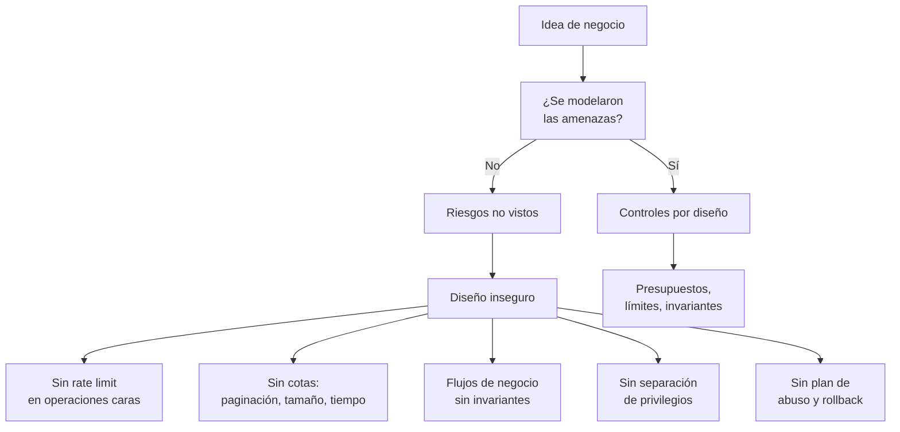

# A06:2025 - Diseño Inseguro

> **Pertenece a:** OWASP Top 10:2025 · [Volver al índice](README.md)

Bajo del **#4 al #6**. Es la categoría más incomoda, porque **no se arregla con un parche**: el defecto está en el diseño, y por eso ninguna herramienta la detecta automáticamente.

## 1. Qué es

A05 dice "tu código hace lo que dijiste, pero lo hace mal". A06 dice "**hiciste lo que diseñaste, y el diseño no contemplaba al atacante**".

La diferencia es dónde hay que intervenir:

| | Inyección (A05) | Diseño inseguro (A06) |
|---|---|---|
| Dónde está el fallo | En el código | En el modelo, el flujo o la arquitectura |
| Se detecta con | SAST, DAST, revisión | Modelado de amenazas, revisión de diseño |
| Se arregla con | Cambiar una consulta | Cambiar el flujo de negocio |
| Se detecta en |QA | Antes de escribir código |

Un ejemplo clásico: un endpoint de cupón de descuento que comprueba si el código es válido y aplica el descuento. Todo el código es correcto. Lo que no existe es un rate limit, así que un script prueba un millón de códigos hasta encontrar uno válido.

## Diagrama general



## 2. Ejemplos de diseño inseguro

### 2.1 Sin rate limit en una operación cara

```typescript
// ❌ El código funciona. Lo que falta es el diseño.
@Post('coupons/redeem')
async redeem(@Body() dto: RedeemCouponDto, @Req() req: Request) {
  const coupon = await this.coupons.findByCode(dto.code);

  if (!coupon) throw new NotFoundException('Cupón no encontrado');
  if (coupon.expiresAt < new Date()) throw new BadRequestException('Expirado');

  await this.orders.applyDiscount(req.user.id, coupon.discountPercent);
  return { ok: true };
}
```

Con seis caracteres alfanuméricos hay ~56 mil millones de combinaciones. Un atacante puede probar todas. **El bug no está en ninguna línea**: está en que nunca se decidió cuánto cuesta una operación.

### 2.2 Sin cotas en los recursos

```typescript
// ❌ El cliente pide lo que quiere
@Get('products')
async list(@Query() query: ListQuery) {
  const pageSize = Number(query.limit ?? 1000);
  return this.products.findMany({ take: pageSize, skip: Number(query.offset) });
}

// ❌ Y un endpoint que devuelve todo sin paginar
@Get('all-products')
async all() {
  return this.products.findMany(); // 4 millones de filas en memoria
}
```

### 2.3 Flujo de negocio sin invariantes

```typescript
// ❌ El estado del pedido se puede manipular desde fuera
@Post('orders/:id/ship')
async ship(@Param('id') id: string, @Body() body: { carrierId: string }) {
  const order = await this.orders.findOne(id);

  // Nadie comprueba que el pedido esté pagado antes de enviarlo
  // Nadie comprueba que carrierId sea un transportista válido
  order.status = 'SHIPPED';
  order.carrierId = body.carrierId; // el cliente elige el transportista
  await this.orders.save(order);
}
```

### 2.4 IDOR como problema de diseño

```typescript
// ❌ El controlador confía en que el servicio filtra bien
@Get('invoices/:id')
async get(@Param('id') id: string) {
  return this.invoices.findOneOrFail(id); // repository sin filtro de usuario
}
```

El código de autorización "está en otra parte" (dice el equipo), y esa otra parte se olvidó.

## 3. Diseño seguro ✅

### 3.1 Presupuesto por operación

```typescript
// ✅ El límite es parte del diseño, no un afterthought
@Post('coupons/redeem')
@Throttle({ default: { limit: 5, ttl: 60_000 } }) // 5 intentos por minuto
async redeem(@Body() dto: RedeemCouponDto, @Req() req: Request) {
  const coupon = await this.coupons.findByCode(dto.code);

  // 2. Uniformizar: mismo error si no existe, expiró o ya se usó
  if (!coupon || coupon.expiresAt < new Date() || coupon.usedAt !== null) {
    throw new BadRequestException('Cupón no válido');
  }

  // 3. Registrar el intento fallido: alimenta la detección de abuso
  await this.audit.log({
    event: 'coupon.redeem.attempt',
    code: dto.code,
    userId: req.user.id,
    ip: req.ip,
  });

  // 4. Reclamación atómica: evita la carrera de dos canjes simultáneos
  const claimed = await this.coupons.claimIfUnused(coupon.id);
  if (!claimed) throw new BadRequestException('Cupón no válido');

  await this.orders.applyDiscount(req.user.id, coupon.discountPercent);
  return { ok: true };
}
```

### 3.2 Cotas explícitas

```typescript
// ✅ Un schema con máximos ya incorporados
import { z } from 'zod';

export const ListQuery = z.object({
  limit: z.coerce.number().int().min(1).max(100).default(20),
  offset: z.coerce.number().int().min(0).max(10_000).default(0),
  sort: z.enum(['createdAt', 'title', 'price']).default('createdAt'),
});

type ListQuery = z.infer<typeof ListQuery>;

// Y además un tope defensivo en la base de datos
const MAX_PAGE = 100;
const take = Math.min(query.limit, MAX_PAGE);
```

| Sin cota | Con cota |
|---|---|
| `take` de 1.000.000 | `take` máximo 100 |
| `offset` de 10⁹ | Máximo 10.000 (más allá, usar cursor) |
| Cuerpo de 10 MB | `express.json({ limit: '100kb' })` |
| Consulta de 30 segundos | `AbortSignal.timeout(5_000)` |
| Carga de 1 GB | Límite de 10 MB por archivo |

### 3.3 Invariantes en el dominio

```typescript
// ✅ Las transiciones válidas son un tipo cerrado
type OrderStatus = 'PENDING' | 'PAID' | 'SHIPPED' | 'DELIVERED' | 'CANCELLED';

// Transiciones permitidas como dato, no como if sueltos
const TRANSITIONS: Record<OrderStatus, readonly OrderStatus[]> = {
  PENDING: ['PAID', 'CANCELLED'],
  PAID: ['SHIPPED', 'CANCELLED'],
  SHIPPED: ['DELIVERED'],
  DELIVERED: [],
  CANCELLED: [],
};

function canTransition(from: OrderStatus, to: OrderStatus): boolean {
  return TRANSITIONS[from].includes(to);
}
```

```typescript
// ✅ El tipo discriminado impide estados imposibles
type Order =
  | { status: 'PENDING'; totalCents: number; carrierId: null }
  | { status: 'PAID'; totalCents: number; paidAt: Date; carrierId: null }
  | { status: 'SHIPPED'; totalCents: number; paidAt: Date; carrierId: CarrierId }
  | { status: 'DELIVERED'; totalCents: number; paidAt: Date; carrierId: CarrierId; deliveredAt: Date }
  | { status: 'CANCELLED'; totalCents: number; cancelledAt: Date; reason: CancelReason };

// ❌ Ahora es imposible de compilar
function setCarrier(carrierId: string): void {
  if (order.status === 'SHIPPED') {
    order.carrierId = carrierId; // type error: CarrierId ≠ string
  }
}

// ✅ Y el compilador te guía en el switch
function totalLabel(order: Order): string {
  switch (order.status) {
    case 'PENDING':
    case 'PAID':
      return `Pendiente de envío: ${order.totalCents / 100}`;
    case 'SHIPPED':
      return `En camino con ${order.carrierId.name}`;
    case 'DELIVERED':
      return `Entregado el ${order.deliveredAt.toISOString()}`;
    case 'CANCELLED':
      return `Cancelado: ${order.reason}`;
  }
}
```

> **Para entenderlo visualmente:** imagina un formulario con un campo que solo aparece si antes respondiste "sí" a otra pregunta. El tipo `Order` hace exactamente eso: si el pedido no está pagado, el compilador ni te deja mencionar `carrierId`. El estado inválido deja de ser un bug de runtime para ser un error de compilación.

### 3.4 Separación de privilegios

```typescript
// ✅ El actor viene del contexto, no del body
export class ShipOrderDto {
  @IsUUID()
  @IsOptional()
  trackingNumber?: string;
  // ❌ no hay carrierId, no hay status, no hay totalCents
}

@Post('orders/:id/ship')
@UseGuards(RolesGuard)
@Roles('warehouse')
async ship(@Param('id') id: OrderId, @Body() dto: ShipOrderDto, @CurrentUser() user: AuthUser) {
  const order = await this.orders.findOneOrFail({ id, tenantId: user.tenantId });

  if (!canTransition(order.status, 'SHIPPED')) {
    throw new ConflictException(`No se puede enviar un pedido en ${order.status}`);
  }

  // El transportista sale del dominio, no del cliente
  const carrier = await this.carriers.forTenant(user.tenantId);
  return this.orders.ship(order, carrier, dto.trackingNumber);
}
```

## 4. En Express

```typescript
// ✅ Middleware de presupuesto global, aplicado por diseño
import rateLimit from 'express-rate-limit';

// Límite amplio para tráfico normal
const globalLimiter = rateLimit({
  windowMs: 60_000,
  limit: 300,
  standardHeaders: 'draft-7',
  legacyHeaders: false,
  keyGenerator: (req) => req.user?.id ?? req.ip!,
});

// Límite estricto para operaciones sensibles
const authLimiter = rateLimit({
  windowMs: 15 * 60_000,
  limit: 5,
  skipSuccessfulRequests: true, // solo cuenta los fallos
});

app.post('/api/coupons/redeem', authLimiter, globalLimiter, redeemHandler);
app.post('/api/login', authLimiter, loginHandler);

// ✅ Presupuesto de cómputo: timeout por request
app.use((req, res, next) => {
  const timer = setTimeout(() => {
    if (!res.headersSent) {
      res.status(503).json({ error: 'Timeout procesando la solicitud' });
    }
  }, 10_000);

  res.on('finish', () => clearTimeout(timer));
  next();
});
```

## 5. Modelado de amenazas

Es la actividad más preventiva que existe. Cuatro preguntas, en orden:

| Pregunta | Ejemplo de respuesta |
|---|---|
| ¿Qué estamos construyendo? | Un endpoint que canjea cupones |
| ¿Qué puede salir mal? | Enumerar cupones, canjear dos veces, usarlo en otro tenant |
| ¿Qué vamos a hacer al respecto? | Rate limit, reclamación atómica, filtro de tenant |
| ¿Hicimos lo suficiente? | Test de carga del límite, alerta por tasa de rechazo |

```typescript
// ✅ Documentación viva de la amenaza, en el propio código
/**
 * AMENAZA: Coupon Brute Force (CAPEC-112)
 * Vector: POST /coupons/redeem sin límite de intentos
 * Controles: rateLimit(5/min por IP+cuenta), respuesta uniforme, auditoría
 * Riesgo residual: un atacante distribuido puede probar 5 por IP
 * Decisión aceptada: monitoring sobre la tasa de canje por cuenta
 */
```

> **Regla práctica:** si una decisión de seguridad no está escrita como una frase que explique el riesgo que mitiga, nadie la va a defender en el futuro. Se pierde en el primer refactor.

## 6. Lista de verificación

- [ ] Rate limit en login, recuperación de contraseña, canje de códigos, OTP y todo lo caro
- [ ] Límites máximos en paginación, tamaño de body, uploads, duración de consulta y respuesta
- [ ] Operaciones caras idempotentes o con reclamación atómica
- [ ] Respuestas uniformes para "no existe" / "no válido" / "ya usado"
- [ ] Estados del dominio como unión discriminada, no como `string`
- [ ] Transiciones de estado declaradas como datos
- [ ] Mascarar campos internos del DTO: nada de `role`, `status`, `total`, `tenantId`
- [ ] Actor derivado del contexto de request, nunca del body
- [ ] Cada endpoint de lectura filtra por tenant/user en la capa de servicio
- [ ] Multi-tenancy forzado en la capa de repositorio, no en cada controlador
- [ ] Límites de tiempo en llamadas salientes (`AbortSignal.timeout`)
- [ ] Un test por amenaza modelada, que falle si el control desaparece
- [ ] Feature flags con kill switch para desactivar operaciones sensibles

## Tarjetas de pregunta y respuesta

<div class="qa-card">
  <span class="qa-tag qa-tag-q">Pregunta</span>
  <div class="qa-q"><p>¿Cuál es la diferencia entre A05 (Inyección) y A06 (Diseño Inseguro)?</p></div>
  <div class="qa-a">
    <span class="qa-tag qa-tag-a">Respuesta</span>
    <p>A05 es un error de implementación: la consulta se construyó mal. A06 es un error de modelo: el flujo nunca consideró el abuso. El cupón sin rate limit no tiene ni una línea incorrecta, y por eso un SAST no lo encuentra. A06 se trabaja antes de escribir código, con modelado de amenazas.</p>
  </div>
</div>

<div class="qa-card">
  <span class="qa-tag qa-tag-q">Pregunta</span>
  <div class="qa-q"><p>¿El rate limit no es un problema de A07 (autenticación)?</p></div>
  <div class="qa-a">
    <span class="qa-tag qa-tag-a">Respuesta</span>
    <p>Cuando limita intentos de autenticación, sí pertenece a A07. Pero el rate limit es un patrón general de control de abuso: cupones, códigos de un solo uso, reset de contraseña, altas masivas. Si no cabe en A07, sigue siendo diseño inseguro si no está contemplado desde el modelo.</p>
  </div>
</div>

<div class="qa-card">
  <span class="qa-tag qa-tag-q">Pregunta</span>
  <div class="qa-q"><p>¿Por qué un tipo discriminado ayuda contra el diseño inseguro?</p></div>
  <div class="qa-a">
    <span class="qa-tag qa-tag-a">Respuesta</span>
    <p>Porque convierte una invariante del negocio en una restricción del compilador. Si un pedido enviado debe tener transportista, el tipo lo hace explícito, y un pedido pendiente no puede mencionar el campo en absoluto. El error deja de aparecer en producción y aparece en el editor. No evita el pensamiento de diseño, pero evita que se pierda en el camino.</p>
  </div>
</div>

<div class="qa-card">
  <span class="qa-tag qa-tag-q">Pregunta</span>
  <div class="qa-q"><p>¿Qué es un kill switch y por qué cuenta como diseño?</p></div>
  <div class="qa-a">
    <span class="qa-tag qa-tag-a">Respuesta</span>
    <p>Es un feature flag para desactivar una operación peligrosa sin desplegar código nuevo. Cuenta como diseño porque la pregunta "¿qué hago si descubro que esta operación está siendo abusada ahora mismo?" necesita una respuesta antes de que ocurra. Decidirlo durante el incidente significa decidirlo tarde.</p>
  </div>
</div>

<div class="qa-card">
  <span class="qa-tag qa-tag-q">Pregunta</span>
  <div class="qa-q"><p>Mi endpoint de lista ya tiene paginación. ¿Está bien?</p></div>
  <div class="qa-a">
    <span class="qa-tag qa-tag-a">Respuesta</span>
    <p>Solo si el máximo está acotado. "<code>limit</code>" sin techo permite <code>?limit=10000000</code>: el atacante no roba datos, pero agota tu memoria y tu tiempo de CPU. El límite superior tiene que ser una decisión de diseño, no un valor por defecto del framework.</p>
  </div>
</div>

<div class="qa-card">
  <span class="qa-tag qa-tag-q">Pregunta</span>
  <div class="qa-q"><p>¿Cómo sé si mi modelo de amenazas está bien?</p></div>
  <div class="qa-a">
    <span class="qa-tag qa-tag-a">Respuesta</span>
    <p>Un test por amenaza, fallando si el control desaparece. Si tu rate limit no está cubierto por un test que verifique el 429, en seis meses alguien lo va a borrar en un refactor y nadie se va a enterar hasta el incidente. El test es lo que convierte un control de diseño en una garantía.</p>
  </div>
</div>

<div class="qa-card">
  <span class="qa-tag qa-tag-q">Pregunta</span>
  <div class="qa-q"><p>El documento dice que "el actor no debe venir del body". ¿Por qué?</p></div>
  <div class="qa-a">
    <span class="qa-tag qa-tag-a">Respuesta</span>
    <p>Porque el body lo controla el cliente, y el contexto no. Si el endpoint acepta <code>carrierId</code>, el usuario elige por dónde sale su paquete. El principio es separar <em>datos de la petición</em> (qué quieres hacer) de <em>contexto de ejecución</em> (quién eres, en qué tenant, con qué rol). El segundo grupo se deriva del token verificado, nunca del payload.</p>
  </div>
</div>

---

> **Siguiente tema:** [A07: Fallas de Autenticación](07-fallas-de-autenticacion.md)