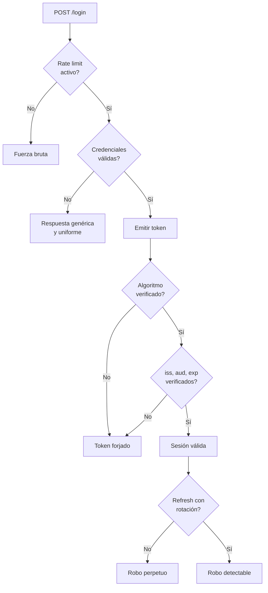
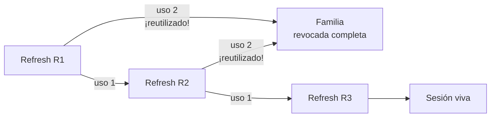

# A07:2025 - Fallas de Autenticación

> **Pertenece a:** OWASP Top 10:2025 · [Volver al índice](README.md)

Se mantiene en el **#7**. La edición 2025 solo le cambia el nombre: de "Fallas de Identificación y Autenticación" a "Fallas de Autenticación". El reporte oficial señala que los frameworks estandarizados **están reduciendo** su incidencia, pero siguen siendo relevantes.

## 1. Qué es

Autenticación es demostrar quién eres. En Node/TypeScript esto significa, en la práctica:

| Subproblema | Fallo típico |
|---|---|
| Credenciales | Permiten fuerza bruta, no hay rate limit |
| Sesión / Token | Cookie sin `httpOnly`, JWT que nunca expira |
| Recuperación de contraseña | Token sin expirar o reutilizable |
| Verificación de identidad | Enumeración de usuarios por el mensaje de error |
| JWT | No se verifica `alg`, o no se comprueba `iss` / `aud` |
| Refresh token | Sin rotación, sin revocación |

## Diagrama general



## 2. Ejemplo vulnerable ❌

### 2.1 Enumeración de usuarios

```typescript
// ❌ El mensaje revela si el email existe
app.post('/api/login', async (req, res) => {
  const user = await UserModel.findOne({ email: req.body.email });

  if (!user) {
    return res.status(404).json({ error: 'Usuario no encontrado' });
  }

  const ok = await verifyPassword(user.passwordHash, req.body.password);
  if (!ok) {
    return res.status(401).json({ error: 'Contraseña incorrecta' });
  }

  res.json({ token: sign(user) });
});
```

Tres fugas en un solo handler: el **código 404** distingue usuario inexistente de contraseña mala, el mensaje es distinto en cada caso, y el tiempo de respuesta también lo delata (buscar un usuario inexistente es más rápido que verificar un hash).

### 2.2 Sin rate limit

```typescript
// ❌ Sin límite: 100 intentos por minuto desde un script
app.post('/api/login', async (req, res) => { /* sin throttling */ });
```

### 2.3 JWT sin verificación

```typescript
// ❌ Decodificar sin verificar: el atacante firma su propio token
app.get('/api/admin', (req, res) => {
  const payload = JSON.parse(Buffer.from(getBearer(req), 'base64').toString());
  if (payload.role === 'admin') res.json(secrets);
});

// ❌ verify() sin fijar algoritmos: vulnerable a confusión HS/RS
jwt.verify(token, process.env.JWT_SECRET);

// ❌ El helper sin options no mira ni iss, ni aud, ni exp
function sign(user: User) {
  return jwt.sign({ sub: user.id, role: user.role }, process.env.JWT_SECRET);
}
```

> **⚠️ Cuidado:** `jwt.sign(payload, secret)` sin `expiresIn` produce un token que **nunca caduca**. Revocar un token así es imposible sin lista de bloqueo, y un token filtrado sigue siendo válido para siempre.

### 2.4 Reset de contraseña

```typescript
// ❌ Token determinista y sin expiración
app.post('/api/reset-password', async (req, res) => {
  const user = await UserModel.findOne({ email: req.body.email });
  const token = Buffer.from(`${user.id}:${user.email}`).toString('base64');

  await mailer.send({ to: user.email, token }); // el token nunca expira

  res.json({ ok: true });
});
```

El token es reversible: cualquiera puede hacer base64 del email, reconstruirlo y cambiar la contraseña de cualquier usuario.

### 2.5 Cookie de sesión sin flags

```typescript
// ❌ Accessible desde JavaScript y sin SameSite
res.cookie('session', sessionId, { maxAge: 1000 * 60 * 60 * 24 * 30 });
```

## 3. Ejemplo seguro ✅

### 3.1 Login uniforme

```typescript
import { createHash, timingSafeEqual } from 'node:crypto';
import { verifyPassword } from './password';

// ✅ DUMMY_HASH: se verifica igual aunque el usuario no exista,
// para que el tiempo de respuesta no revele nada
const DUMMY_HASH = 'argon2id$v=19$m=19456,t=2,p=1$c29tZXNhbHR2YWx1ZQ$...';

app.post('/api/login', loginLimiter, async (req, res) => {
  const parsed = LoginSchema.safeParse(req.body);
  if (!parsed.success) {
    return res.status(400).json({ error: 'Datos inválidos' });
  }

  const { email, password } = parsed.data;

  const user = await UserModel.findOne({ email: normalizeEmail(email) });
  const hashToCheck = user?.passwordHash ?? DUMMY_HASH;

  const ok = await verifyPassword(hashToCheck, password);

  // ✅ Un solo mensaje y un solo código, siempre
  if (!user || !ok) {
    return res.status(401).json({ error: 'Credenciales inválidas' });
  }

  const session = await this.sessionStore.create({
    userId: user.id,
    tenantId: user.tenantId,
    ip: req.ip,
    userAgent: req.get('user-agent'),
  });

  res.cookie('session', session.id, SESSION_COOKIE_OPTIONS);
  res.json({ ok: true });
});
```

| Fuga | Defensa |
|---|---|
| Mensaje distinto | Un solo mensaje: "Credenciales inválidas" |
| Código HTTP distinto | Un solo código: `401` |
| Tiempo de respuesta | Hash dummy cuando el usuario no existe |
| Rate limit | 5 intentos por cuenta cada 15 min |
| Registro | Los fallos se loguean con IP, email hasheado y User-Agent |

### 3.2 Rate limit por cuenta, no solo por IP

```typescript
// ✅ Un atacante distribuido evade el límite por IP
const loginLimiter = rateLimit({
  windowMs: 15 * 60_000,
  limit: 5,
  // Clave compuesta: cuenta + IP
  keyGenerator: (req) => {
    const email = normalizeEmail(String(req.body?.email ?? ''));
    const emailHash = createHash('sha256').update(email).digest('hex').slice(0, 16);
    return `${emailHash}:${req.ip}`;
  },
  skipSuccessfulRequests: true,
  standardHeaders: 'draft-7',
  legacyHeaders: false,
});
```

> **Regla práctica:** limita por **cuenta** para bloquear ataques dirigidos y por **IP** para bloquear volumen. Las dos dimensiones hacen falta: el primero detiene el ataque a un usuario concreto, el segundo detiene el barrido masivo.

### 3.3 JWT con verificación estricta

```typescript
import { jwtVerify } from 'jose';

const ISSUER = 'https://api.miapp.com';
const AUDIENCE = 'miapp-client';

// ✅ Clave de al menos 256 bits, con el algoritmo explícito
const secret = new TextEncoder().encode(process.env.JWT_SECRET!);

export async function issueTokens(user: AuthUser): Promise<TokenPair> {
  const accessToken = await new SignJWT({ role: user.role, tenantId: user.tenantId })
    .setProtectedHeader({ alg: 'HS256', typ: 'JWT' }) // explícito, no implícito
    .setSubject(user.id)
    .setIssuer(ISSUER)
    .setAudience(AUDIENCE)
    .setIssuedAt()
    .setJti(randomUUID()) // id único: permite revocación
    .setExpirationTime('15m') // corto a propósito
    .sign(secret);

  // El refresh es opaco y se guarda en la base de datos, para poder revocarlo
  const refreshToken = randomBytes(48).toString('base64url');
  await this.refreshStore.save({
    token: await hashToken(refreshToken),
    userId: user.id,
    familyId: randomUUID(),
    expiresAt: new Date(Date.now() + 30 * 24 * 3600 * 1000),
  });

  return { accessToken, refreshToken };
}

export async function verifyAccess(token: string): Promise<JwtPayload> {
  const { payload } = await jwtVerify(token, secret, {
    algorithms: ['HS256'], // fijados: nunca confíes en el header
    issuer: ISSUER,
    audience: AUDIENCE,
    clockTolerance: 5, // segundos de desfase permitido
  });

  return payload as JwtPayload;
}
```

### 3.4 Rotación de refresh token

```typescript
// ✅ Cada refresh invalida el anterior y reutilización = robo detectado
async rotate(presentedToken: string): Promise<TokenPair> {
  const hash = await hashToken(presentedToken);
  const stored = await this.refreshStore.findByHash(hash);

  if (!stored) throw new UnauthorizedException('Refresh token inválido');
  if (stored.expiresAt < new Date()) throw new UnauthorizedException('Expirado');

  // 🚩 Reutilización: si el token ya se rotó, alguien lo robó
  if (stored.usedAt !== null) {
    await this.refreshStore.revokeFamily(stored.familyId); // mata toda la familia
    await this.audit.log({
      event: 'auth.refresh.reuse_detected',
      userId: stored.userId,
      familyId: stored.familyId,
    });
    throw new UnauthorizedException('Sesión invalidada');
  }

  await this.refreshStore.markUsed(stored.id);
  return this.issueTokens({ id: stored.userId } as AuthUser);
}
```



> **Importante:** el "token reuse detection" es lo que convierte un robo de token en **un incidente detectable**. Sin eso, el atacante y el usuario legítimo renuevan en paralelo y nadie se entera nunca.

### 3.5 Reset de contraseña seguro

```typescript
// ✅ Token aleatorio, de un solo uso, con expiración
app.post('/api/forgot-password', forgotLimiter, async (req, res) => {
  const { email } = ForgotSchema.parse(req.body);
  const user = await UserModel.findOne({ email: normalizeEmail(email) });

  if (!user) {
    // Mismo 200: no revelamos nada
    return res.json({ ok: true });
  }

  const token = randomBytes(32).toString('base64url');
  await this.tokenStore.save({
    // Se guarda el hash, no el token: si alguien lee la tabla, no sirve
    tokenHash: await hashToken(token),
    userId: user.id,
    purpose: 'password_reset',
    expiresAt: new Date(Date.now() + 15 * 60 * 1000), // 15 minutos
  });

  await mailer.sendResetEmail(user.email, token);

  res.json({ ok: true }); // idéntico exista o no el usuario
});
```

```typescript
// ✅ Un solo uso: se marca consumido, no se borra (para auditar)
app.post('/api/reset-password', resetLimiter, async (req, res) => {
  const { token, password } = ResetSchema.parse(req.body);

  const record = await this.tokenStore.findByHash(await hashToken(token));

  if (!record || record.purpose !== 'password_reset') {
    throw new BadRequestException('Enlace inválido');
  }
  if (record.expiresAt < new Date()) {
    throw new BadRequestException('Enlace expirado');
  }
  if (record.usedAt !== null) {
    throw new BadRequestException('Enlace ya utilizado');
  }

  await this.userService.setPassword(record.userId, password);

  // Consumir el token e invalidar todas las sesiones
  await this.tokenStore.markUsed(record.id);
  await this.sessionStore.revokeAllForUser(record.userId);

  res.json({ ok: true });
});
```

> **⚠️ Cuidado:** resetear una contraseña debe **revocar todas las sesiones**. Si no, el atacante que tenía la sesión mantiene el acceso después de que el usuario legítimo recupera la cuenta.

### 3.6 Cookies de sesión

```typescript
const SESSION_COOKIE_OPTIONS = {
  httpOnly: true,
  secure: true,
  sameSite: 'lax',
  maxAge: 1000 * 60 * 60 * 8,
  path: '/',
  __Host: '', // prefijo: exige secure + path=/ + sin domain
} as const;

app.use(session({
  name: '__Host-sid',
  secret: process.env.SESSION_SECRET!,
  store: new RedisStore({ prefix: 'sess:', ttl: 8 * 3600 }),
  cookie: { ...SESSION_COOKIE_OPTIONS, maxAge: undefined },
  resave: false,
  saveUninitialized: false,
  rolling: true,
}));
```

| Flag | Sin él |
|---|---|
| `httpOnly` | El XSS lee el token |
| `secure` | El token viaja en claro por HTTP |
| `sameSite` | CSRF (ver [A01](01-control-de-acceso.md)) |
| `__Host-` | Impide que un subdominio hermano fije la cookie |

## 4. En NestJS

```typescript
// src/auth/auth.service.ts
@Injectable()
export class AuthService {
  constructor(
    @InjectRepository(User) private readonly users: Repository<User>,
    private readonly jwt: JwtService,
    private readonly sessions: SessionService,
    private readonly audit: AuditService,
    private readonly throttler: ThrottlerStorage,
  ) {}

  async validateCredentials(email: string, password: string): Promise<User> {
    const user = await this.users.findOneBy({ email: normalizeEmail(email) });

    // Hash dummy: coste constante exista o no el usuario
    const hash = user?.passwordHash ?? DUMMY_HASH;
    const ok = await this.verify(hash, password);

    if (!user || !ok) {
      await this.audit.log({ event: 'auth.login.failed', email, ip });
      // Mensaje y código idénticos siempre
      throw new UnauthorizedException('Credenciales inválidas');
    }

    return user;
  }
}
```

```typescript
// src/auth/local.strategy.ts
@Injectable()
export class LocalStrategy extends PassportStrategy(Strategy, 'local') {
  constructor(private readonly auth: AuthService) {
    // El secret no se usa en Strategy, pero la firma de Passport lo exige
    super({ usernameField: 'email', passwordField: 'password' });
  }

  async validate(email: string, password: string): Promise<AuthUser> {
    const user = await this.auth.validateCredentials(email, password);

    await this.auth.sessions.create({
      userId: user.id,
      tenantId: user.tenantId,
      role: user.role,
    });

    return { id: user.id, tenantId: user.tenantId, role: user.role };
  }
}
```

```typescript
// src/auth/throttler.config.ts — NestJS 5+
export const authThrottler = {
  throttlers: [
    // 5 intentos por cuenta cada 15 minutos
    { name: 'short', ttl: 60_000, limit: 5 },
  ],
  storage: new ThrottlerStorageRedisService(), // compartido entre réplicas
};
```

```typescript
// src/auth/auth.controller.ts
@Controller('auth')
export class AuthController {
  @Post('login')
  @HttpCode(200) // nunca 201 en un login
  @UseGuards(AuthThrottlerGuard)
  @UseGuards(LocalAuthGuard)
  async login(@CurrentUser() user: AuthUser) {
    return this.auth.issueSession(user);
  }

  @Post('logout')
  @UseGuards(JwtAuthGuard)
  @HttpCode(204)
  async logout(@Req() req: Request) {
    await this.sessions.revoke(req.user.sessionId);
  }
}
```

## 5. Lista de verificación

- [ ] Mensaje y código HTTP idénticos para usuario inexistente y contraseña incorrecta
- [ ] Tiempo de respuesta constante (hash dummy cuando el usuario no existe)
- [ ] Rate limit por cuenta **y** por IP en login, reset y verificación
- [ ] Rate limit distribuido (Redis) si hay más de una réplica
- [ ] `algorithms: ['HS256']` fijado explícitamente en la verificación
- [ ] `issuer`, `audience` y `expirationTime` siempre presentes
- [ ] Access token corto (5-15 min) con refresh token rotativo
- [ ] Detección de reutilización de refresh token que revoca la familia
- [ ] Token de reset aleatorio, con hash almacenado, expiración de 15 min y un solo uso
- [ ] Reset de contraseña revoca todas las sesiones activas
- [ ] Cookies con `httpOnly`, `secure`, `sameSite` y prefijo `__Host-`
- [ ] Secretos de al menos 256 bits, rotados y nunca en el repositorio
- [ ] MFA (TOTP, WebAuthn) en cuentas administrativas
- [ ] Sesiones visibles y revocables por el usuario desde la UI

## Tarjetas de pregunta y respuesta

<div class="qa-card">
  <span class="qa-tag qa-tag-q">Pregunta</span>
  <div class="qa-q"><p>¿Por qué importa el tiempo de respuesta además del mensaje?</p></div>
  <div class="qa-a">
    <span class="qa-tag qa-tag-a">Respuesta</span>
    <p>Porque un atacante puede distinguir "usuario no encontrado" de "contraseña incorrecta" sin leer el mensaje: si el segundo tarda 200 ms y el primero 5 ms, ya lo sabe. La defensa es verificar siempre un hash, real o dummy, para que el coste sea idéntico en los dos caminos.</p>
  </div>
</div>

<div class="qa-card">
  <span class="qa-tag qa-tag-q">Pregunta</span>
  <div class="qa-q"><p>Si fijo <code>algorithms: ['HS256']</code>, ¿no basta con verificar la firma?</p></div>
  <div class="qa-a">
    <span class="qa-tag qa-tag-a">Respuesta</span>
    <p>Fijar el algoritmo es crítico por el ataque de confusión de algoritmo: si el header dice <code>alg: none</code> o apunta a un algoritmo con clave pública, y tu librería lo acepta, el atacante firma sin saber el secreto. La verificación de firma sola no protege; hay que fijar <em>qué</em> algoritmos se aceptan y además comprobar <code>iss</code> y <code>aud</code>.</p>
  </div>
</div>

<div class="qa-card">
  <span class="qa-tag qa-tag-q">Pregunta</span>
  <div class="qa-q"><p>¿Por qué el access token debe durar 15 minutos y no 24 horas?</p></div>
  <div class="qa-a">
    <span class="qa-tag qa-tag-a">Respuesta</span>
    <p>Porque un access token es autocontenido: mientras esté vigente, no puedes revocarlo. Es la ventana máxima de exposición si se filtra. Con 15 minutos, la rotación del refresh token se convierte en el mecanismo real de revocación, y un token robado deja de servir casi enseguida.</p>
  </div>
</div>

<div class="qa-card">
  <span class="qa-tag qa-tag-q">Pregunta</span>
  <div class="qa-q"><p>¿Qué es la detección de reutilización de refresh token?</p></div>
  <div class="qa-a">
    <span class="qa-tag qa-tag-a">Respuesta</span>
    <p>Cada refresh token se marca como usado al canjearlo. Si un token ya usado vuelve a aparecer, significa que alguien lo copió, y en ese momento se revoca toda la "familia" de tokens de esa sesión. Sin esto, el atacante y el usuario legítimo pueden renovar en paralelo indefinidamente sin que nada lo indique.</p>
  </div>
</div>

<div class="qa-card">
  <span class="qa-tag qa-tag-q">Pregunta</span>
  <div class="qa-q"><p>¿Por qué se guarda el hash del token de reset y no el token?</p></div>
  <div class="qa-a">
    <span class="qa-tag qa-tag-a">Respuesta</span>
    <p>Por la misma razón que las contraseñas: si alguien lee la tabla (una inyección, un backup, un log), con el hash no puede autenticarse. El token plano solo existe en el email, que es el único sitio que el usuario controla.</p>
  </div>
</div>

<div class="qa-card">
  <span class="qa-tag qa-tag-q">Pregunta</span>
  <div class="qa-q"><p>¿Qué diferencia hay entre "<code>Authorization: Bearer</code>" y la cookie de sesión, en cuanto a CSRF?</p></div>
  <div class="qa-a">
    <span class="qa-tag qa-tag-a">Respuesta</span>
    <p>Con Bearer, el token lo añade explícitamente el JavaScript del cliente, así que una página externa no puede ponerlo por ti: no hay CSRF. Con cookie, el navegador la envía solo en cualquier request al dominio, y por eso una página externa sí puede disparar la acción. Si usas cookies, necesita <code>sameSite</code> y token CSRF.</p>
  </div>
</div>

<div class="qa-card">
  <span class="qa-tag qa-tag-q">Pregunta</span>
  <div class="qa-q"><p>Mi app tiene rate limit por IP. ¿Es suficiente?</p></div>
  <div class="qa-a">
    <span class="qa-tag qa-tag-a">Respuesta</span>
    <p>No para ataques dirigidos. Un atacante con 500 proxies tiene 500 límites. Necesitas las dos dimensiones: por IP para el volumen y por cuenta para bloquear el ataque a un usuario concreto. Y si tienes varias réplicas, el contador tiene que ser compartido (Redis), porque un contador en memoria se reinicia en cada instancia.</p>
  </div>
</div>

<div class="qa-card">
  <span class="qa-tag qa-tag-q">Pregunta</span>
  <div class="qa-q"><p>El usuario recuperó su contraseña. ¿Por qué hay que cerrar sus otras sesiones?</p></div>
  <div class="qa-a">
    <span class="qa-tag qa-tag-a">Respuesta</span>
    <p>Porque recuperar la contraseña es la reacción a un compromiso. Si alguien entró con tu cuenta y tú solo cambias la contraseña, el atacante conserva su sesión activa y vuelve a entrar sin necesitar la contraseña. Resetear es el momento exacto en que hay que revocar todo lo demás.</p>
  </div>
</div>

---

> **Siguiente tema:** [A08: Fallas en la Integridad del Software o de los Datos](08-integridad-de-software-y-datos.md)