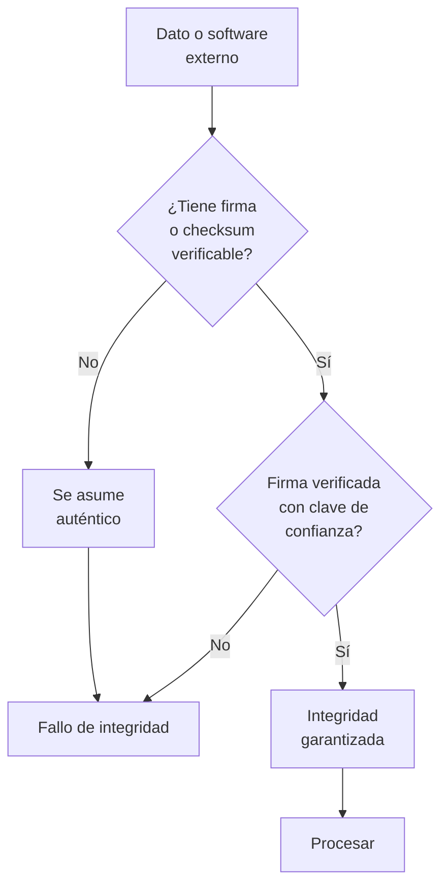

# A08:2025 - Fallas en la Integridad del Software o de los Datos

> **Pertenece a:** OWASP Top 10:2025 · [Volver al índice](README.md)

Se mantiene en el **#8**. Es la categoría más infravalorada, y el propio OWASP lo reconoce: siempre está subrepresentada en los datos porque la mayoría de estos fallos solo se manifiestan **en el momento del despliegue o de la actualización**.

## 1. Qué es

El principio es: **no asumas que un software, una actualización o un dato que llega de fuera es auténtico hasta verificarlo.**



| Escenario | Dónde falla en Node/TS |
|---|---|
| **Webhook sin verificar** | Se procesa un evento de Stripe falsificado: marcando pedidos como pagados |
| **Deserialización insegura** | `node-serialize`, `eval` sobre datos externos |
| **Actualización automática** | Dependencia o artefacto de CI sin verificar su origen |
| **CI/CD sin control** | Un workflow ejecuta código de un PR externo |
| **YAML peligroso** | `yaml.load()` con `__proto__` (prototype pollution, ver [A05](05-inyeccion.md)) |
| **SBOM y artefactos** | Artefacto firmado por alguien sin la clave |

## 2. Webhooks sin verificar

Este es el ejemplo más relevante en una API de pagos, y el más caro cuando falla.

### Vulnerable ❌

```typescript
// ❌ Confía en que el evento es auténtico porque "viene de Stripe"
app.post('/api/webhooks/stripe', express.raw({ type: 'application/json' }), async (req, res) => {
  const event = JSON.parse(req.body.toString());

  // Si alguien descubre la URL, puede mandar el evento que quiera
  if (event.type === 'checkout.session.completed') {
    await this.orders.markAsPaid(event.data.object.metadata.orderId);
    res.json({ received: true });
  }
});
```

El impacto real: un atacante que encuentre la URL puede mandar un evento falso y **marcar pedidos como pagados sin haber pagado**.

### Seguro ✅

```typescript
// ✅ Verificar firma + timestamp anti-replay
import { createHmac, timingSafeEqual } from 'node:crypto';

const SIGNATURE_HEADER = 'stripe-signature';
const TOLERANCE_SECONDS = 300; // 5 minutos
const replayCache = new Map<string, number>(); // en producción: Redis

app.post(
  '/api/webhooks/stripe',
  // ⚠️ El body debe ser RAW: el middleware de JSON rompe la firma
  express.raw({ type: 'application/json', limit: '256kb' }),
  async (req, res) => {
    const signature = req.get(SIGNATURE_HEADER);
    if (!signature) {
      return res.status(400).json({ error: 'Falta la firma' });
    }

    const parts = parseStripeSignature(signature);
    const timestamp = Number(parts.t);
    const provided = parts.v1;

    // 1. Ventana temporal: rechaza sesiones grabadas y reenviadas
    if (Math.abs(Date.now() / 1000 - timestamp) > TOLERANCE_SECONDS) {
      return res.status(400).json({ error: 'Firma expirada' });
    }

    // 2. Anti-replay por id de evento
    if (replayCache.has(parts.id)) {
      return res.status(400).json({ error: 'Evento duplicado' });
    }

    // 3. Firma HMAC sobre timestamp + punto + body crudo
    const expected = createHmac('sha256', process.env.STRIPE_WEBHOOK_SECRET!)
      .update(`${parts.t}.${req.body.toString('utf8')}`)
      .digest('hex');

    if (
      provided.length !== expected.length ||
      !timingSafeEqual(Buffer.from(provided), Buffer.from(expected))
    ) {
      await this.audit.log({ event: 'webhook.signature_invalid', parts });
      return res.status(400).json({ error: 'Firma inválida' });
    }

    replayCache.set(parts.id, Date.now());

    // 4. Solo después de verificar se interpreta el evento
    const event = JSON.parse(req.body.toString('utf8'));
    await this.webhooks.handle(event);

    res.json({ received: true });
  },
);
```

> **⚠️ Cuidado:** si aplicas `express.json()` **antes** del handler, el objeto se deserializa, cambia el orden de las claves y se pierde el espacio en blanco, así que la firma nunca coincidirá. Por eso el `express.raw()` tiene que ir en la ruta, antes de cualquier parser global.

### Webhooks genéricos con HMAC

```typescript
// ✅ Cuando el proveedor no tiene SDK: HMAC sobre el body crudo
function verifyWebhook(
  rawBody: Buffer,
  header: string | undefined,
  secret: string,
): boolean {
  if (!header) return false;

  const expected = createHmac('sha256', secret).update(rawBody).digest('hex');
  const a = Buffer.from(expected, 'hex');
  const b = Buffer.from(header.trim(), 'hex');

  return a.length === b.length && timingSafeEqual(a, b);
}
```

## 3. Deserialización insegura

### Vulnerable ❌

```typescript
// ❌ eval convierte una cadena en código ejecutable
app.post('/api/import', (req, res) => {
  const doc = eval(req.body.payload); // ejecución remota de código
  res.json(doc);
});

// ❌ node-serialize: RCE directo
import { deserialize, unserialize } from 'node-serialize';
app.post('/api/state', (req, res) => {
  const state = unserialize(req.body.state); // {"rce":"_$$ND_FUNC$$_function(){require('child_process').execSync('id')}()"}
  res.json(state);
});

// ❌ YAML con funciones
import { load } from 'yaml';
const config = load(req.body.config); // puede invocar funciones
```

### Seguro ✅

```typescript
// ✅ JSON.parse es seguro: no ejecuta nada
const config = JSON.parse(text);

// ✅ Con validación de esquema inmediatamente después
import { z } from 'zod';

const ConfigSchema = z.object({
  retries: z.number().int().min(0).max(5).default(3),
  endpoint: z.string().url(),
  features: z.record(z.boolean()).default({}),
}).strict();

const parsed = ConfigSchema.safeParse(JSON.parse(text));
if (!parsed.success) {
  throw new BadRequestException('Configuración inválida');
}

// ✅ YAML solo con esquema JSON, que desactiva las funciones
import { parse } from 'yaml';
const doc = parse(text, { schema: 'json' }); // nunca 'core' ni default
```

```typescript
// ✅ Nunca construyas código con template literals a partir de input
const handler = new Function('req', 'res', req.body.code); // RCE
```

| Nunca uses | Por qué | Alternativa |
|---|---|---|
| `eval` | Ejecuta la cadena como código | `JSON.parse` |
| `new Function` | Igual que `eval` | Una tabla de handlers |
| `node-serialize` | Diseñado para ejecutar funciones | `JSON.parse` |
| `vm` con input | El sandbox es escapable | Aislar en un proceso |
| `yaml.load` (core) | Instancia funciones | `parse` con `schema: 'json'` |

## 4. Cadena de suministro de software e integridad

Ver [A03](03-cadena-de-suministro-de-software.md) para el detalle de dependencias. Aquí el foco es **integridad**: verificar que el software que entra en producción es el que tu equipo aprobó.

### Install scripts y artefactos

```typescript
// ❌ Instalar y ejecutar un paquete remoto en runtime
app.post('/api/plugins/install', async (req, res) => {
  exec(`npm install ${req.body.packageName}`, { shell: true });
});

// ✅ Nunca instalar en runtime. El software se despliega, no se instala por HTTP
```

```yaml
# ❌ Un workflow de PR externo con permisos de escritura
name: PR Check
on: pull_request_target

jobs:
  test:
    runs-on: ubuntu-latest
    permissions: write # 🔴 crítico
    steps:
      - uses: actions/checkout@v4
        with:
          ref: ${{ github.event.pull_request.head.sha }} # código del fork
      - run: npm ci
      - run: npm test

# ✅ Separar: build de confianza sin checkout del fork
name: Verify PR
on:
  pull_request:
    permissions: read

jobs:
  build:
    runs-on: ubuntu-latest
    steps:
      - uses: actions/checkout@v4
      - run: npm ci
      - run: npm run build
      - uses: actions/upload-artifact@v4
        with:
          name: pr-build
          path: dist/
```

### Verificación de artefactos

```typescript
// ✅ Verificar firma de un artefacto descargado
import { createVerify } from 'node:crypto';
import { readFile } from 'node:fs/promises';

export async function verifyArtifact(
  artifactPath: string,
  signaturePath: string,
  publicKeyPem: string,
): Promise<void> {
  const data = await readFile(artifactPath);
  const signature = await readFile(signaturePath);

  const verifier = createVerify('RSA-SHA256');
  verifier.update(data);
  verifier.end();

  if (!verifier.verify(publicKeyPem, signature)) {
    throw new Error('Firma inválida del artefacto');
  }
}
```

```bash
# ✅ npm verifica la integridad del registro por hash
# El lockfile guarda el integrity (sha512) de cada tarball
npm ci   # falla si el hash del paquete no coincide
```

## 5. Integridad de datos de la base de datos

```typescript
// ❌ Updates de base de datos sin transacción ni verificación
await db.run(`UPDATE accounts SET balance = balance - ${amount} WHERE id = ${from}`);
await db.run(`UPDATE accounts SET balance = balance + ${amount} WHERE id = ${to}`);
// Si la segunda falla, el dinero desaparece

// ✅ Transacción + verificación de saldo en la misma unidad
await db.transaction(async (tx) => {
  const res = await tx.run(
    'UPDATE accounts SET balance = balance - $1 WHERE id = $2 AND balance >= $1',
    [amount, from],
  );

  if (res.changes === 0) {
    throw new Error('Saldo insuficiente'); // rollback automático
  }

  await tx.run('UPDATE accounts SET balance = balance + $1 WHERE id = $2', [amount, to]);
  await tx.run(
    'INSERT INTO ledger (from_id, to_id, amount, created_at) VALUES ($1, $2, $3, now())',
    [from, to, amount],
  );
});
```

> **Importante:** un ledger inmutable (append-only) es una forma de integridad: los saldos se pueden recalcular y detectar cualquier manipulación. Es el mismo principio que un libro mayor contable.

## 6. En NestJS

```typescript
// src/integrity/artifact-integrity.ts
@Injectable()
export class ArtifactIntegrityService {
  private readonly trustedDigests = new Map<string, string>(
    Object.entries(JSON.parse(readFileSync('trusted-digests.json', 'utf8'))),
  );

  /**
   * AMENAZA: artefacto de build manipulado (supply chain)
   * Control: digest SHA-256 fijado en el repositorio, comparación
   *          en tiempo constante antes de usar el artefacto
   */
  assertTrusted(name: string, buffer: Buffer): void {
    const expected = this.trustedDigests.get(name);
    if (!expected) {
      throw new InternalServerErrorException(`Artefacto no confiable: ${name}`);
    }

    const actual = createHash('sha256').update(buffer).digest('hex');

    if (!timingSafeEqual(Buffer.from(actual), Buffer.from(expected))) {
      await this.audit.log({ event: 'integrity.digest_mismatch', name });
      throw new InternalServerErrorException('Artefacto alterado');
    }
  }
}
```

```typescript
// src/config/config.loader.ts
@Injectable()
export class ConfigLoader {
  private load(raw: string): AppConfig {
    // JSON.parse + esquema estricto: nunca eval
    const parsed = AppConfigSchema.safeParse(JSON.parse(raw));

    if (!parsed.success) {
      const issues = parsed.error.issues.map((i) => `${i.path.join('.')}: ${i.message}`);
      throw new ConfigException(`Configuración inválida:\n${issues.join('\n')}`);
    }

    return parsed.data;
  }
}
```

## 7. Lista de verificación

- [ ] Webhooks con verificación de firma HMAC/JWS sobre el body crudo
- [ ] Ventana de timestamp (5 min) y cache de eventos ya procesados (anti-replay)
- [ ] `express.raw()` en las rutas de webhook, antes de cualquier parser JSON
- [ ] Comparación de firma con `timingSafeEqual`
- [ ] Cero `eval`, `new Function`, `node-serialize` y `vm` sobre datos externos
- [ ] `yaml.parse` solo con `schema: 'json'`
- [ ] `express.json({ limit })` en todos los endpoints que aceptan body
- [ ] Workflows con `permissions:` mínimos y sin checkout de código de forks
- [ ] Artefactos de build con digest fijado y verificado antes de desplegar
- [ ] `npm ci` en CI (verifica el `integrity` de cada tarball del lockfile)
- [ ] Transacciones en operaciones que tocan datos financieros o de inventario
- [ ] Registro inmutable (append-only) para datos críticos
- [ ] SBOM generado en cada release
- [ ] Firmas de release verificadas por el consumidor

## Tarjetas de pregunta y respuesta

<div class="qa-card">
  <span class="qa-tag qa-tag-q">Pregunta</span>
  <div class="qa-q"><p>Mi endpoint de webhook usa <code>express.json()</code>. ¿Puedo verificar la firma de todos modos?</p></div>
  <div class="qa-a">
    <span class="qa-tag qa-tag-a">Respuesta</span>
    <p>Prácticamente no. El parseo reordena claves y normaliza el body, así que el string que recibes ya no es el que se firmó y la comparación falla siempre. Necesitas el body crudo: aplica <code>express.raw()</code> en esa ruta específica, y verifica la firma sobre el Buffer antes de hacer <code>JSON.parse</code>.</p>
  </div>
</div>

<div class="qa-card">
  <span class="qa-tag qa-tag-q">Pregunta</span>
  <div class="qa-q"><p>¿Qué gana un atacante con un webhook sin verificar?</p></div>
  <div class="qa-a">
    <span class="qa-tag qa-tag-a">Respuesta</span>
    <p>Control total del flujo de negocio que depende del webhook. En un sistema de pagos, marcar pedidos como pagados sin pagar. En un sistema de suscripciones, activar planes premium. Es de las vulns más baratas de explotar (una request HTTP) y de mayor impacto.</p>
  </div>
</div>

<div class="qa-card">
  <span class="qa-tag qa-tag-q">Pregunta</span>
  <div class="qa-q"><p>¿Por qué <code>JSON.parse</code> es seguro y <code>node-serialize</code> no?</p></div>
  <div class="qa-a">
    <span class="qa-tag qa-tag-a">Respuesta</span>
    <p>Porque JSON solo tiene siete tipos de datos y ninguna forma de expresar "esto es una función". <code>node-serialize</code>, en cambio, serializa funciones y tiene una función <code>unserialize</code> que las invoca al deserializar. Un payload con <code>_$$ND_FUNC$$_</code> ejecuta código arbitrario al deserializar.</p>
  </div>
</div>

<div class="qa-card">
  <span class="qa-tag qa-tag-q">Pregunta</span>
  <div class="qa-q"><p>¿Qué es un ataque de replay y cómo lo prevengo?</p></div>
  <div class="qa-a">
    <span class="qa-tag qa-tag-a">Respuesta</span>
    <p>Es capturar una request válida y reenviarla tal cual. Como la firma sigue siendo correcta, el servidor la acepta otra vez. Se previene con dos capas: incluir un timestamp en lo firmado y rechazar lo que sea más viejo de 5 minutos, y además llevar un registro de los IDs de evento ya procesados para no ejecutar dos veces la misma operación.</p>
  </div>
</div>

<div class="qa-card">
  <span class="qa-tag qa-tag-q">Pregunta</span>
  <div class="qa-q"><p>¿Por qué es peligroso <code>pull_request_target</code> en un workflow?</p></div>
  <div class="qa-a">
    <span class="qa-tag qa-tag-a">Respuesta</span>
    <p>Porque se ejecuta con los permisos del repositorio base, no con los del PR. Si además hace checkout del código de la rama del fork y ejecuta <code>npm ci</code> o <code>npm test</code>, estás ejecutando código de un desconocido con tokens de escritura. O separas en dos workflows, o nunca haces checkout del código del fork en el que tiene permisos.</p>
  </div>
</div>

<div class="qa-card">
  <span class="qa-tag qa-tag-q">Pregunta</span>
  <div class="qa-q"><p>¿Qué aporta el campo <code>integrity</code> del lockfile?</p></div>
  <div class="qa-a">
    <span class="qa-tag qa-tag-a">Respuesta</span>
    <p>Es un hash SHA-512 del tarball. Si alguien publica una versión nueva con el mismo número, el hash no coincide y <code>npm ci</code> falla. Es una verificación de integridad real que no depende de la confianza en el registro, y por eso el lockfile commiteado no es solo reproducibilidad, es seguridad.</p>
  </div>
</div>

<div class="qa-card">
  <span class="qa-tag qa-tag-q">Pregunta</span>
  <div class="qa-q"><p>¿Por qué una transacción de base de datos es un control de integridad?</p></div>
  <div class="qa-a">
    <span class="qa-tag qa-tag-a">Respuesta</span>
    <p>Porque garantiza atomicidad: o se aplican todos los cambios o ninguno. Sin ella, dos updates secuenciales pueden dejar el sistema en un estado imposible si el segundo falla. Combinado con un ledger append-only, además puedes recalcular los saldos y detectar cualquier manipulación posterior.</p>
  </div>
</div>

---

> **Siguiente tema:** [A09: Fallas en el Registro, Alerta y Monitoreo de Seguridad](09-registro-y-alertas.md)