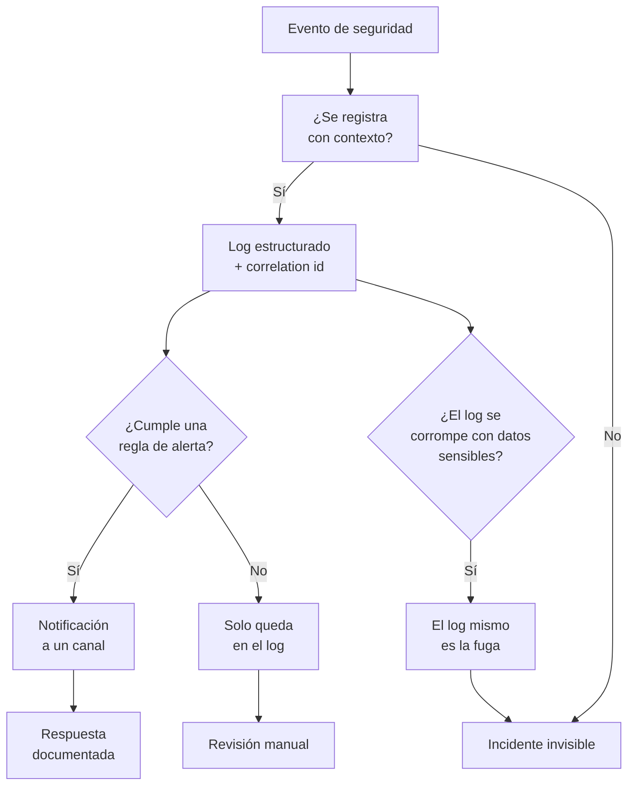

# A09:2025 - Fallas en el Registro, Alerta y Monitoreo de Seguridad

> **Pertenece a:** OWASP Top 10:2025 · [Volver al índice](README.md)

Se mantiene en el **#9**. En 2025 el nombre hace más énfasis que nunca en la **alerta**: tener logs no sirve si nadie recibe una notificación cuando algo importante ocurre.

Esta categoría es la que determina tu capacidad de responder. Todas las otras son prevención; esta es detección.

## 1. Qué es

Tres capacidades distintas, y confundirlas es el error habitual:

| Capacidad | Pregunta | Sin ella |
|---|---|---|
| **Registro** | ¿Qué pasó? | No puedes reconstruir un incidente |
| **Alerta** | ¿Hay que mirar esto ahora? | Sabes que pasó, seis meses tarde |
| **Monitoreo** | ¿Algo se desvía de lo normal? | No detectas patrones que nadieAttendance |

## Diagrama general



## 2. Qué se debe y qué no se registra

### Nunca registrar

| Dato | Por qué no |
|---|---|
| Contraseñas | Aunque hasheadas, un log filtrado alimenta un ataque offline |
| Tokens de sesión, JWT, cookies | Acceso inmediato y total a la cuenta |
| Números de tarjeta, CVV | PCI prohíbe almacenarlos en texto plano |
| Datos personales innecesarios | El principio de minimización de datos |
| Cuerpos de request completos | Contienen todo lo anterior, por accidente |

### Sí registrar

| Evento | Campos mínimos |
|---|---|
| Login exitoso / fallido | `userId` (o hash de email), IP, User-Agent, timestamp, resultado |
| Logout y revocación | `userId`, `sessionId`, origen |
| Acceso denegado (A01) | `subjectId`, recurso solicitado, IP, acción intentada |
| Cambio de contraseña / email | `userId`, qué cambió, IP, método de autenticación usado |
| Uso de token de reset / OTP | `userId`, resultado, IP |
| Elevación de privilegios | Actor, rol anterior, rol nuevo, quién lo aprobó |
| Accesos a datos sensibles | `userId`, recurso, volumen (no el contenido) |
| Errores de integridad | Firma inválida, digest mismatch, id de evento duplicado |

## 3. Ejemplo vulnerable ❌

```typescript
// ❌ console.log con el body entero
app.post('/api/login', async (req, res) => {
  try {
    const user = await auth.login(req.body);
    console.log('login ok', req.body); // 🔴 email + password en el log
    res.json({ token: user.token });
  } catch (e) {
    console.log('error', e); // 🔴 puede incluir la consulta SQL con datos
    res.status(500).json({ error: 'Error interno' });
  }
});
```

```typescript
// ❌ Log sin contexto: inútil para investigar
console.log('error en la api');
```

```typescript
// ❌ Registra el éxito y el fallo, pero sin alertarlos
if (!valid) {
  log.info('login fallido');
}
```

Problemas en una sola línea: el password en el log, el stack trace hacia el cliente, ningún `userId`, ninguna IP, ninguna alerta, y un `console.log` que en producción puede no ir a ningún agregador.

## 4. Ejemplo seguro ✅

### 4.1 Logger estructurado con redacción

```typescript
// src/observability/logger.ts
import pino from 'pino';
import { randomUUID } from 'node:crypto';

const isProduction = process.env.NODE_ENV === 'production';

export const logger = pino({
  level: process.env.LOG_LEVEL ?? 'info',

  // Redacción: la última línea de defensa, no la primera
  redact: {
    paths: [
      'password',
      'newPassword',
      'currentPassword',
      'token',
      'accessToken',
      'refreshToken',
      'authorization',
      'cookie',
      'cardNumber',
      'cvv',
      'ssn',
      '*.password',
      'req.headers.authorization',
      'req.headers.cookie',
      'res.headers["set-cookie"]',
      'body.email', // ver nota: email hasheado es preferible
    ],
    censor: '[REDACTED]',
  },

  formatters: {
    level: (label) => ({ level: label }),
  },

  // Timestamp ISO en UTC: indispensable para correlacionar con otros servicios
  timestamp: pino.stdTimeFunctions.isoTime,

  base: {
    service: 'mi-api',
    env: process.env.NODE_ENV,
    version: process.env.APP_VERSION,
  },
});

export function newCorrelationId(): string {
  return randomUUID();
}
```

> **Importante:** `redact` es una red de seguridad, no un permiso para loguear el body. Si redactas `body.email` para protegerlo, loguear el body completo sigue filtrando el resto de campos nuevos que nadie pensó en redactar. Lo correcto es loguear campos explícitos.

### 4.2 Middleware de correlación

```typescript
app.use((req, res, next) => {
  // Acepta el id del balanceador o genera uno propio
  req.id = req.get('x-request-id') ?? newCorrelationId();
  req.log = req.log ?? logger.child({ reqId: req.id });

  res.setHeader('x-request-id', req.id);

  const start = process.hrtime.bigint();

  res.on('finish', () => {
    req.log.info(
      {
        method: req.method,
        path: req.originalUrl.split('?')[0], // sin query string: puede llevar datos
        status: res.statusCode,
        durationMs: Number(process.hrtime.bigint() - start) / 1e6,
        userId: req.user?.id,
        ip: req.ip,
        userAgent: req.get('user-agent'),
      },
      'request completed',
    );
  });

  next();
});
```

Sin `reqId`, correlacionar el error de una dependencia con la request que lo provocó es trabajo manual.

### 4.3 Eventos de seguridad

```typescript
// src/auth/auth.audit.ts
import { createHash } from 'node:crypto';

// Un ID estable y no reversible para inspeccionar la identidad
function subjectRef(email: string): string {
  return `sub:${createHash('sha256').update(email.toLowerCase()).digest('hex').slice(0, 16)}`;
}

@Injectable()
export class AuthAudit {
  private readonly logger = logger.child({ module: 'auth.audit' });

  async loginFailed(email: string, ip: string, ua: string, reason: string): Promise<void> {
    this.logger.warn(
      { event: 'auth.login.failed', subject: subjectRef(email), ip, ua, reason },
      'login fallido',
    );
  }

  async accessDenied(input: {
    subjectId: string;
    resource: string;
    requestedId: string;
    ip: string;
  }): Promise<void> {
    // 🔴 Alerta: el acceso denegado es un indicador fuerte
    this.logger.warn({ event: 'authz.access.denied', ...input }, 'acceso denegado');
  }

  async sensitiveAction(input: {
    userId: string;
    action: 'password_changed' | 'email_changed' | 'role_granted' | 'mfa_disabled';
    reauthRequired: boolean;
    ip: string;
  }): Promise<void> {
    this.logger.info({ event: 'auth.sensitive_action', ...input }, 'acción sensible');
  }
}
```

```typescript
// src/auth/auth.service.ts
async login(dto: LoginDto, ctx: RequestContext): Promise<TokenPair> {
  const user = await this.users.findByEmail(dto.email);
  const ok = await this.verify(user?.passwordHash ?? DUMMY_HASH, dto.password);

  if (!user || !ok) {
    // Log SIEMPRE, respuesta genérica SIEMPRE
    await this.audit.loginFailed(dto.email, ctx.ip, ctx.ua, 'invalid_credentials');
    throw new UnauthorizedException('Credenciales inválidas');
  }

  // Log de login exitoso: sesión creada desde un lugar inesperado
  if (isNewDevice(user, ctx)) {
    this.logger.info(
      { event: 'auth.login.new_device', userId: user.id, ip: ctx.ip, ua: ctx.ua },
      'login desde dispositivo nuevo',
    );
  }

  return this.issueTokens(user);
}
```

### 4.4 Qué NO enviar al cliente

```typescript
// ✅ ErrorFilter: log interno detallado, respuesta opaca
@Catch()
export class GlobalExceptionFilter implements ExceptionFilter {
  private readonly logger = logger.child({ module: 'http.errors' });

  catch(exception: unknown, host: ArgumentsHost): void {
    const ctx = host.switchToHttp();
    const res = ctx.getResponse<Response>();
    const req = ctx.getRequest<RequestWithId>();

    const errorId = randomUUID();

    // El detalle completo va al log, con contexto
    this.logger.error(
      {
        err: exception,
        errorId,
        reqId: req.id,
        method: req.method,
        path: req.originalUrl.split('?')[0],
        userId: req.user?.id,
      },
      'excepción no manejada',
    );

    if (res.headersSent) return;

    res.status(500).json({
      error: 'Error interno',
      errorId, // el cliente puede reportarlo; el equipo puede buscarlo
      reqId: req.id,
    });
  }
}
```

El `errorId` es la pieza clave: el usuario ve un código opaco, y tú puedes buscarlo en el log para tener el stack completo.

## 5. Alertas

### 5.1 Reglas mínimas

```yaml
# alerting/rules.yml
groups:
  - name: auth-security
    rules:
      - alert: LoginFailureSpike
        # Más de 20 fallos en 5 minutos: ataque de credenciales
        expr: rate(auth_login_failed_total[5m]) > 20 / 60
        for: 2m
        labels:
          severity: high
        annotations:
          summary: "Pico de fallos de login: {{ $value }}/s"

      - alert: AuthorizationDeniedSpike
        # Indicador fuerte: alguien intenta acceder a lo que no es suyo
        expr: rate(authz_access_denied_total[5m]) > 10 / 60
        for: 1m
        labels:
          severity: high
        annotations:
          summary: "Pico de accesos denegados: posible IDOR en curso"

      - alert: RefreshTokenReuse
        # Robado de token confirmado por el detector de reutilización
        expr: increase(auth_refresh_reuse_total[10m]) > 0
        labels:
          severity: critical
        annotations:
          summary: "Reutilización de refresh token: sesión revocada"

      - alert: WebhookSignatureFailure
        expr: rate(webhook_signature_invalid_total[10m]) > 5 / 60
        for: 5m
        labels:
          severity: high
        annotations:
          summary: "Firmas de webhook inválidas repetidas"

      - alert: ErrorRateSpike
        # 5xx por encima del 2% durante 5 minutos
        expr: |
          sum(rate(http_requests_total{status=~"5.."}[5m]))
          / sum(rate(http_requests_total[5m])) > 0.02
        for: 5m
        labels:
          severity: medium

      - alert: LogPipelineSilent
        # Si el logging falla, estás ciego: alerta sobre la propia alerta
        expr: up{job="api"} == 1 and rate(log_lines_emitted_total[5m]) == 0
        for: 10m
        labels:
          severity: critical
        annotations:
          summary: "Pipeline de logs sin emitir: pérdida de visibilidad"
```

> **⚠️ Cuidado:** una alerta que nadie atiende es ruido, y el ruido entrena al equipo a ignorar las alertas. Empieza con cinco reglas que apunten a acciones concretas, y añade más solo cuando las actuales se disparan por error con frecuencia.

### 5.2 Qué alerta de verdad

| Alertable | Por qué |
|---|---|
| Reutilización de refresh token | Robo confirmado (A07) |
| Firma de webhook inválida repetida | Forgery en curso (A08) |
| Pico de accesos denegados | IDOR o enumeración en curso (A01) |
| Cambio de email/contraseña sin reautenticación | Secuestro de cuenta (A07) |
| Token de reset usado dos veces | Posible compromiso |
| Error 5xx disparado | Puede ser exploited o fallo de infraestructura |
| Pipeline de logs mudo | Perdiste visibilidad |

## 6. Lista de verificación

- [ ] Logs estructurados (JSON), no strings concatenados
- [ ] `reqId` / correlation ID en todas las requests y propagado a los servicios
- [ ] Timestamp ISO en UTC
- [ ] `redact` configurado para contraseñas, tokens, cookies y PII
- [ ] Nunca se registra el body completo de un request
- [ ] Email representado como hash, no en claro
- [ ] Login exitoso y fallido registrados con IP y User-Agent
- [ ] Accesos denegados registrados (indicador de ataque)
- [ ] Acciones sensibles con requisito de reautenticación
- [ ] Error interno con stack al log y respuesta opaca con `errorId` al cliente
- [ ] Query strings fuera de los logs (pueden llevar tokens)
- [ ] Retención definida y logs con datos sensibles cifrados o con acceso restringido
- [ ] Alertas sobre los eventos de la tabla, con severidad y runbook
- [ ] Destino de logs con control de acceso y retención
- [ ] Alerta sobre el propio pipeline de logs (fail-safe)

## Tarjetas de pregunta y respuesta

<div class="qa-card">
  <span class="qa-tag qa-tag-q">Pregunta</span>
  <div class="qa-q"><p>¿Cuál es la diferencia entre registro, alerta y monitoreo?</p></div>
  <div class="qa-a">
    <span class="qa-tag qa-tag-a">Respuesta</span>
    <p>El registro guarda lo que pasó. La alerta te avisa de que algo requiere atención ahora. El monitoreo detecta desviaciones respecto a la línea base. La mayoría de los equipos tiene el primero, pocos el segundo, y casi ninguno el tercero. Tener logs sin alertas es tener un archivo que nadie lee.</p>
  </div>
</div>

<div class="qa-card">
  <span class="qa-tag qa-tag-q">Pregunta</span>
  <div class="qa-q"><p>¿Por qué no debo loguear el body completo aunque tenga <code>redact</code>?</p></div>
  <div class="qa-a">
    <span class="qa-tag qa-tag-a">Respuesta</span>
    <p>Porque <code>redact</code> funciona sobre una lista de campos conocidos. En cuanto alguien añade un campo nuevo al DTO (<code>taxId</code>, <code>apiKey</code>, <code>bankAccount</code>), se filtra sin que nadie lo note. Loguea campos explícitos: <code>{ userId, action, result }</code>. Es más verboso y no se rompe.</p>
  </div>
</div>

<div class="qa-card">
  <span class="qa-tag qa-tag-q">Pregunta</span>
  <div class="qa-q"><p>¿Qué es un correlation ID y por qué lo necesito?</p></div>
  <div class="qa-a">
    <span class="qa-tag qa-tag-a">Respuesta</span>
    <p>Es un identificador único por request que se propaga a todos los servicios que participan. Sin él, cuando una request falla en un servicio que llama a otros tres, tienes cuatro entradas de log sin forma de saber cuáles pertenecen a la misma operación. Se genera en el borde (o se acepta del balanceador) y se incluye en cada línea.</p>
  </div>
</div>

<div class="qa-card">
  <span class="qa-tag qa-tag-q">Pregunta</span>
  <div class="qa-q"><p>¿Por qué los accesos denegados son un evento de seguridad valioso?</p></div>
  <div class="qa-a">
    <span class="qa-tag qa-tag-a">Respuesta</span>
    <p>Porque un acceso denegado significa que alguien intentó hacer algo que no debía. Un pico de 404 con muchos IDs distintos es el perfil exacto de un IDOR en curso. Y como el código devuelve 404 para no revelar nada, el log es la única señal disponible.</p>
  </div>
</div>

<div class="qa-card">
  <span class="qa-tag qa-tag-q">Pregunta</span>
  <div class="qa-q"><p>¿Por qué hashear el email en los logs en lugar de omitirlo?</p></div>
  <div class="qa-a">
    <span class="qa-tag qa-tag-a">Respuesta</span>
    <p>Porque necesitas poder correlacionar ataques dirigidos a una cuenta concreta sin guardar el dato. Un hash SHA-256 truncado es determinista: el mismo email siempre da el mismo identificador, así que puedes contar "cuántos fallos tuvo esta cuenta" sin almacenar el email. Es el mismo compromiso que el token de reset.</p>
  </div>
</div>

<div class="qa-card">
  <span class="qa-tag qa-tag-q">Pregunta</span>
  <div class="qa-q"><p>¿Qué le devuelvo al cliente cuando hay un error 500?</p></div>
  <div class="qa-a">
    <span class="qa-tag qa-tag-a">Respuesta</span>
    <p>Un mensaje genérico y un identificador de correlación, por ejemplo <code>{ error: "Error interno", errorId: "..." }</code>. El stack, la consulta SQL y la estructura interna van al log con ese mismo <code>errorId</code>. Así el usuario puede reportar el código y tú encuentras el detalle completo, sin filtrar nada sensible.</p>
  </div>
</div>

<div class="qa-card">
  <span class="qa-tag qa-tag-q">Pregunta</span>
  <div class="qa-q"><p>¿Cuántas alertas debería tener un servicio pequeño?</p></div>
  <div class="qa-a">
    <span class="qa-tag qa-tag-a">Respuesta</span>
    <p>Cinco o seis, las que correspondan a incidentes reales y tengan una acción clara asociada. Empieza por: reutilización de refresh token, firma de webhook inválida, pico de accesos denegados, error 5xx sostenido, y pipeline de logs mudo. Añade la primera alerta nueva solo cuando una existente se haya_falseado más de una vez.</p>
  </div>
</div>

<div class="qa-card">
  <span class="qa-tag qa-tag-q">Pregunta</span>
  <div class="qa-q"><p>¿Los logs no son datos sensibles? ¿Por qué los protegemos?</p></div>
  <div class="qa-a">
    <span class="qa-tag qa-tag-a">Respuesta</span>
    <p>Porque acabaron conteniéndolos: contraseñas filtradas por un <code>console.log</code> olvidado, tokens de sesión, emails, IPs. Los logs suelen tener permisos más laxos y retención más larga que la base de datos, así que son un objetivo atractivo. Restringe el acceso, cifra en reposo y define una retención acorde a los datos que realmente contienen.</p>
  </div>
</div>

---

> **Siguiente tema:** [A10: Manejo Inadecuado de Condiciones Excepcionales](10-condiciones-excepcionales.md)
