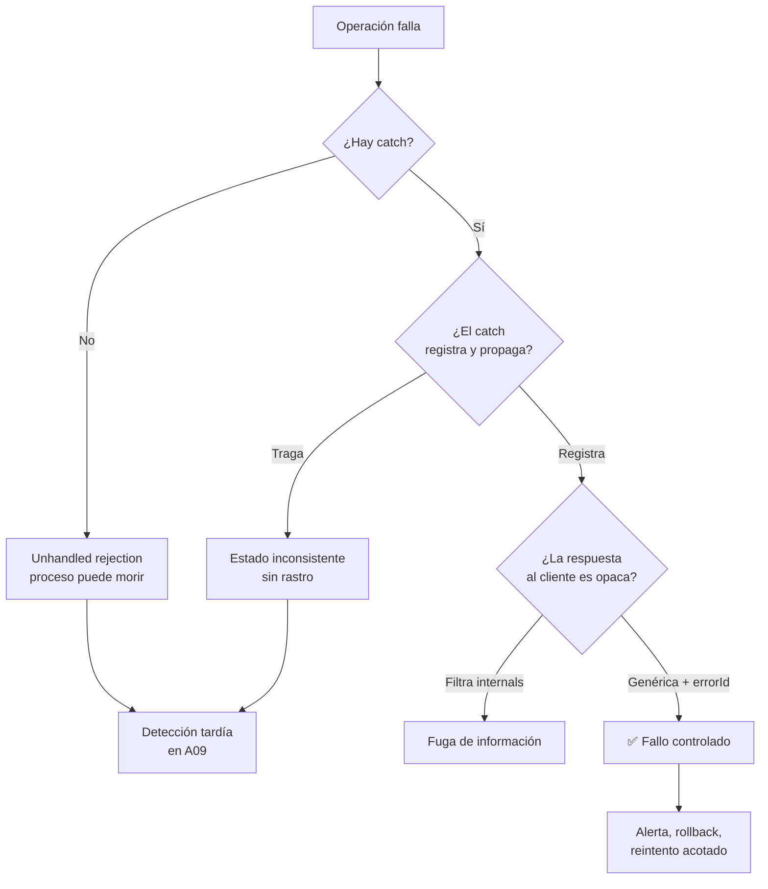

# A10:2025 - Manejo Inadecuado de Condiciones Excepcionales

> **Pertenece a:** OWASP Top 10:2025 · [Volver al índice](README.md)

**Categoría nueva en la edición 2025**, con 24 CWE asociados. Es la categoría donde más código *correcto* se rompe en producción: no hay ninguna vulnerabilidad de por medio, solo un `catch` que se traga el error y un sistema que sigue como si nada.

## 1. Qué es

Todo sistema falla. La pregunta no es si tu código va a lanzar una excepción, sino **qué pasa cuando lo hace**.

| Anti-patrón | Qué produce |
|---|---|
| `catch` vacío | El error desaparece; el sistema sigue con estado corrupto |
| `catch (e: any)` | Se pierde todo el tipado; `e.message` es `undefined` a veces |
| Tragar `Promise` | Unhandled rejection silenciosa |
| Handler `async` sin `await` en Express | La respuesta nunca se envía, la request se cuelga |
| Sin timeout en `fetch` | Una dependencia lenta agota todas las conexiones |
| Stack trace al cliente | Fuga de estructura interna |
| Sin graceful shutdown | Se pierden requests en vuelo al desplegar |
| `Promise.all` sin cota | Miles de operaciones concurrentes agotan la conexión |

## Diagrama general



## 2. Ejemplo vulnerable ❌

### 2.1 El `catch` que traga todo

```typescript
// ❌ El peor patrón: swallow
app.post('/api/orders', async (req, res) => {
  try {
    const order = await orders.create(req.body);
    await payments.charge(order);
    await inventory.reserve(order.items);
    await notifications.send(order);

    res.status(201).json(order);
  } catch (e) {
    // Sin log, sin rollback, sin nada
  }
});
```

Qué pasa en realidad si `payments.charge` falla: la request queda colgada **para siempre** (nadie responde), el pedido existe en la base de datos sin cobrar, y no hay ni un registro de que pasó. En dos horas tienes una tabla de pedidos fantasma y ninguna pista.

### 2.2 Handler async sin control de promesas

```typescript
// ❌ Express 4 no captura promesas rechazadas
app.get('/api/orders/:id', async (req, res) => {
  const order = await orders.findOne(req.params.id); // si esto falla...
  res.json(order);
});

// El rechazo se convierte en unhandledRejection
// La request queda abierta hasta que expira el timeout del proxy
// El cliente recibe un 504 sin contexto
```

> **⚠️ Cuidado:** Express 4 **sí** captura rechazos de handlers `async`, pero solo si registras el router con el wrapper correcto. Lo que nunca captura es un `setImmediate`, un callback de `eventEmitter`, o una promesa creada sin `await`. La regla sigue siendo válida: toda promesa debe tener un manejador de error explícito.

### 2.3 `e: any` y construcción de mensajes

```typescript
// ❌ e es unknown en TS estricto: "Property 'message' does not exist"
try {
  await charge(order);
} catch (e: any) {
  if (e.code === 'ECONNREFUSED') { /* ... */ }
  res.status(500).json({ error: e.message }); // puede ser undefined, o filtrar internals
}

// ❌ Y si además concatenas:
  res.status(500).json({ error: `Fallo en el cobro: ${e}` }); // "[object Object]"
```

### 2.4 Sin timeout

```typescript
// ❌ Si el proveedor se cuelga, esta promesa no resuelve nunca
const response = await fetch('https://api.proveedor.com/charge', {
  method: 'POST',
  body: JSON.stringify(payload),
});
```

### 2.5 `Promise.all` sin cota

```typescript
// ❌ 5000 pedidos → 5000 conexiones simultáneas a la base de datos
await Promise.all(orders.map((o) => enrichWithCustomer(o)));
```

## 3. Ejemplo seguro ✅

### 3.1 Tipos de error discriminados

```typescript
// src/payments/payment.error.ts
export type PaymentError =
  | { kind: 'insufficient_funds'; availableCents: number }
  | { kind: 'card_declined'; code: string; retryable: false }
  | { kind: 'provider_timeout'; retryable: true; afterMs: number }
  | { kind: 'provider_unavailable'; retryable: true; afterMs: number };

export class PaymentFailure extends Error {
  constructor(public readonly failure: PaymentError) {
    super(`payment_failed:${failure.kind}`);
    this.name = 'PaymentFailure';
  }
}
```

```typescript
// ✅ El compilador obliga a cubrir todos los casos
async function describe(failure: PaymentError): string {
  switch (failure.kind) {
    case 'insufficient_funds':
      return `Saldo insuficiente: hay ${failure.availableCents / 100}`;
    case 'card_declined':
      return 'La tarjeta fue rechazada';
    case 'provider_timeout':
    case 'provider_unavailable':
      return 'El proveedor no respondió, reintentaremos';
  }
  // Si añades un caso nuevo al union, este error aparece aquí
}
```

```typescript
// ✅ assertNever para garantizar exhaustividad
function assertNever(value: never): never {
  throw new Error(`Caso no contemplado: ${JSON.stringify(value)}`);
}

function describe2(failure: PaymentError): string {
  switch (failure.kind) {
    case 'insufficient_funds':
      return `Saldo insuficiente: hay ${failure.availableCents / 100}`;
    case 'card_declined':
      return 'La tarjeta fue rechazada';
    case 'provider_timeout':
      return 'Reintentaremos en un momento';
    case 'provider_unavailable':
      return 'Reintentaremos en un momento';
    default:
      return assertNever(failure); // el error aparece si falta un caso
  }
}
```

### 3.2 `unknown` y normalización de errores

```typescript
// src/common/errors.ts
type ErrorShape = { message: string; code: string; status: number; cause?: unknown };

export function normalizeError(err: unknown): ErrorShape {
  if (err instanceof PaymentFailure) {
    return {
      message: describe(err.failure),
      code: err.failure.kind,
      status: err.failure.retryable ? 503 : 422,
      cause: err,
    };
  }

  if (err instanceof ValidationError) {
    return { message: 'Datos inválidos', code: 'VALIDATION', status: 400, cause: err };
  }

  if (isAbortError(err)) {
    return { message: 'Tiempo de espera agotado', code: 'TIMEOUT', status: 504, cause: err };
  }

  // ✅ Nunca expones el error desconocido: es opaco por definición
  return { message: 'Error interno', code: 'INTERNAL', status: 500, cause: err };
}

function isAbortError(err: unknown): boolean {
  return err instanceof Error && err.name === 'AbortError';
}
```

```typescript
// ✅ El catch recibe unknown y normaliza; nunca `any`
app.post('/api/orders', asyncHandler(async (req, res) => {
  const order = await orders.create(OrderSchema.parse(req.body));

  // Saga con compensación explícita: cada paso sabe cómo deshacerse
  await saga.run([
    async () => payments.charge(order),
    async () => inventory.reserve(order.items),
    async () => notifications.send(order),
  ], {
    compensate: [
      async () => inventory.release(order.items),
      async () => payments.refund(order.id),
    ],
  });

  res.status(201).json(order);
}));
```

### 3.3 El wrapper de Express

```typescript
// src/common/async-handler.ts
import type { RequestHandler } from 'express';

// ✅ Garantiza que un rechazo SIEMPRE llega al error handler
export function asyncHandler(fn: RequestHandler): RequestHandler {
  return (req, res, next) => {
    Promise.resolve(fn(req, res, next)).catch(next);
  };
}
```

```typescript
// ✅ Error handler global: registra todo con contexto y responde opaco
app.use((err: unknown, req: Request, res: Response, _next: NextFunction) => {
  const normalized = normalizeError(err);
  const errorId = randomUUID();

  req.log.error(
    { err, errorId, code: normalized.code, userId: req.user?.id },
    'error manejado',
  );

  // Unhandled: log a stderr y deja morir el proceso (el orquestador reinicia)
  if (err instanceof Error && 'fatal' in err) {
    process.stderr.write(`FATAL ${errorId}: ${err.stack}\n`);
    process.exit(1);
  }

  res.status(normalized.status).json({
    error: normalized.message,
    errorId,
    reqId: req.id,
  });
});
```

### 3.4 Timeouts

```typescript
// ✅ fetch con timeout: siempre
async function fetchWithTimeout(
  url: string,
  init: RequestInit = {},
  timeoutMs = 5_000,
): Promise<Response> {
  const signal = AbortSignal.any([
    AbortSignal.timeout(timeoutMs),
    init.signal ?? new AbortController().signal,
  ]);

  try {
    return await fetch(url, { ...init, signal });
  } catch (err) {
    if (err instanceof Error && err.name === 'TimeoutError') {
      throw new UpstreamTimeoutError(url, timeoutMs);
    }
    throw err;
  }
}
```

```typescript
// ✅ pg con timeout de conexión y de consulta
const pool = new Pool({
  connectionTimeoutMillis: 3_000,
  statement_timeout: 5_000, // cancela la query, no espera indefinidamente
  idle_in_transaction_session_timeout: 10_000,
});
```

### 3.5 Concurrencia acotada

```typescript
// ✅ En lugar de Promise.all sobre 5000 elementos
async function mapWithConcurrency<T, R>(
  items: readonly T[],
  limit: number,
  fn: (item: T, index: number) => Promise<R>,
): Promise<R[]> {
  const results: R[] = new Array(items.length);
  let next = 0;

  const workers = Array.from({ length: Math.min(limit, items.length) }, async () => {
    while (true) {
      const index = next++;
      if (index >= items.length) return;
      results[index] = await fn(items[index]!, index);
    }
  });

  await Promise.all(workers);
  return results;
}

// 10 conexiones como máximo, sin importar cuántos pedidos haya
await mapWithConcurrency(orders, 10, (order) => enrichWithCustomer(order));
```

### 3.6 Graceful shutdown

```typescript
// src/server.ts
import { createServer } from 'node:http';
import { pool } from './db';

const server = createServer(app);
let shuttingDown = false;

async function shutdown(signal: string): Promise<void> {
  if (shuttingDown) return; // segundo SIGTERM: no repetir
  shuttingDown = true;

  logger.info({ signal }, 'apagado limpio iniciado');

  // 1. Dejar de aceptar conexiones nuevas
  server.close(async () => {
    try {
      // 2. Cerrar el pool: espera a que terminen las queries en vuelo
      await pool.end();
      // 3. Flush de logs y colas
      await telemetry.shutdown();
      process.exit(0);
    } catch (err) {
      logger.error({ err }, 'error en el apagado');
      process.exit(1);
    }
  });

  // 4. Si no se cierra en 10 s, forzar salida
  setTimeout(() => {
    logger.error('apagado forzado tras timeout');
    process.exit(1);
  }, 10_000).unref();
}

process.on('SIGTERM', () => void shutdown('SIGTERM')); // Kubernetes, Docker
process.on('SIGINT', () => void shutdown('SIGINT')); // Ctrl+C

// Unhandled rejection y excepción no capturada: log y morir
// El proceso debe morir para que el orquestador lo reinicie limpio
process.on('unhandledRejection', (reason) => {
  logger.fatal({ reason }, 'unhandled rejection');
  void shutdown('unhandledRejection');
});

process.on('uncaughtException', (err) => {
  logger.fatal({ err }, 'uncaught exception');
  void shutdown('uncaughtException');
});
```

> **Importante:** `uncaughtException` sin salida es peligroso. El proceso está en un estado que nadie entiende; dejarlo vivo convierte un bug en corruption silenciosa. La convención correcta es loguear el error y morir, para que el orquestador levante una instancia limpia.

## 4. En NestJS

```typescript
// src/common/filters/all-exceptions.filter.ts
@Catch()
export class AllExceptionsFilter implements ExceptionFilter {
  constructor(
    private readonly httpAdapterHost: HttpAdapterHost,
    private readonly logger: PinoLogger,
  ) {}

  catch(exception: unknown, host: ArgumentsHost): void {
    const { httpAdapter } = this.httpAdapterHost;
    const ctx = host.switchToHttp();
    const res = ctx.getResponse<Response>();
    const req = ctx.getRequest<Request>();

    const normalized = normalizeError(exception);

    // Las HttpException de Nest ya traen status y respuesta
    if (exception instanceof HttpException) {
      const body = exception.getResponse();
      this.logger.warn({ code: normalized.code, path: req.url }, 'http exception');
      httpAdapter.reply(res, exception.getStatus(), body);
      return;
    }

    const errorId = randomUUID();
    this.logger.error(
      { err: exception, errorId, path: req.url, userId: req.user?.id },
      'excepción no manejada',
    );

    httpAdapter.reply(res, 500, {
      error: 'Error interno',
      errorId,
      reqId: req.id,
    });
  }
}
```

```typescript
// src/main.ts
const app = await NestFactory.create(AppModule, {
  // Crítico: sin esto, Nest devuelve el stack en desarrollo
  abortOnError: false,
});

app.useGlobalFilters(new AllExceptionsFilter());
app.enableShutdownHooks(); // traduce SIGTERM en onModuleDestroy
```

### 4.1 Result type en lugar de excepciones para el dominio

```typescript
// ✅ El dominio no lanza excepciones por errores esperados
type Result<T, E> = { ok: true; value: T } | { ok: false; error: E };

async function withdraw(
  accountId: string,
  amountCents: number,
): Promise<Result<{ newBalanceCents: number }, WithdrawError>> {
  const account = await this.accounts.findById(accountId);
  if (!account) return { ok: false, error: { kind: 'not_found' } };
  if (account.balanceCents < amountCents) {
    return { ok: false, error: { kind: 'insufficient_funds', available: account.balanceCents } };
  }

  const newBalanceCents = account.balanceCents - amountCents;
  await this.accounts.updateBalance(accountId, newBalanceCents);

  return { ok: true, value: { newBalanceCents } };
}
```

```typescript
// El caller está obligado a manejar el error: no puede olvidarlo
const result = await this.withdrawService.withdraw(accountId, amountCents);

if (!result.ok) {
  switch (result.error.kind) {
    case 'not_found':
      throw new NotFoundException('Cuenta no encontrada');
    case 'insufficient_funds':
      throw new UnprocessableEntityException(
        `Saldo insuficiente: ${result.error.available / 100}`,
      );
    default:
      throw assertNever(result.error);
  }
}

return result.value;
```

| Enfoque | Cuándo |
|---|---|
| Excepción | Error inesperado, no previsto en el diseño |
| `Result<T, E>` | Error esperado de negocio (saldo insuficiente, cupón vencido) |
| `HttpException` | Traducir a un status HTTP concreto |

> **Para entenderlo visualmente:** una excepción es una bola que rueda por el pasillo y hay que cazarla donde aterrice. Un `Result` es una respuesta que te devuelven en la mano, y no puedes mirar a otro lado porque el compilador te obliga a mirarla. En un flujo de negocio con tres pasos que pueden fallar de tres maneras distintas, lo segundo es mucho más seguro de revisar.

## 5. Lista de verificación

- [ ] Cero `catch` vacíos o que solo hacen `console.log`
- [ ] `catch (e: unknown)`, nunca `any`
- [ ] Normalizador de errores que clasifique los conocidos y opaquifique el resto
- [ ] `assertNever` en los `switch` sobre uniones discriminadas
- [ ] Ningún `err.message` o `err.stack` en la respuesta HTTP
- [ ] Wrapper de handlers async en Express (o Express 5, que ya captura)
- [ ] `AbortSignal.timeout` en toda llamada `fetch` saliente
- [ ] `connectionTimeoutMillis` y `statement_timeout` en el pool de base de datos
- [ ] `Promise.all` sustituido por un mapper con concurrencia acotada
- [ ] Reintentos con backoff exponencial, jitter y **techo de intentos**
- [ ] Solo se reintenta lo que es `retryable: true`
- [ ] Manejadores de `unhandledRejection` y `uncaughtException` que loguean y mueren
- [ ] Graceful shutdown con `SIGTERM`, cierre del pool y timeout de fuerza
- [ ] Transacciones o compensaciones para operaciones multi-paso
- [ ] Error de timeout mapeado a 503/504, no a 500 genérico

## Tarjetas de pregunta y respuesta

<div class="qa-card">
  <span class="qa-tag qa-tag-q">Pregunta</span>
  <div class="qa-q"><p>¿Cuál es el problema de un <code>catch</code> vacío?</p></div>
  <div class="qa-a">
    <span class="qa-tag qa-tag-a">Respuesta</span>
    <p>Que el fallo deja de propagarse, así que el resto del flujo continúa como si hubiera ido bien. En un flujo de tres pasos, el segundo falla y el tercero se ejecuta igual: terminas con un pedido creado, sin cobrar y notificado. Y como no hay log, no hay forma de saberlo hasta que un cliente se queja semanas después.</p>
  </div>
</div>

<div class="qa-card">
  <span class="qa-tag qa-tag-q">Pregunta</span>
  <div class="qa-q"><p>¿Por qué <code>catch (e: unknown)</code> y no <code>any</code>?</p></div>
  <div class="qa-a">
    <span class="qa-tag qa-tag-a">Respuesta</span>
    <p>Con <code>unknown</code> el compilador te obliga a narrowing antes de tocar una propiedad, así que no puedes leer <code>e.message</code> a ciegas. Con <code>any</code> desaparece el aviso y acabas con <code>${e}</code> imprimir <code>[object Object]</code>. <code>unknown</code> documenta la honestidad: no sabes qué se lanzó.</p>
  </div>
</div>

<div class="qa-card">
  <span class="qa-tag qa-tag-q">Pregunta</span>
  <div class="qa-q"><p>¿Por qué los errores de dominio son mejores como <code>Result</code> que como excepción?</p></div>
  <div class="qa-a">
    <span class="qa-tag qa-tag-a">Respuesta</span>
    <p>Porque "saldo insuficiente" es un resultado previsto del flujo, no una anomalía. Con <code>Result</code>, el compilador obliga a cada caller a mirar el error, y en un flujo con varios pasos se puede acumular sin anidar try/catch. Las excepciones se reservan para lo inesperado: bugs, fallos de red, invariantes rotas.</p>
  </div>
</div>

<div class="qa-card">
  <span class="qa-tag qa-tag-q">Pregunta</span>
  <div class="qa-q"><p>Mi handler async de Express hace <code>await</code> y responde. ¿Puede colgarse?</p></div>
  <div class="qa-a">
    <span class="qa-tag qa-tag-a">Respuesta</span>
    <p>Sí, si lo que se cuelga es un <code>fetch</code> sin timeout, o una query sin <code>statement_timeout</code>. La petición no se cuelga porque el handler sea async, sino porque la promesa nunca resuelve. La defensa no es un <code>try/catch</code>, sino un timeout explícito en cada dependencia externa.</p>
  </div>
</div>

<div class="qa-card">
  <span class="qa-tag qa-tag-q">Pregunta</span>
  <div class="qa-q"><p>¿Cuál es la diferencia entre <code>Promise.all</code> y un mapper con concurrencia acotada?</p></div>
  <div class="qa-a">
    <span class="qa-tag qa-tag-a">Respuesta</span>
    <p><code>Promise.all</code> lanza todas las operaciones a la vez: con 5.000 elementos, 5.000 conexiones simultáneas a la base de datos, y agotamiento del pool. Un mapper con límite de 10 mantiene el orden de resultados, propaga el primer error, y nunca supera el presupuesto de recursos. Es un problema de diseño (A06) que se manifiesta como caída de producción.</p>
  </div>
</div>

<div class="qa-card">
  <span class="qa-tag qa-tag-q">Pregunta</span>
  <div class="qa-q"><p>¿Cuándo conviene reintentar y cuándo no?</p></div>
  <div class="qa-a">
    <span class="qa-tag qa-tag-a">Respuesta</span>
    <p>Solo lo que es transitorio por naturaleza: timeout de red, 429, 503 del proveedor. Nunca un error de validación ni una tarjeta rechazada: ahí el reintento es inútil y solo multiplica la carga. Y siempre con backoff exponencial, jitter y un techo de intentos. Un reintento sin techo es un vector de DoS.</p>
  </div>
</div>

<div class="qa-card">
  <span class="qa-tag qa-tag-q">Pregunta</span>
  <div class="qa-q"><p>¿Por qué hay que salir en <code>uncaughtException</code> en vez de seguir?</p></div>
  <div class="qa-a">
    <span class="qa-tag qa-tag-a">Respuesta</span>
    <p>Porque el proceso queda en un estado que nadie puede describir. Puede tener una transacción a medio hacer, un listener duplicado o una caché inconsistente. Loguear y morir deja que el orquestador levante una instancia limpia; seguir convierte un bug visible en corrupción silenciosa que aparece días después.</p>
  </div>
</div>

<div class="qa-card">
  <span class="qa-tag qa-tag-q">Pregunta</span>
  <div class="qa-q"><p>¿Qué aporta el graceful shutdown si el orquestador ya manda SIGKILL?</p></div>
  <div class="qa-a">
    <span class="qa-tag qa-tag-a">Respuesta</span>
    <p>El <code>SIGKILL</code> no se puede capturar, así que el proceso muere en seco y se pierden las requests en vuelo. Pero los orquestadores primero envían <code>SIGTERM</code> y esperan un periodo de gracia (típicamente 30 s). Sin manejador, tu app ignora el <code>SIGTERM</code>, agotas el periodo y te llega el <code>SIGKILL</code>. Con manejador, terminas limpio.</p>
  </div>
</div>

---

> **Siguiente tema:** [Cuestionario](cuestionario.md) — preguntas de repaso de las diez categorías