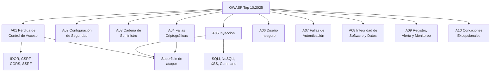

# OWASP Top 10:2025

> Basado en el documento oficial [OWASP Top 10:2025](https://owasp.org/Top10/2025/es/), octava edición, publicada en noviembre de 2025.

El OWASP Top 10 es un **documento estándar de concienciación para desarrolladores**. No es una norma obligatoria ni una lista exhaustiva: es el consenso de la comunidad sobre los diez riesgos de seguridad más críticos en aplicaciones web, ordenados por frecuencia de aparición e impacto.

Estas notas aplican cada categoría a **TypeScript y Node.js**, con ejemplos en **Express** y **NestJS**.

## Diagrama de overview

## Las diez categorías

| # | Categoría | En una frase | Página |
|---|---|---|---|
| A01 | Pérdida de Control de Acceso | Un usuario autenticado hace algo que no debería poder hacer | [→](01-control-de-acceso.md) |
| A02 | Configuración de Seguridad Incorrecta | La app funciona, pero con los valores por defecto e inseguros | [→](02-configuracion-de-seguridad.md) |
| A03 | Fallas en la Cadena de Suministro de Software | El atacante no entra por tu código, entra por una dependencia tuya | [→](03-cadena-de-suministro-de-software.md) |
| A04 | Fallas Criptográficas | Datos sensibles en claro, o algoritmos de protección incorrectos | [→](04-fallas-criptograficas.md) |
| A05 | Inyección | Datos del usuario interpretados como código | [→](05-inyeccion.md) |
| A06 | Diseño Inseguro | La funcionalidad es correcta, pero el diseño nunca consideró al atacante | [→](06-diseno-inseguro.md) |
| A07 | Fallas de Autenticación | No poder demostrar quién eres, ni saber si lo que dice el token es válido | [→](07-fallas-de-autenticacion.md) |
| A08 | Fallas en la Integridad del Software o de los Datos | Asumir que un software o un dato externo es auténtico sin verificarlo | [→](08-integridad-de-software-y-datos.md) |
| A09 | Fallas en el Registro, Alerta y Monitoreo de Seguridad | El ataque ocurre y nadie se entera | [→](09-registro-y-alertas.md) |
| A10 | Manejo Inadecuado de Condiciones Excepcionales | El `catch` se traga el error y el sistema sigue como si nada | [→](10-condiciones-excepcionales.md) |

## Qué cambió respecto a 2021

Si ya conoces la edición 2021, esta tabla es el mapa mental más rápido:

| 2021 | 2025 | Cambio |
|---|---|---|
| A01 Broken Access Control | **A01** Pérdida de Control de Acceso | Se mantiene en el #1. **Absorbe SSRF** (que era A10:2021) y también CSRF |
| A02 Cryptographic Failures | **A04** Fallas Criptográficas | Baja del #2 al #4, pero mantiene un impacto muy alto |
| A03 Injection | **A05** Inyección | Baja del #3 al #5. Sigue incluyendo XSS y SQLi |
| A04 Insecure Design | **A06** Diseño Inseguro | Baja del #4 al #6 |
| A05 Security Misconfiguration | **A02** Configuración de Seguridad Incorrecta | **Sube del #5 al #2**. Es el cambio más grande en ranking |
| A06 Vulnerable and Outdated Components | **A03** Cadena de Suministro de Software | Se **amplía**: ya no es solo "dependencias con CVE", ahora incluye el ecosistema completo (registros, sistemas de build, distribución) |
| A07 Identification and Authentication Failures | **A07** Fallas de Autenticación | Solo cambia el nombre. Sigue en el #7 |
| A08 Software and Data Integrity Failures | **A08** Fallas en la Integridad del Software o de los Datos | Igual posición, nombre ajustado |
| A09 Security Logging and Monitoring Failures | **A09** Registro, Alerta y Monitoreo | Igual posición, se enfatiza la alerta |
| A10 Server Side Request Forgery (SSRF) | — | **Desaparece como categoría**: se trata dentro de A01 |
| — | **A10** Manejo Inadecuado de Condiciones Excepcionales | **Categoría nueva en 2025** |

> **⚠️ Cuidado:** si buscas documentación, cursos o blogs sobre el OWASP Top 10, lo más probable es que encuentres la edición **2021**. Las categorías se renumeraron, así que "A02 era criptografía" ya no es cierto.

### Las dos novedades de 2025

**A03 — Cadena de Suministro de Software.** Antes solo se hablaba de tu `package.json`. Ahora el alcance es todo el ecosistema: registros npm, cadenas de suministro de los mantenedores, sistemas de build, artefactos de CI/CD y la distribución. El voto de la comunidad lo puso en la lista de forma abrumadora.

**A10 — Manejo Inadecuado de Condiciones Excepcionales.** Categoría nueva dedicada a lo que pasa cuando algo falla: errores tragados, promesas rechazadas sin manejar, timeouts agotados, respuestas de error que filtran internals. Es la categoría donde más código "correcto" se rompe en producción.

## Cómo usar el Top 10

> **Importante:** el Top 10 sirve como **punto de partida** para un programa de seguridad, no como una lista de verificación final.

En la práctica, para una aplicación Node/TypeScript conviene usarlo así:

| Momento | Qué haces con el Top 10 |
|---|---|
| **Diseño** | Modelar amenazas: ¿quién hace qué? ¿dónde hay un objeto ajeno que tocar? (A01, A06) |
| **Implementación** | Revisar cada endpoint nuevo contra las diez categorías (A01, A02, A05, A07) |
| **Dependencias** | Automatizar auditoría y actualización continua (A03) |
| **Producción** | Verificar logs, alertas y manejo de errores (A09, A10) |
| **Auditoría** | Usar ASVS (no solo el Top 10) para tener requisitos verificables |

> **Para ir más allá:** si necesitas una lista de requisitos que se pueda auditar, usa el [OWASP ASVS](https://owasp.org/www-project-application-security-verification-standard/) en lugar del Top 10. El Top 10 agrupa por tipo de riesgo; el ASVS lista controles concretos.

## Navegación

1. [A01: Pérdida de Control de Acceso](01-control-de-acceso.md)
2. [A02: Configuración de Seguridad Incorrecta](02-configuracion-de-seguridad.md)
3. [A03: Fallas en la Cadena de Suministro de Software](03-cadena-de-suministro-de-software.md)
4. [A04: Fallas Criptográficas](04-fallas-criptograficas.md)
5. [A05: Inyección](05-inyeccion.md)
6. [A06: Diseño Inseguro](06-diseno-inseguro.md)
7. [A07: Fallas de Autenticación](07-fallas-de-autenticacion.md)
8. [A08: Fallas en la Integridad del Software o de los Datos](08-integridad-de-software-y-datos.md)
9. [A09: Fallas en el Registro, Alerta y Monitoreo de Seguridad](09-registro-y-alertas.md)
10. [A10: Manejo Inadecuado de Condiciones Excepcionales](10-condiciones-excepcionales.md)

- [Cuestionario](cuestionario.md) — Preguntas de repaso de las diez categorías

---

> **Siguiente tema:** [A01: Pérdida de Control de Acceso](01-control-de-acceso.md)